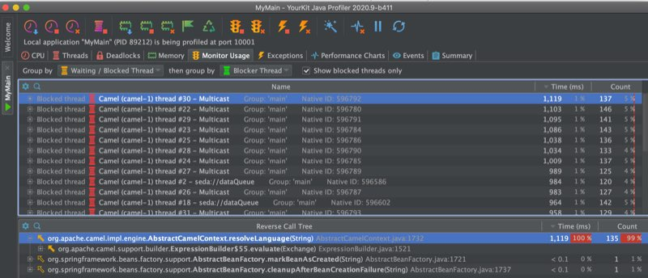
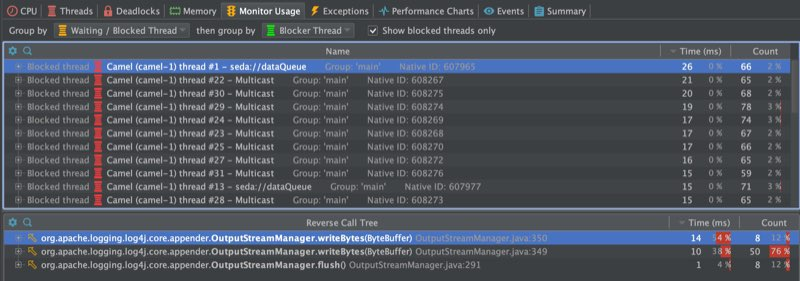
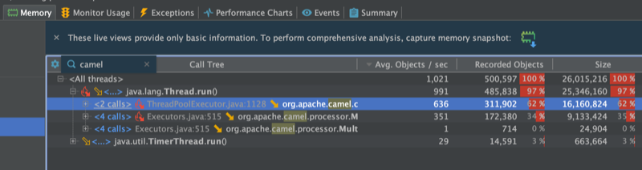
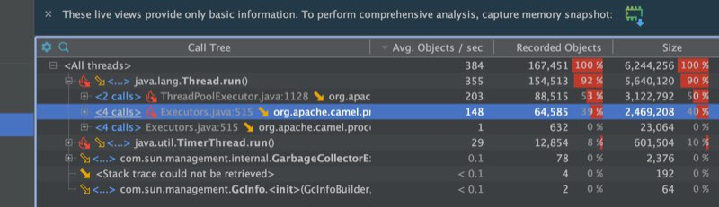
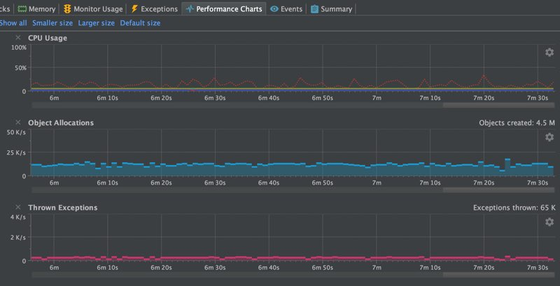
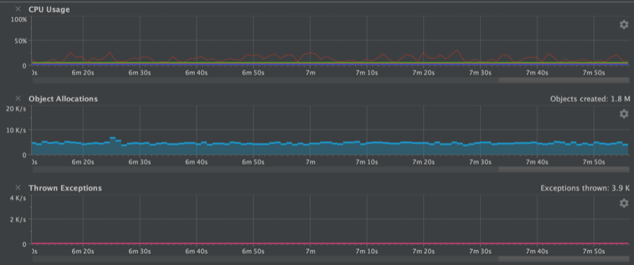

# Apache Camel 3.6 What's New

Published 2020-10-21 by Claus Ibsen in Releases

Details of what we have done in the Camel 3.6 release.

Apache Camel 3.6 has just been released.

This is a non-LTS release which means we will not provide patch releases but use the release _as-is_. The next planned LTS release is 3.7 scheduled towards the end of the year.

## So what’s in this release?

This release introduces a set of new features and noticeable improvements that we will cover in this blog post.

### Spring Boot

We have upgraded to the latest release at this time which is Spring Boot 2.3.4. Support for Spring Boot 2.4 is planned for Camel 3.7.

### Optimizations

To speed up the startup we switched to a new UUID generator. The old (classic) generator was inherited from Apache ActiveMQ which needed to ensure its ids were unique in a network of brokers, and therefore to ensure this the generator was using the hostname as the prefix in the id. This required on startup to do network access to obtain this information which costs a little time. Also depending on networks this can be more restrictive and delay the startup. The new generator is a pure in-memory fast generator that was used by Camel K and Camel Quarkus.

We also identified a few other spots during route initialization. For example, one small change was to avoid doing some regular expression masking on route endpoints which weren’t necessary anymore.

Now the bigger improvements are in the following areas

#### Avoid throwing exceptions

We identified on spring runtimes that Camel would query the spring bean registry for known beans by id, which the Spring framework would throw a NoSuchBeanDefinitionException if the bean is not present. As Camel does a bit of optional bean discovery during bootstrap, we found a way to avoid this which prevents this.

#### Singleton languages

Another related problem is that in Camel 3 due to the modularization then some of the languages (bean, simple, and others) have been changed from being a singleton to prototype scoped. This is one of the biggest problems and we had a Camel user report a problem with thread contention in a high concurrent use-case would race for resolving languages (they are prototype scoped). So you would have this problem, and because the language resolver would query the registry first then Spring would throw `NoSuchBeanDefinitionException`, and then Camel would resolve the language via its own classpath resolver. So all together this cost performance. We can see this in the screenshots from the profiler in the following.

")

Camel 3.5 Blocked Threads (Click to enlarge)

")

Camel 3.6 Blocked Threads (Click to enlarge)

The top screenshot is using Camel 3.5 and the bottom 3.6. At the top, we can see the threads are blocked in Camel’s `resolveLanguage` method. And in 3.6 then it’s the log4j logger that is blocking for writing to the log file. Both applications are using the same Camel application and have been running for about 8 minutes.

#### Reduce object allocations

The next screenshots are showing a sample of the object allocations.

")

Camel 3.5 Average Object Allocations Per Seconds (Click to enlarge)

")

Camel 3.6 Average Object Allocations Per Seconds (Click to enlarge)

With Camel 3.5 we are average about 1000 obj/sec and with 3.6 we are down to about a 1/3th.

One of the improvements to help reduce the object allocations was how parameters to languages was changed from using a Map to a plain object array. The Map takes up more memory and object allocations than a single fixed object array.

#### Do as much init as possible

Another performance improvement that aids during runtime was that we moved as much we could from the evaluation to the initialization phase in the Camel languages (simple, bean, etc.). We did this by introducing the init phase and ensuring CamelContext was carried around in the interns so we can use the context during the init phase, where its really needed. This ensures the runtime evaluation is as fast as possible.

#### Other smaller optimizations

We also improved the simple language to be a bit smarter in its binary operators (such as header.foo > 100). Now the simple language has stronger types for numeric and boolean types during its parsing, which allows us to know better from the right and left hand side of the binary operator to do type coercion so the types are comparable by the JVM. Before we may end up with falling back to converting to string types on both sides. And there is more to come, I have some ideas how to work on a compiled simple language.

The screenshots below show a chart with the CPU, object allocations, and thrown exceptions.

")

Camel 3.5 Performance Charts (Click to enlarge)

")

Camel 3.6 Performance Charts (Click to enlarge)

As we can see this summarise what was mentioned was done to optimize. The number of exceptions has been reduced to 0 at runtime. There is about 3500 thrown during bootstrap (that is Java JAXB which is used for loading the spring XML file with the Camel routes used for the sample application). We do have a fast XML loader in Camel that is not using JAXB.

Another improvement we did was to build a source code generator for a new `UriFactory` which allows each component to quickly build dynamic endpoint URIs from a `Map` of parameters. The previous solution was to use `RuntimeCamelCatalog` that was more generic and required loading component metadata from JSON descriptor files. A few components use this to optimize the `toD` (such as HTTP components). By this change, we avoid the runtime catalog as a dependency (reduce JAR size) and the source code generated URI factory is much faster (its speedy plain Java). However, the sample application used for this blog did not use `toD` nor the `UriFactory`.

Source from [external blog post](http://www.davsclaus.com/2020/10/apache-camel-36-more-camel-core.md)

### API Components overhaul

There are several API based components which are source code generated from _external API_. We have overhauled the code generator which now scrapes and includes documentation and keep the documentation up to date as well.

Also, we include additional metadata for Camel tooling so they can provide code assistance when Camel end-users are using these API based components. Some of those external APIs are huge and you can have hundreds of APIs.

The API based components are: [AS2](../../../../components/next/as2-component.md), [Box](../../../../components/next/box-component.md), [Braintree](../../../../components/next/braintree-component.md), [FHIR](../../../../components/next/fhir-component.md), Google [Calendar](../../../../components/next/google-calendar-component.md)/[Drive](../../../../components/next/google-drive-component.md)/[Mail](../../../../components/next/google-mail-component.md)/[Sheets](../../../../components/next/google-sheets-component.md), [Olingo](../../../../components/next/olingo4-component.md), [Twillio](../../../../components/next/twilio-component.md), and [Zendesk](../../../../components/next/zendesk-component.md).

### Reduce reflection

Yet another release where we reduced using reflections in a few spots in Camel core and in some of the components.

### Language precompilation

As mentioned in the optimization section we moved initialization of languages to an earlier phase. Camel now pre compile languages when its applicable, for example JSonPath, and XPath language.

And speaking of pre-compiled languages then Camel 3.7 introduces the jOOR language to use runtime compile Java in the Camel DSL. A compiled simple language is also on the roadmap.

### Optimized components startup

The camel core has been optimized in Camel 3 to be small, slim, and fast on startup. This benefits Camel Quarkus which can do built time optimizations that take advantage of the optimized camel core.

We have continued this effort in the Camel components where whenever possible initialization is moved ahead to an earlier phase during startup, that allows enhanced built time optimizations. As there are a lot of Camel components then this work will progress over the next couple of Camel releases.

### New components

This was a historical slow release in terms of new components. In fact there is only 1 new component:

-   AWS2-EventBridge: Manage AWS EventBridge cluster instances

You can read more about the new AWS EventBridge component in the [blog announcement](../../../../blog/2020/10/camel-aws2-eventbridge-intro/index.md).

## Upgrading

Make sure to read the [upgrade guide](../../../../manual/camel-3x-upgrade-guide-3_6.md) if you are upgrading to this release from a previous Camel version.

## Release Notes

You can find more information about this release in the [release notes](../../../../releases/release-3.6.0/), with a list of JIRA tickets resolved in the release.