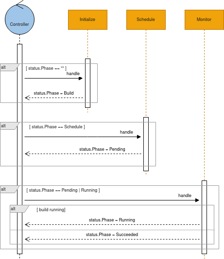

# Build

A **Build** resource, describes the process of assembling a container image that copes with the requirement of an [Integration](integration.md) or [IntegrationKit](integration-kit.md).

The result of a build is an [IntegrationKit](integration-kit.md) that can and should be reused for multiple [Integrations](integration.md).

```go
type Build struct {
	Spec   BuildSpec    (1)
	Status BuildStatus  (2)
}

type BuildSpec struct {
	Tasks []Task        (3)
}
```

<table><tbody><tr><td><i class="conum" data-value="1"></i><b>1</b></td><td>The desired state</td></tr><tr><td><i class="conum" data-value="2"></i><b>2</b></td><td>The status of the object at current time</td></tr><tr><td><i class="conum" data-value="3"></i><b>3</b></td><td>The build tasks</td></tr></tbody></table>

> **Note**
> the full go definition can be found [here](https://github.com/apache/camel-k/blob/main/pkg/apis/camel/v1/build_types.go)



## Build strategy

You can choose from different build strategies. The build strategy defines how a build should be executed. At the moment the available strategies are:

-   buildStrategy: pod (each build is run in a separate pod, the operator monitors the pod state)
    
-   buildStrategy: routine (each build is run as a go routine inside the operator pod)
    

## Build order strategy

You can choose from different build order strategies. The strategy defines in which order queued builds are run. At the moment the available strategies are:

-   buildOrderStrategy: sequential (runs builds strictly sequential so that only one single build per operator namespace is running at a time.)
    
-   buildOrderStrategy: dependencies (strategy looks at the list of dependencies required by an Integration and queues builds that may reuse base images produced by other scheduled builds in order to leverage the incremental build option. The strategy allows non-matching builds to run in parallel to each other.)
    
-   buildOrderStrategy: fifo (performs the builds with first in first out strategy based on the creation timestamp. The strategy allows builds to run in parallel to each other but oldest builds will be run first.)
    

## Build queues

IntegrationKits and its base images should be reused for multiple Integrations in order to accomplish an efficient resource management and to optimize build and startup times for Camel K Integrations.

In order to reuse images the operator is going to queue builds in sequential order. This way the operator is able to use efficient image layering for Integrations.

By default, builds are queued sequentially based on their layout (e.g. native, fast-jar) and the build namespace.

To avoid having many builds running in parallel the operator uses a maximum number of running builds setting that limits the amount of builds running.

You can set this limit in the [IntegrationPlatform](integration-platform.md) settings.

The default values for this limitation is based on the build strategy.

-   buildStrategy: pod (MaxRunningBuilds=10)
    
-   buildStrategy: routine (MaxRunningBuilds=3)