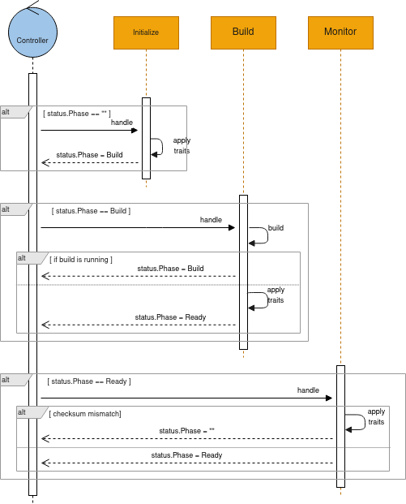

# IntegrationKit

The **IntegrationKit** is a fundamental side resource which describes a container image created by the camel-k operator as well as the configurations that need to be applied to every integration that is executed on top of it. An **IntegrationKit** does not include any source code or resource file defined by the **Integration** from which it has been generated.

```go
type IntegrationKit struct {
	Spec   IntegrationKitSpec   (1)
	Status IntegrationKitStatus (2)
}

type IntegrationKitSpec struct {
	Image         string                 (3)
	Dependencies  []string               (4)
	Repositories  []string               (4)
	Profile       TraitProfile           (5)
	Traits        map[string]TraitSpec   (5)
	Configuration []ConfigurationSpec    (6)
}
```

<table><tbody><tr><td><i class="conum" data-value="1"></i><b>1</b></td><td>The desired state</td></tr><tr><td><i class="conum" data-value="2"></i><b>2</b></td><td>The status of the object at current time</td></tr><tr><td><i class="conum" data-value="3"></i><b>3</b></td><td>The container image</td></tr><tr><td><i class="conum" data-value="4"></i><b>4</b></td><td>The dependencies required by the kit and related repositories (if needed)</td></tr><tr><td><i class="conum" data-value="5"></i><b>5</b></td><td>The traits configuration</td></tr><tr><td><i class="conum" data-value="6"></i><b>6</b></td><td>The integration configuration (properties, secrets, configmaps)</td></tr></tbody></table>

> **Note**
> the full go definition can be found [here](https://github.com/apache/camel-k/blob/main/pkg/apis/camel/v1/integrationkit_types.go)

