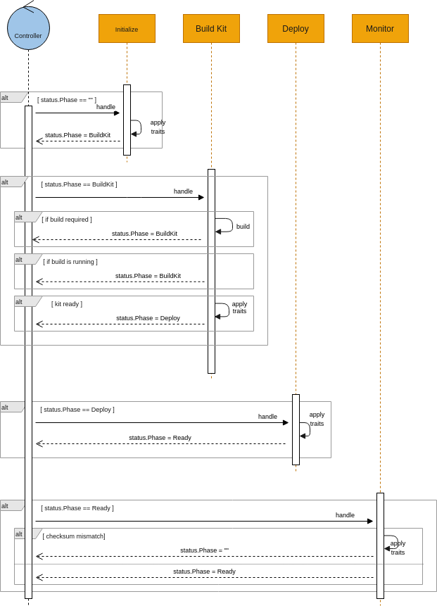

# Integration

An **Integration** describe the application by listing sources, resources, dependencies and by providing configuration options.

```go
type Integration struct {
	Spec   IntegrationSpec   (1)
	Status IntegrationStatus (2)
}

type IntegrationSpec struct {
	Sources            []SourceSpec           (3)
	Flows              []Flow                 (3)
	Resources          []ResourceSpec         (3)
	Dependencies       []string               (4)
	Repositories       []string               (4)
	Profile            TraitProfile           (5)
	Traits             map[string]TraitSpec   (5)
	Configuration      []ConfigurationSpec    (6)
}
```

<table><tbody><tr><td><i class="conum" data-value="1"></i><b>1</b></td><td>The desired state</td></tr><tr><td><i class="conum" data-value="2"></i><b>2</b></td><td>The status of the object at current time</td></tr><tr><td><i class="conum" data-value="3"></i><b>3</b></td><td>Integration sources and resource files</td></tr><tr><td><i class="conum" data-value="4"></i><b>4</b></td><td>The dependencies required by the integration and related repositories (if needed)</td></tr><tr><td><i class="conum" data-value="5"></i><b>5</b></td><td>The traits configuration</td></tr><tr><td><i class="conum" data-value="6"></i><b>6</b></td><td>The integration configuration (properties, secrets, configmaps)</td></tr></tbody></table>

> **Note**
> the full go definition can be found [here](https://github.com/apache/camel-k/blob/main/pkg/apis/camel/v1/integration_types.go)

