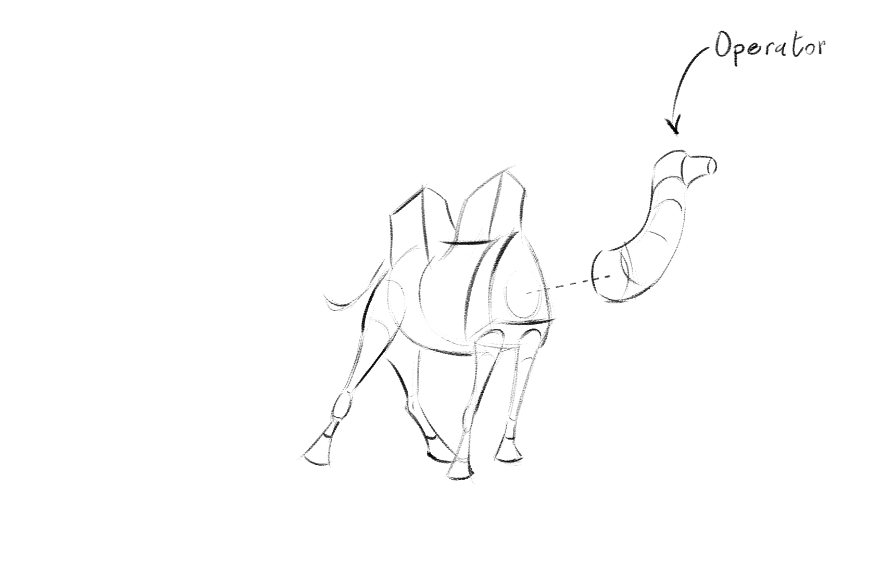
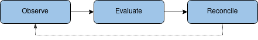
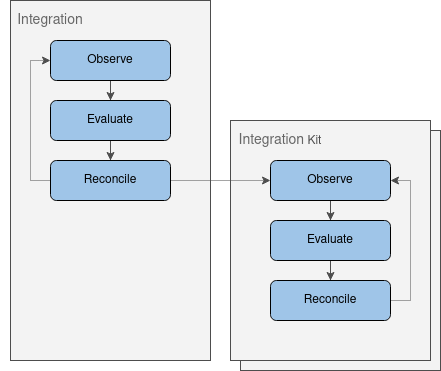
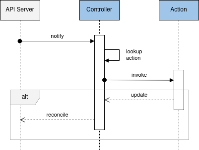

# Operator



Per the Kubernetes glossary, a controller is an application that implements a control-loop that **observes** the shared state of the cluster through the API server, **evaluates** the changes needed to move the current state toward the desired state and finally applies the changes to **reconcile** the resources to the desired state.



This pattern is the foundation of every [Controllers](https://kubernetes.io/docs/concepts/architecture/controller/) shipped by default by Kubernetes but can also be used by [Operators](https://kubernetes.io/docs/concepts/extend-kubernetes/operator) that are controllers that encode domain specific knowledge and extends the Kubernetes API to create, configure and manage instances of complex applications on behalf of Kubernetes users.

With the Camel K Operator we have moved this pattern to the next level as it goes beyond the tasks to install and maintain applications but materializes them according to the integration logic expressed through the **Camel DSL**.

The Camel K Operator defines a number of new Kubernetes API through the [**Custom Resource** (CR)](https://kubernetes.io/docs/concepts/extend-kubernetes/#user-defined-types) extension mechanism:

-   [IntegrationPlatform](cr/integration-platform.md)
    
-   [Integration](cr/integration.md)
    
-   [IntegrationKit](cr/integration-kit.md)
    
-   [Build](cr/build.md)
    
-   [CamelCatalog](cr/camel-catalog.md)
    

All the api conform to the Kubernetes [api conventions](https://github.com/kubernetes/community/blob/master/contributors/devel/sig-architecture/api-conventions.md).

To manage the interaction with them, a simple control loop was not enough. So we ended up with a sort of “Hierarchical Operator Pattern” where the reconcile phase may trigger other controllers and supervises them.



## State Machine

With the exception of the `CamelCatalog`, each CR has a dedicated state machine in charge to orchestrate the transition to the phases each CR needs to go through to bring integrations to the desired state.



Each state of the CR is handled by a dedicated handler, named `Action`, defined as follows:

```go
type Action interface {
	CanHandle(cr *v1.CR) bool (1)
	Handle(ctx context.Context, cr *v1.CR) (*v1.CR, error) (2)
}
```

<table><tbody><tr><td><i class="conum" data-value="1"></i><b>1</b></td><td>Determine if the action can handle the CR as an example by looking at the phase of the CR which is stored as part of the status sub resource.</td></tr><tr><td><i class="conum" data-value="2"></i><b>2</b></td><td>Implement the action and return a non <code>nil</code> instance to signal to the controller that the CR needs to be updated with the new one, instead, if the method returns a <code>nil</code> instance, then nothing will happen and unless the CR changes outside the control of the operator, the same action will be invoked on the next iteration. This is useful when a CR needs to delegate some work to a different controller so the CR won’t be moved to the next stage till the sub operation has completed.</td></tr></tbody></table>

> **Note**
> Since the go language does not yet support generics, there is an `Action` definition per CR, The full list of definitions can be found in the [controller package](https://github.com/apache/camel-k/tree/main/pkg/controller)

## Operator resource mapping

By default, the Camel K operator (global mode) will manage all Camel K resources on the cluster doing the reconciliation loops for the resources in order to apply the mentioned state machine.

For clusters with multiple Camel K tenants this approach is not going to work as user groups may want to separate the workloads with respective authentication and authorization schemes. For multi tenancy the Camel K operator uses an operator id that can be applied to resources in the form of an annotation. The annotation selects the operator that should handle the resource.

This approach allows multiple Camel K installations and operators on the same cluster with each operator handling an explicit set of Camel K resources identified by the operator id.

By default, the Camel K operator has the id `camel-k` and users with only one single installation on the cluster will not even notice the existence of this identifier. When an administrator wants to add more Camel K operator installations to the cluster the operator id needs to be unique and resources should be annotated with the respective annotation `camel.apache.org/operator.id=<operator-id>`. With this approach we make sure that only one single operator installation manages a resource at a time.

Read more about this topic in [Multiple Operators and Selective Upgrades](../installation/advanced/multi.md)