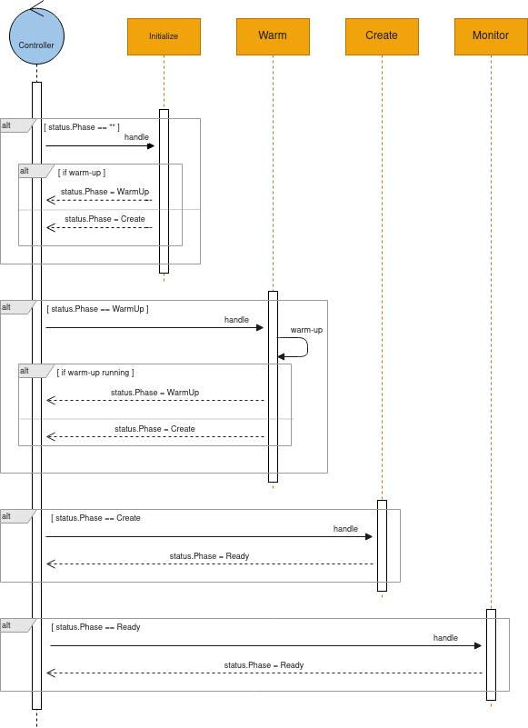

# IntegrationPlatform

The **IntegrationPlatform** CR is the resource used to control the behavior of the Camel K Operator.

> **Note**
> this custom resource is deprecated since version 2.11.0

```go
type IntegrationPlatform struct {
	Spec   IntegrationPlatformSpec   (1)
	Status IntegrationPlatformStatus (2)
}

type IntegrationPlatformSpec struct {
	Cluster       IntegrationPlatformCluster       (3)
	Profile       TraitProfile                     (4)
	Pipeline      IntegrationPlatformPipelineSpec  (5)
	Traits        map[string]TraitSpec             (6)
	Configuration []ConfigurationSpec              (6)
	Kamelet       []IntegrationPlatformKameletSpec (7)
}
```

<table><tbody><tr><td><i class="conum" data-value="1"></i><b>1</b></td><td>The desired state</td></tr><tr><td><i class="conum" data-value="2"></i><b>2</b></td><td>The status of the object at current time</td></tr><tr><td><i class="conum" data-value="3"></i><b>3</b></td><td>The type of the Kubernetes Cluster (Kubernetes or OpenShift)</td></tr><tr><td><i class="conum" data-value="4"></i><b>4</b></td><td>Configures the traits that have to be applied by default (Kubernetes, OpenShift, Knative)</td></tr><tr><td><i class="conum" data-value="5"></i><b>5</b></td><td>Configuration options of the image build process such as the type of the builder, the container registry and the maven repositories that have to be configured in order retrieve the artifacts needed by the integrations.</td></tr><tr><td><i class="conum" data-value="6"></i><b>6</b></td><td>The traits and configuration options (properties, secrets, configmaps) that have to be propagated to each integration.</td></tr><tr><td><i class="conum" data-value="7"></i><b>7</b></td><td>Locations to look up Kamelet definitions</td></tr></tbody></table>

> **Note**
> the full go definition can be found [here](https://github.com/apache/camel-k/blob/main/pkg/apis/camel/v1/integrationplatform_types.go)

Upon start-up, the operator checks if the **IntegrationPlatform** is ready and if not, it executes all the steps required to be ready to operate:

