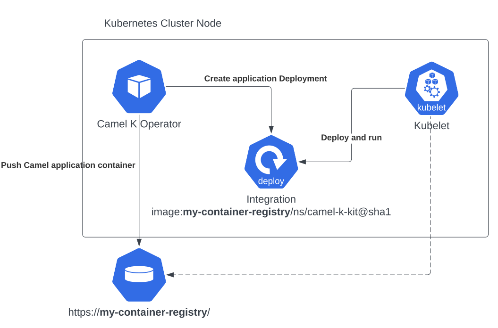

# Configuring Registry

Every Camel K installation needs a container registry that will be used to host integration container images. This is required to host the images that will be used by Kubernetes to execute the Camel application you’ve built.



The Camel K operator is in charge to build a Camel application and to "containerize" it, storing the result into a container registry. The same registry is used by the cluster to run the Camel application. Basically the operator push the image and the cluster pull it from the same source.

For the reason above it’s important that you provide a container registry which is accessible from both the operator Pod and the cluster internal mechanisms. However, a **default registry** is present in certain platforms such as _Minikube_, _Openshift_ or _Docker Desktop_.

For any other platform that do not provide a default container registry, then, a container registry must be provided accordingly.

You will need to add or edit any existing registry environment variable configuration according your installation method. These are the variables you can configure:

  
| Name | Description | Default Value |
| --- | --- | --- |
| REGISTRY\_ADDRESS | Address (URL, hostname or IP address) of the container registry. |  |
| REGISTRY\_SVC\_NAMESPACE | Kubernetes namespace where the container registry service is deployed. |  |
| REGISTRY\_SVC\_NAME | Name of the Kubernetes service exposing the container registry. |  |
| REGISTRY\_INSECURE | Whether to allow insecure (non-TLS) connections to the registry. | false |
| REGISTRY\_SECRET | Name of the Kubernetes secret used for registry authentication. |  |
| REGISTRY\_CA\_CONFIGMAP | Name of the ConfigMap containing the registry CA certificate. |  |
| REGISTRY\_ORGANIZATION | Organization or namespace within the registry used for images. | <operator-namespace> |

You need to provide at least the `REGISTRY_ADDRESS` parameter or `REGISTRY_SVC_NAME` (and additionally `REGISTRY_SVC_NAMESPACE` if the registry is in a namespace different from the operator namespace).

> **Note**
> if you configure `REGISTRY_SVC_NAME` you need to make sure the the Service with the given name can be read by the operator, assigning the proper RBAC privileges.

## How to configure Camel K container registry

When running a production grade installation, you’ll be probably using a private container registry which is accessible via authenticated method. The secret is something that will be [included at deployment time](https://kubernetes.io/docs/tasks/configure-pod-container/pull-image-private-registry/#create-a-pod-that-uses-your-secret) as `imagePullSecret` configuration.

### Create a secret for your registry

The easiest way to create a Secret is to leverage the `kubectl` CLI:

```bash
kubectl create secret docker-registry registry --docker-server <my-registry-address> --docker-username <my-user> --docker-password <my-password>
```

> **Note**
> you must include `--docker-server docker.io` value also if you’re using Docker Hub. The default value provided by `kubectl` won’t.

As each registry may have a slightly different way of securing the access you can use the generic guidelines provided in and adjust accordingly (more information in the [Secret registry configuration](registry/registry-secret.md) guide). We expect that at the end of the process you have a public address (1) an _organization_ (2) (optional, see details below) and a _secret_ (3) values that will be used to configure the registry.

### Role of the organization parameter

The `organization` parameter is optional. When it’s missing, the operator will use the operator namespace name to create an image within such organization name. When you’re using an container registry you may be limited to store image in a given organization only. In this case, you must provide the name of such `organization` with this option.

## Container registry requirements

Each platform may have its default registry of choice. And each container registry may have a slight different configuration. Please, be aware that we won’t be able to support all the available solutions.

The only requirement we have is that the registry must be able to produce/consume images with the following tagging convention: `<registry-host>[:<registry-port>]/<k8s-namespace>/kit-<hash-code>@sha256:<sha256-code>`, ie `10.110.251.124/default/kit-ck0612dahvgs73ffe5g0@sha256:3c9589dd093b689aee6bf5c2d35aa1fce9d0e76d5bb7da8b61d87e7a1ed6f36a`.

This should be within the standard convention adopted by [pulling a Docker image by digest](https://docs.docker.com/engine/reference/commandline/pull/#pull-an-image-by-digest-immutable-identifier) (immutable).

> **Note**
> you can configure Camel K to use an insecure private registry. However, your Kubernetes cluster may not be able to [pull images from an insecure registry without proper configuration](https://github.com/apache/camel-k/issues/4720#issuecomment-1708228367).

### Special container registry requirements

We have some hints that can help you configuring on the most common platforms:

-   [Docker Desktop](registry/special/docker-desktop.md)
    
-   [Gcr.io](registry/special/gcr.md)
    
-   [Github Packages](registry/special/github.md)
    
-   [IBM Container Registry](registry/special/icr.md)
    
-   [Kind](registry/special/kind.md)
    
-   [Minikube](registry/special/minikube.md)
    
-   [Openshift](registry/special/openshift.md)
    

## Run your own container registry

You can also [run your own registry](registry/special/own.md), but this option is recommended only for advanced use cases as it may requires certain changes in the cluster configuration, so, make sure to understand how each change may affect your cluster. As you’ve seen in the diagram above, the cluster has to be aware of the presence of the registry in order to pull the images pushed by the operator.