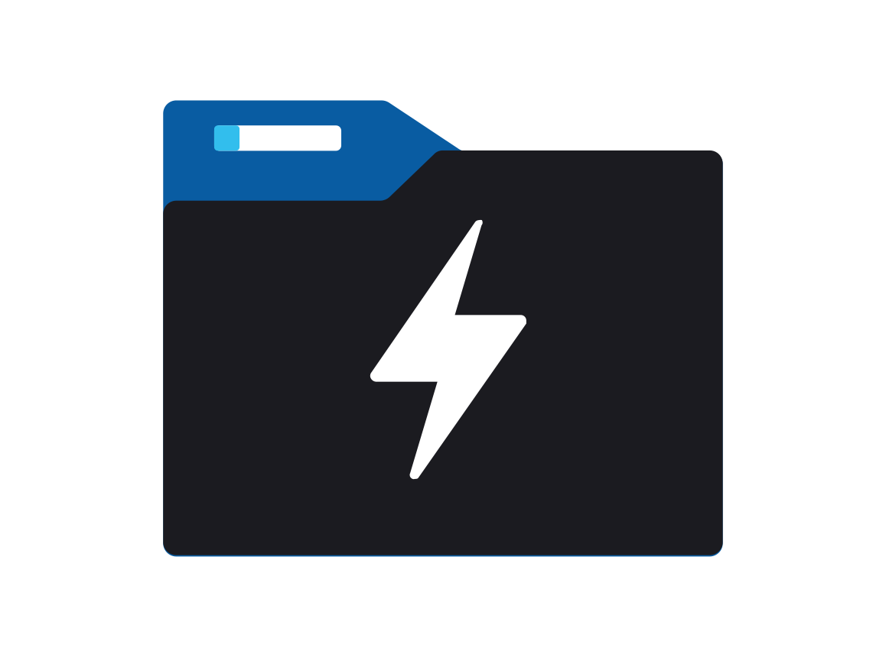

#  Azure Storage Blob Data Lake Sink

**Provided by: "Apache Software Foundation"**

**Support Level for this Kamelet is: "Stable"**

Send data to Azure Storage Blob Data Lake.

## Configuration Options

The following table summarizes the configuration options available for the `azure-storage-datalake-sink` Kamelet:

     
| Property | Name | Description | Type | Default | Example |
| --- | --- | --- | --- | --- | --- |
| **accountName** | Account Name | **Required** The Azure Storage Blob Data lake account name. | string |  |  |
| **clientId** | Client Id | **Required** The Azure Storage Blob Data lake client Id. | string |  |  |
| **clientSecret** | Client Secret | **Required** The Azure Storage Blob Data lake client secret. | string |  |  |
| **fileSystemName** | File System Name | **Required** The Azure Storage Blob Data lake File system name. | string |  |  |
| **tenantId** | Tenant Id | **Required** The Azure Storage Blob Data lake tenant id. | string |  |  |
| **credentialType** | Credential Type | Determines the credential strategy to adopt. Enum values: \* CLIENT\_SECRET \* SHARED\_KEY\_CREDENTIAL \* AZURE\_IDENTITY \* AZURE\_SAS \* SERVICE\_CLIENT\_INSTANCE | string | CLIENT\_SECRET |  |

## Dependencies

At runtime, the `azure-storage-datalake-sink` Kamelet relies upon the presence of the following dependencies:

-   camel:azure-storage-datalake
    
-   camel:kamelet
    
-   camel:core
    
-   camel:timer
    

## Camel JBang usage

### **Prerequisites**

-   You’ve installed [JBang](https://www.jbang.dev/).
    
-   You have executed the following command:
    

```shell
jbang app install camel@apache/camel
```

Supposing you have a file named route.yaml with this content:

```yaml
- route:
    from:
      uri: "kamelet:timer-source"
      parameters:
        period: 10000
        message: 'test'
      steps:
        - to:
            uri: "kamelet:azure-storage-datalake-sink"
```

You can now run it directly through the following command

```shell
camel run route.yaml
```

## Azure Storage Datalake Sink Kamelet Description

### Authentication methods

In this Kamelet, you can use these Azure authentication methods:

-   Client secret: `CLIENT_SECRET` (default)
    
-   Azure SAS: `AZURE_SAS`
    
-   Azure Identity mechanism: `AZURE_IDENTITY`
    
-   Plain Shared Account Key: `SHARED_ACCOUNT_KEY`
    
-   Service client instance: `SERVICE_CLIENT_INSTANCE`
    
-   Shared key credentials: `SHARED_KEY_CREDENTIAL`
    

The order of evaluation for `AZURE_IDENTITY` is the following:

-   Enviroment
    
-   Workload Identity
    
-   Managed Identity
    
-   Azure Developer CLI
    
-   IntelliJ
    
-   Azure CLI
    
-   Azure Powershell
    

For more information, see the [Azure Identity documentation](https://learn.microsoft.com/en-us/java/api/overview/azure/identity-readme)

### Optional Headers

In the headers, you can set the `file` / `ce-file` property to specify the filename to upload. If you do set property in the header, the Kamelet uses the exchange ID as filename.

## Kamelet source file

[https://github.com/apache/camel-kamelets/blob/main/kamelets/azure-storage-datalake-sink.kamelet.yaml](https://github.com/apache/camel-kamelets/blob/main/kamelets/azure-storage-datalake-sink.kamelet.yaml)