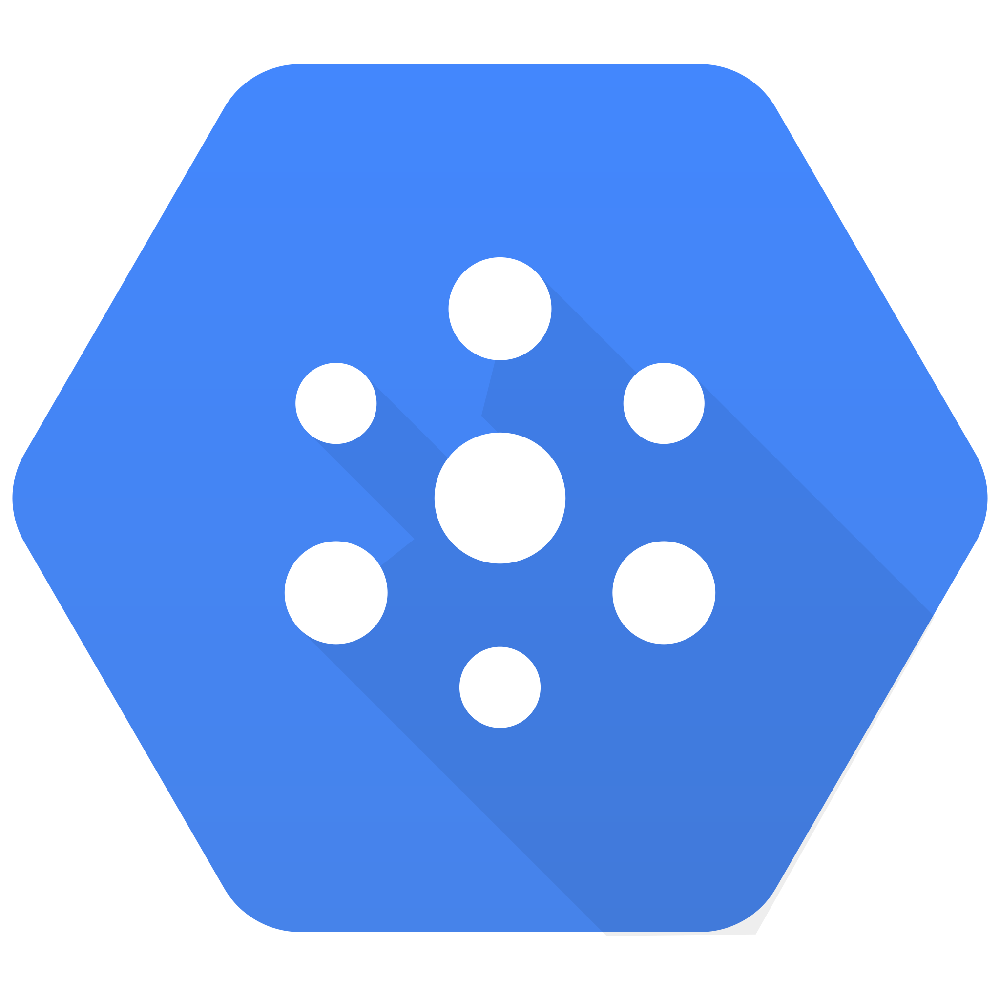

#  Google Pubsub Source

**Provided by: "Apache Software Foundation"**

**Support Level for this Kamelet is: "Stable"**

Consume messages from Google Cloud Pub/Sub.

## Configuration Options

The following table summarizes the configuration options available for the `google-pubsub-source` Kamelet:

     
| Property | Name | Description | Type | Default | Example |
| --- | --- | --- | --- | --- | --- |
| **projectId** | Project Id | **Required** The Google Cloud Pub/Sub Project ID. | string |  |  |
| **subscriptionName** | Subscription Name | **Required** The subscription name. | string |  |  |
| **concurrentConsumers** | Concurrent Consumers | The number of parallel streams to consume from the subscription. | integer | 1 |  |
| **maxMessagesPerPoll** | Max Messages Per Poll | The maximum number of messages to receive from the server in a single API call. | integer | 1 |  |
| **serviceAccountKey** | Service Account Key | The service account key to use as credentials for the Pub/Sub publisher/subscriber. You must encode this value in base64. | binary |  |  |
| **synchronousPull** | Synchronous Pull | Specifies to synchronously pull batches of messages. | boolean | false |  |

## Dependencies

At runtime, the `google-pubsub-source` Kamelet relies upon the presence of the following dependencies:

-   camel:kamelet
    
-   camel:google-pubsub
    
-   camel:jackson
    

## Camel JBang usage

### **Prerequisites**

-   You’ve installed [JBang](https://www.jbang.dev/).
    
-   You have executed the following command:
    

```shell
jbang app install camel@apache/camel
```

Supposing you have a file named route.yaml with this content:

```yaml
- route:
    from:
      uri: "kamelet:google-pubsub-source"
      parameters:
        .
        .
        .
      steps:
        - to:
            uri: "kamelet:log-sink"
```

You can now run it directly through the following command

```shell
camel run route.yaml
```

## Google Pubsub Source Kamelet Description

### Authentication methods

This Kamelet uses Service Account Key authentication to connect to Google Cloud Pub/Sub. You need to provide:

-   A service account key encoded in base64 format
    
-   The Google Cloud Project ID
    
-   The subscription name from which to consume messages
    

### Output format

The Kamelet consumes messages from Google Cloud Pub/Sub and produces the message data in JSON format.

### Configuration

The Kamelet requires the following parameters:

-   `projectId`: The Google Cloud Pub/Sub Project ID
    
-   `subscriptionName`: The subscription name
    

Optional parameters: - `serviceAccountKey`: The service account key to use as credentials (must be base64 encoded) - `synchronousPull`: Specifies to synchronously pull batches of messages (default: false) - `maxMessagesPerPoll`: The maximum number of messages to receive from the server in a single API call (default: 1) - `concurrentConsumers`: The number of parallel streams to consume from the subscription (default: 1)

### Usage example

```yaml
apiVersion: camel.apache.org/v1alpha1
kind: KameletBinding
metadata:
  name: google-pubsub-source-binding
spec:
  source:
    ref:
      kind: Kamelet
      apiVersion: camel.apache.org/v1alpha1
      name: google-pubsub-source
    properties:
      projectId: "my-gcp-project"
      subscriptionName: "my-subscription"
      serviceAccountKey: "{{service-account-key-base64}}"
      synchronousPull: true
      maxMessagesPerPoll: 10
      concurrentConsumers: 2
  sink:
    ref:
      kind: Service
      apiVersion: v1
      name: my-service
```

## Kamelet source file

[https://github.com/apache/camel-kamelets/blob/main/kamelets/google-pubsub-source.kamelet.yaml](https://github.com/apache/camel-kamelets/blob/main/kamelets/google-pubsub-source.kamelet.yaml)