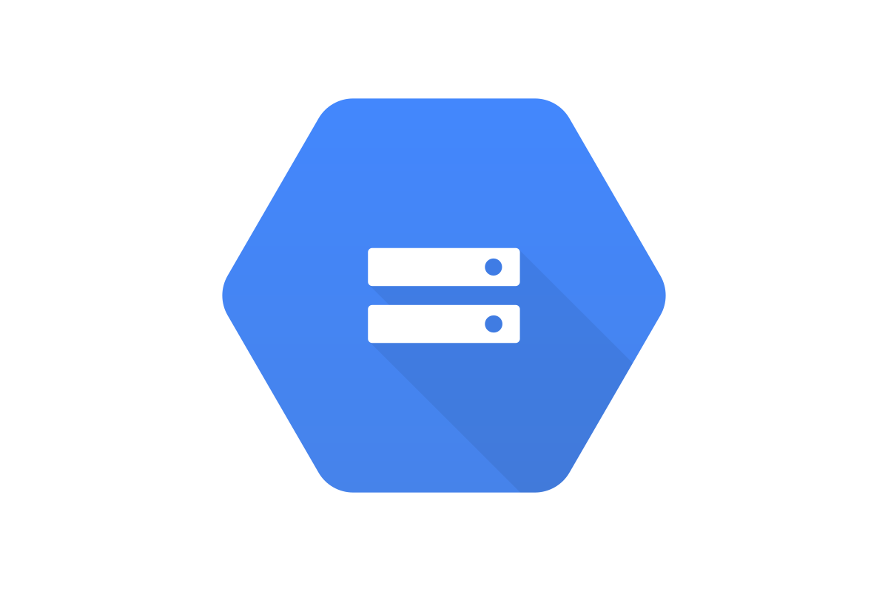

#  Google Storage Source

**Provided by: "Apache Software Foundation"**

**Support Level for this Kamelet is: "Stable"**

Consume objects from Google Cloud Storage.

## Configuration Options

The following table summarizes the configuration options available for the `google-storage-source` Kamelet:

     
| Property | Name | Description | Type | Default | Example |
| --- | --- | --- | --- | --- | --- |
| **bucketNameOrArn** | Bucket Name Or ARN | **Required** The Google Cloud Storage bucket name or Bucket Amazon Resource Name (ARN). | string |  |  |
| **autoCreateBucket** | Autocreate Bucket | Specifies to automatically create the Google Cloud Storage bucket. | boolean | false |  |
| **deleteAfterRead** | Auto-delete Objects | Specifies to delete objects after consuming them. | boolean | true |  |
| **filter** | Filter | A regular expression to include only blobs with name matching it. | string |  |  |
| **prefix** | Prefix | The prefix which is used in the BlobListOptions to only consume objects we are interested in. | string |  |  |
| **serviceAccountKey** | Service Account Key | The service account key to use as credentials for Google Cloud Storage access. You must encode this value in base64. | binary |  |  |

## Dependencies

At runtime, the `google-storage-source` Kamelet relies upon the presence of the following dependencies:

-   camel:kamelet
    
-   camel:google-storage
    
-   camel:jackson
    

## Camel JBang usage

### **Prerequisites**

-   You’ve installed [JBang](https://www.jbang.dev/).
    
-   You have executed the following command:
    

```shell
jbang app install camel@apache/camel
```

Supposing you have a file named route.yaml with this content:

```yaml
- route:
    from:
      uri: "kamelet:google-storage-source"
      parameters:
        .
        .
        .
      steps:
        - to:
            uri: "kamelet:log-sink"
```

You can now run it directly through the following command

```shell
camel run route.yaml
```

## Google Storage Source Kamelet Description

### Authentication methods

This Kamelet uses Service Account Key authentication to connect to Google Cloud Storage. You need to provide:

-   A service account key encoded in base64 format (optional, can use default credentials)
    
-   The bucket name or Amazon Resource Name (ARN) from which to consume objects
    

### Output format

The Kamelet consumes objects from Google Cloud Storage and produces the object data.

### Configuration

The Kamelet requires the following parameters:

-   `bucketNameOrArn`: The Google Cloud Storage bucket name or Bucket Amazon Resource Name (ARN)
    

Optional parameters: - `serviceAccountKey`: The service account key to use as credentials (must be base64 encoded) - `deleteAfterRead`: Specifies to delete objects after consuming them (default: true) - `autoCreateBucket`: Specifies to automatically create the Google Cloud Storage bucket (default: false) - `prefix`: The prefix which is used in the BlobListOptions to only consume objects we are interested in

### Usage example

```yaml
apiVersion: camel.apache.org/v1alpha1
kind: KameletBinding
metadata:
  name: google-storage-source-binding
spec:
  source:
    ref:
      kind: Kamelet
      apiVersion: camel.apache.org/v1alpha1
      name: google-storage-source
    properties:
      bucketNameOrArn: "my-storage-bucket"
      serviceAccountKey: "{{service-account-key-base64}}"
      deleteAfterRead: false
      autoCreateBucket: false
      prefix: "data/"
  sink:
    ref:
      kind: Service
      apiVersion: v1
      name: my-service
```

## Kamelet source file

[https://github.com/apache/camel-kamelets/blob/main/kamelets/google-storage-source.kamelet.yaml](https://github.com/apache/camel-kamelets/blob/main/kamelets/google-storage-source.kamelet.yaml)