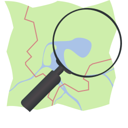

#  Nominatim GeoCode Action

**Provided by: "Apache Software Foundation"**

**Support Level for this Kamelet is: "Stable"**

Find locations on Earth by name and address.

## Configuration Options

The following table summarizes the configuration options available for the `nominatim-geocode-action` Kamelet:

     
| Property | Name | Description | Type | Default | Example |
| --- | --- | --- | --- | --- | --- |
| **serverUrl** | Server URL | **Required** Url of the Nominatim server. | string |  | https://nominatim.openstreetmap.org |

## Dependencies

At runtime, the `nominatim-geocode-action` Kamelet relies upon the presence of the following dependencies:

-   camel:core
    
-   camel:jackson
    
-   camel:geocoder
    
-   camel:kamelet
    

## Camel JBang usage

### **Prerequisites**

-   You’ve installed [JBang](https://www.jbang.dev/).
    
-   You have executed the following command:
    

```shell
jbang app install camel@apache/camel
```

Supposing you have a file named route.yaml with this content:

```yaml
- route:
    from:
      uri: "kamelet:timer-source"
      parameters:
        period: 10000
        message: 'test'
      steps:
        - to:
            uri: "kamelet:nominatim-geocode-action"
            parameters:
            .
            .
            .
        - to:
            uri: "kamelet:log-sink"
```

You can now run it directly through the following command

```shell
camel run route.yaml
```

## Kamelet source file

[https://github.com/apache/camel-kamelets/blob/main/kamelets/nominatim-geocode-action.kamelet.yaml](https://github.com/apache/camel-kamelets/blob/main/kamelets/nominatim-geocode-action.kamelet.yaml)