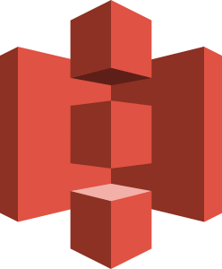
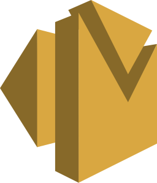
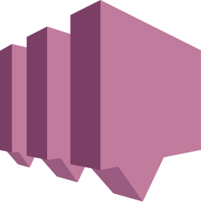
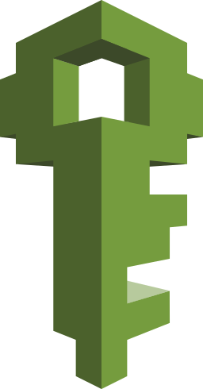
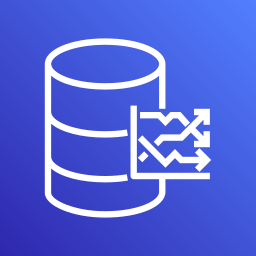

# Camel Kamelets Documentation Index

Index of Camel Kamelets documentation pages.

# Kamelet Catalog

## Kamelet specification

Kamelets were originally born for Kubernetes and they have eventually moved to be used as Camel core resources. Its specification is a [Kubernetes CRD specification](apis/spec.md). You can use it in your project by using Maven dependency `org.apache.camel.kamelets:camel-kamelets-crds`.

## Development guide

Kamelets are extensible components. Look at the guide and learn [how to develop a new Kamelet](development.md).

## Compatibility Matrix

Compatibility between Kamelets catalog and Camel core    
| Camel-Kamelets Version | Using Camel Version | LTS Until | Branch |
| --- | --- | --- | --- |
| [Next (Pre-release)](index.md) | [4.8.0](../../components/next/index.md) |  | [main](https://github.com/apache/camel-kamelets) |
| [4.18.x (LTS)](../4.18.x/index.md) | [4.18.0](../../components/4.18.x/index.md) |  | [4.18.x](https://github.com/apache/camel-kamelets/tree/4.18.x) |
| [4.14.x (LTS)](../4.14.x/index.md) | [4.14.0](../../components/4.14.x/index.md) |  | [4.14.x](https://github.com/apache/camel-kamelets/tree/4.14.x) |

This page contains the default Apache Camel Kamelets catalog.

Consult the Kamelets User Guide for information about how to use these.

**We love contributions for this catalog**: you can follow the Kamelets Developer Guide for information on how to create new Kamelets and contribute them to the official [github.com/apache/camel-kamelets](https://github.com/apache/camel-kamelets/) repository.

[Camel Kamelets API](apis/spec.md)

[Camel Kamelets API](apis/spec.md)

 [ Avro Deserialize Action](avro-deserialize-action.html)

 [ Avro Serialize Action](avro-serialize-action.html)

 [ AWS Bedrock Agent Runtime Sink](aws-bedrock-agent-runtime-sink.html)

 [ AWS Bedrock Text Sink](aws-bedrock-text-sink.html)

 [ AWS Cloudtrail Source](aws-cloudtrail-source.html)

 [ AWS CloudWatch Metrics Sink](aws-cloudwatch-sink.html)

 [ AWS Comprehend Sink](aws-comprehend-sink.html)

 [ AWS DynamoDB Sink](aws-ddb-sink.html)

 [ AWS DynamoDB Streams Source](aws-ddb-streams-source.html)

 [ AWS EC2 Sink](aws-ec2-sink.html)

 [ AWS Eventbridge Sink](aws-eventbridge-sink.html)

 [ AWS Kinesis Firehose Sink](aws-kinesis-firehose-sink.html)

 [ AWS Kinesis Sink](aws-kinesis-sink.html)

 [ AWS Kinesis Source](aws-kinesis-source.html)

 [ AWS Lambda Sink](aws-lambda-sink.html)

 [ AWS Polly Sink](aws-polly-sink.html)

 [ AWS Redshift Sink](aws-redshift-sink.html)

 [ AWS Redshift Source](aws-redshift-source.html)

 [ AWS S3 Event Based Source](aws-s3-event-based-source.html)

 [ AWS S3 Sink](aws-s3-sink.html)

 [ AWS S3 Source](aws-s3-source.html)

 [ AWS S3 Streaming upload Sink](aws-s3-streaming-upload-sink.html)

 [ AWS Secrets Manager Sink](aws-secrets-manager-sink.html)

 [ AWS SES Sink](aws-ses-sink.html)

 [ AWS SNS FIFO Sink](aws-sns-fifo-sink.html)

 [ AWS SNS Sink](aws-sns-sink.html)

 [ AWS SQS Batch Sink](aws-sqs-batch-sink.html)

 [ AWS SQS FIFO Sink](aws-sqs-fifo-sink.html)

 [ AWS SQS Sink](aws-sqs-sink.html)

 [ AWS SQS Source](aws-sqs-source.html)

 [ AWS STS Assume Role Action](aws-sts-assume-role-action.html)

 [ AWS Timestream Query Sink](aws-timestream-query-sink.html)

 [ AWS Translate Action](aws-translate-action.html)

 [ Azure CosmosDB Sink](azure-cosmosdb-sink.html)

 [ Azure CosmosDB Source](azure-cosmosdb-source.html)

 [ Azure Eventhubs Sink](azure-eventhubs-sink.html)

 [ Azure Eventhubs Source](azure-eventhubs-source.html)

 [ Azure Function Sink](azure-functions-sink.html)

 [ Azure Servicebus Sink](azure-servicebus-sink.html)

 [ Azure Servicebus Source](azure-servicebus-source.html)

 [ Azure Storage Blob Append Sink](azure-storage-blob-append-sink.html)

 [ Azure Storage Blob Changefeed Source](azure-storage-blob-changefeed-source.html)

 [ Azure Storage Blob Event-based Source](azure-storage-blob-event-based-source.html)

 [ Azure Storage Blob Sink](azure-storage-blob-sink.html)

 [ Azure Storage Blob Source](azure-storage-blob-source.html)

 [ Azure Storage Blob Data Lake Sink](azure-storage-datalake-sink.html)

 [ Azure Storage Blob Data Lake Source](azure-storage-datalake-source.html)

 [ Azure Storage Files Sink](azure-storage-files-sink.html)

 [ Azure Storage File Source](azure-storage-files-source.html)

 [ Azure Storage Queue Sink](azure-storage-queue-sink.html)

 [ Azure Storage Queue Source](azure-storage-queue-source.html)

 [ Bitcoin Source](bitcoin-source.html)

 [ Caffeine Action](caffeine-action.html)

 [ Cassandra Sink](cassandra-sink.html)

 [ Cassandra Source](cassandra-source.html)

 [ Ceph Sink](ceph-sink.html)

 [ Ceph Source](ceph-source.html)

 [ Chuck Norris Source](chuck-norris-source.html)

 [ Chunk Template Action](chunk-template-action.html)

 [ Couchbase Sink](couchbase-sink.html)

 [ Counter Source](counter-source.html)

 [ Cron Source](cron-source.html)

 [ Crypto Decrypt Action](crypto-decrypt-action.html)

 [ Crypto Encrypt Action](crypto-encrypt-action.html)

 [ Data Type Action](data-type-action.html)

 [ Databricks Sink](databricks-sink.html)

 [ Databricks Source](databricks-source.html)

 [ Delay Action](delay-action.html)

 [ Image-to-Text Action](djl-image-to-text-action.html)

 [ DNS DIG Action](dns-dig-action.html)

 [ DNS IP Action](dns-ip-action.html)

 [ DNS Lookup Action](dns-lookup-action.html)

 [ Drop Field Action](drop-field-action.html)

 [ Drop Header Action](drop-header-action.html)

 [ Drop Headers Action](drop-headers-action.html)

 [ Dropbox Sink](dropbox-sink.html)

 [ Dropbox Source](dropbox-source.html)

 [ Earthquake Source](earthquake-source.html)

 [ ElasticSearch Index Sink](elasticsearch-index-sink.html)

 [ ElasticSearch Search Source](elasticsearch-search-source.html)

 [ Exec Sink](exec-sink.html)

 [ Extract Field Action](extract-field-action.html)

 [ FHIR Sink](fhir-sink.html)

 [ FHIR Source](fhir-source.html)

 [ File Watch Source](file-watch-source.html)

 [ Freemarker Template Action](freemarker-template-action.html)

 [ FTP Sink](ftp-sink.html)

 [ FTP Source](ftp-source.html)

 [ FTPS Sink](ftps-sink.html)

 [ FTPS Source](ftps-source.html)

 [ GitHub Commit Source](github-commit-source.html)

 [ GitHub Event Source](github-event-source.html)

 [ GitHub Pull Request Comments Source](github-pullrequest-comment-source.html)

 [ GitHub Pull Request Source](github-pullrequest-source.html)

 [ GitHub Tag Source](github-tag-source.html)

 [ Google Big Query Sink](google-bigquery-sink.html)

 [ Google Calendar Source](google-calendar-source.html)

 [ Google Functions Sink](google-functions-sink.html)

 [ Google Mail Source](google-mail-source.html)

 [ Google Pubsub Sink](google-pubsub-sink.html)

 [ Google Pubsub Source](google-pubsub-source.html)

 [ Google Sheets Sink](google-sheets-sink.html)

 [ Google Sheets Source](google-sheets-source.html)

 [ Google Storage Event-based Source](google-storage-event-based-source.html)

 [ Google Storage Sink](google-storage-sink.html)

 [ Google Storage Source](google-storage-source.html)

 [ Google Vertex AI Sink](google-vertexai-sink.html)

 [ GraphQL Sink](graphql-sink.html)

 [ Has Header Filter Action](has-header-filter-action.html)

 [ Header Matches Filter Action](header-matches-filter-action.html)

 [ Hoist Field Action](hoist-field-action.html)

 [ Secured HTTP Sink](http-secured-sink.html)

 [ HTTP Secured Source](http-secured-source.html)

 [ HTTP Sink](http-sink.html)

 [ HTTP Source](http-source.html)

 [ IBM Cloud Object Storage Sink](ibm-cos-sink.html)

 [ IBM Cloud Object Storage Source](ibm-cos-source.html)

 [ IBM Watson Natural Language Understanding Sink](ibm-watson-language-sink.html)

 [ Infinispan Sink](infinispan-sink.html)

 [ Infinispan Source](infinispan-source.html)

 [ Insert Field Action](insert-field-action.html)

 [ Insert Header Action](insert-header-action.html)

 [ Is Tombstone Filter Action](is-tombstone-filter-action.html)

 [ Jira Add Comment Sink](jira-add-comment-sink.html)

 [ Jira Add Issue Sink](jira-add-issue-sink.html)

 [ Jira oauth Source](jira-oauth-source.html)

 [ Jira Source](jira-source.html)

 [ Jira Transition Issue Sink](jira-transition-issue-sink.html)

 [ Jira Update Issue Sink](jira-update-issue-sink.html)

 [ JMS - AMQP 1.0 Sink](jms-amqp-10-sink.html)

 [ JMS - AMQP 1.0 Source](jms-amqp-10-source.html)

 [ JMS - AMQP 1.0 SSL Sink](jms-amqp-10-ssl-sink.html)

 [ JMS - AMQP 1.0 SSL Source](jms-amqp-10-ssl-source.html)

 [ JMS - Apache Artemis Sink](jms-apache-artemis-sink.html)

 [ JMS - Apache Artemis Source](jms-apache-artemis-source.html)

 [ JMS - IBM MQ Sink](jms-ibm-mq-sink.html)

 [ JMS - IBM MQ Source](jms-ibm-mq-source.html)

 [ JMS Pooled - Apache Artemis Sink](jms-pooled-apache-artemis-sink.html)

 [ JMS Pooled - Apache Artemis Source](jms-pooled-apache-artemis-source.html)

 [ Jolt Transformation Action](jolt-transformation-action.html)

 [ JSLT Action](jslt-action.html)

 [ Json Deserialize Action](json-deserialize-action.html)

 [ Json Patch Action](json-patch-action.html)

 [ Json Schema Validator Action](json-schema-validator-action.html)

 [ Json Serialize Action](json-serialize-action.html)

 [ Jsonata Action](jsonata-action.html)

 [ Kafka Not Secured with Apicurio Registry Sink](kafka-apicurio-registry-not-secured-sink.html)

 [ Kafka Not Secured with Apicurio Registry Source](kafka-apicurio-registry-not-secured-source.html)

 [ Azure Kafka through Eventhubs with Azure Schema Registry Sink](kafka-azure-schema-registry-sink.html)

 [ Azure Kafka through Eventhubs with Azure Schema Registry Source](kafka-azure-schema-registry-source.html)

 [ Kafka Batch Not Secured with Apicurio Registry Source](kafka-batch-apicurio-registry-not-secured-source.html)

 [ Kafka Batch with Apicurio Registry secured with Keycloak Source](kafka-batch-apicurio-registry-source.html)

 [ Azure Kafka Batch through Eventhubs with Azure Schema Registry Source](kafka-batch-azure-schema-registry-source.html)

 [ Kafka Batch Manual Commit Action](kafka-batch-manual-commit-action.html)

 [ Kafka Batch Source](kafka-batch-source.html)

 [ Kafka Manual Commit Action](kafka-manual-commit-action.html)

 [ Kafka not secured with Apicurio Registry secured with Keycloak for JSON schema support Source](kafka-not-secured-apicurio-registry-json-source.html)

 [ Kafka Not Secured with Apicurio Registry secured with Keycloak Sink](kafka-not-secured-apicurio-registry-sink.html)

 [ Kafka not secured with Apicurio Registry secured with Keycloak Source](kafka-not-secured-apicurio-registry-source.html)

 [ Kafka Sink](kafka-sink.html)

 [ Kafka Source](kafka-source.html)

 [ Kubernetes Namespaces Source](kubernetes-namespaces-source.html)

 [ Kubernetes Nodes Source](kubernetes-nodes-source.html)

 [ Kubernetes Pods Source](kubernetes-pods-source.html)

 [ Log Action](log-action.html)

 [ Log Sink](log-sink.html)

 [ Mail IMAP Source](mail-imap-source.html)

 [ Mail Sink](mail-sink.html)

 [ MariaDB Sink](mariadb-sink.html)

 [ MariaDB Source](mariadb-source.html)

 [ Mask Fields Action](mask-field-action.html)

 [ Message Timestamp Router Action](message-timestamp-router-action.html)

 [ Minio Sink](minio-sink.html)

 [ Minio Source](minio-source.html)

 [ MongoDB Changes Stream Source](mongodb-changes-stream-source.html)

 [ MongoDB Sink](mongodb-sink.html)

 [ MongoDB Source](mongodb-source.html)

 [ MQTT Sink](mqtt-sink.html)

 [ MQTT Source](mqtt-source.html)

 [ MQTT v5 Sink](mqtt5-sink.html)

 [ MQTT 5 Source](mqtt5-source.html)

 [ Microsoft Exchange IMAP OAuth2 Source](ms-exchange-online-imap-oauth-source.html)

 [ Mustache Template Action](mustache-template-action.html)

 [ Mvel Template Action](mvel-template-action.html)

 [ MySQL Sink](mysql-sink.html)

 [ MySQL Source](mysql-source.html)

 [ NATS Sink](nats-sink.html)

 [ NATS Source](nats-source.html)

 [ Nominatim GeoCode Action](nominatim-geocode-action.html)

 [ OGC Api Feature Get Item Action](ogcapi-features-action.html)

 [ OpenSearch Index Sink](opensearch-index-sink.html)

 [ OpenSearch Search Source](opensearch-search-source.html)

 [ Oracle Database Sink](oracle-database-sink.html)

 [ Oracle Database Source](oracle-database-source.html)

 [ PDF Action](pdf-action.html)

 [ PostgreSQL Sink](postgresql-sink.html)

 [ PostgreSQL Source](postgresql-source.html)

 [ PQC Key Encapsulation/Decapsulation Action](pqc-kem-action.html)

 [ PQC Signature Action](pqc-signature-action.html)

 [ Predicate Filter Action](predicate-filter-action.html)

 [ Protobuf Deserialize Action](protobuf-deserialize-action.html)

 [ Protobuf Serialize Action](protobuf-serialize-action.html)

 [ Pulsar Sink](pulsar-sink.html)

 [ Pulsar Source](pulsar-source.html)

 [ Redis Sink](redis-sink.html)

 [ Redis Source](redis-source.html)

 [ Regex Router Action](regex-router-action.html)

 [ Replace Field Action](replace-field-action.html)

 [ Resolve Schema Action](resolve-pojo-schema-action.html)

 [ REST OpenAPI Sink](rest-openapi-sink.html)

 [ Salesforce composite upsert Sink](salesforce-composite-upsert-sink.html)

 [ Salesforce Create Sink](salesforce-create-sink.html)

 [ Salesforce Delete Sink](salesforce-delete-sink.html)

 [ Salesforce Source](salesforce-source.html)

 [ Salesforce Update Sink](salesforce-update-sink.html)

 [ SCP Sink](scp-sink.html)

 [ Set Body Action](set-body-action.html)

 [ Set Kafka Key Action](set-kafka-key-action.html)

 [ SFTP Sink](sftp-sink.html)

 [ SFTP Source](sftp-source.html)

 [ Simple Filter Action](simple-filter-action.html)

 [ Slack Sink](slack-sink.html)

 [ Slack Source](slack-source.html)

 [ Snowflake Sink](snowflake-sink.html)

 [ Snowflake Source](snowflake-source.html)

 [ Solr Sink](solr-sink.html)

 [ Solr Source](solr-source.html)

 [ Splunk HEC Sink](splunk-hec-sink.html)

 [ Splunk Sink](splunk-sink.html)

 [ Splunk Source](splunk-source.html)

 [ RabbitMQ Sink](spring-rabbitmq-sink.html)

 [ RabbitMQ Source](spring-rabbitmq-source.html)

 [ Microsoft SQL Server Sink](sqlserver-sink.html)

 [ Microsoft SQL Server Source](sqlserver-source.html)

 [ SSH Sink](ssh-sink.html)

 [ SSH Source](ssh-source.html)

 [ String Template Action](string-template-action.html)

 [ Telegram Sink](telegram-sink.html)

 [ Telegram Source](telegram-source.html)

 [ Throttle Action](throttle-action.html)

 [ Timer Source](timer-source.html)

 [ Timestamp Router Action](timestamp-router-action.html)

 [ Kafka Topic Name Matches Filter Action](topic-name-matches-filter-action.html)

 [ Twitter Direct Message Source](twitter-directmessage-source.html)

 [ Twitter Search Source](twitter-search-source.html)

 [ Twitter Timeline Source](twitter-timeline-source.html)

 [ Value to Key Action](value-to-key-action.html)

 [ Velocity Template Action](velocity-template-action.html)

 [ Webhook Source](webhook-source.html)

 [ wttr.in Source](wttrin-source.html)

 [ XJ Identity Action](xj-identity-action.html)

 [ XJ Template Action](xj-template-action.html)

[Kamelets Developer Guide](development.md)