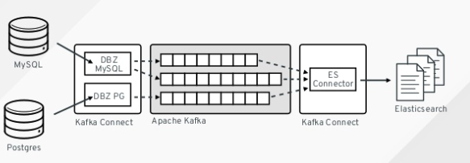

# Change Data Capture

Camel supports the [Change Data Capture](https://en.wikipedia.org/wiki/Change_data_capture) pattern.

This pattern allows tracking changes in databases, and then let applications listen to change events, and react accordingly. For example this can be used as a [Messaging Bridge](messaging-bridge.md) to bridge two systems.

Camel integrates with [Debezium](https://debezium.io/) which is a CDC system. There are a number of Camel Debezium components that works with different databases such as MySQL, Postgres, and MongoDB.

## Example

See the [Camel Debezium Example](https://github.com/apache/camel-examples/tree/main/examples/debezium) for more details.