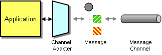

# Channel Adapter

Camel supports the [Channel Adapter](https://www.enterpriseintegrationpatterns.com/patterns/messaging/ChannelAdapter.md) from the [EIP patterns](enterprise-integration-patterns.md).

How can you connect an application to the messaging system so that it can send and receive messages?



Use a Channel Adapter that can access the application’s API or data and publish messages on a channel based on this data, and that likewise can receive messages and invoke functionality inside the application.

The Channel Adapter is implemented in Camel by components. Each component adapters between the systems and Camel where all details are hidden in the implementation of the component, which allows applications to easily send and receive data.

## Example

An application must receive messages from a Kafka topic, which can be done by using the [Kafka](../kafka-component.md) component.

One solution is to use a Camel route which consumes from the Kafka topic which calls a bean with the data.

```java
from("kafka:cheese?brokers={{kafka.host}}:{{kafka.port}}"
    .to("bean:cheeseBean");
```

And the bean has method which accepts the message payload as a byte array.

```java
public class CheeseBean {

  public void receiveCheeseData(byte[] data) {
    // do something
  }
}
```

You can also use [POJO consuming](../../../manual/pojo-consuming.md) with `@Consume` annotation.

```java
public class CheeseBean {
  @Consume("kafka:cheese?brokers={{kafka.host}}:{{kafka.port}}")
  public void receiveCheeseData(byte[] data) {
    // do something
  }
}
```