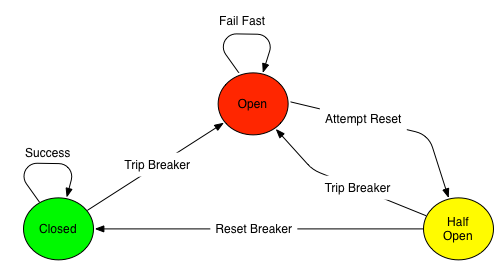

# Circuit Breaker

The Circuit Breaker pattern is inspired by the real-world electrical circuit breaker, which is used to detect excessive current draw and fail fast to protect electrical equipment. The software-based circuit breaker works on the same notion, by encapsulating the operation and monitoring it for failures. The Circuit Breaker pattern operates in three states, as illustrated in the following figure:



The states are as follows:

-   **Closed** — When operating successfully.
    
-   **Open** — When failure is detected, and the breaker opens to short-circuit and fail fast. In this state, the circuit breaker avoids invoking the protected operation and avoids putting additional load on the struggling service.
    
-   **Half Open** — After a short period in the open state, an operation is attempted to see whether it can complete successfully, and depending on the outcome, it will transfer to either open or closed state.
    

The Circuit Breaker eip supports 4 options, which are listed below.

   
| Name | Description | Default | Type |
| --- | --- | --- | --- |
| **resilience4jConfiguration** | Configures the circuit breaker to use Resilience4j with the given configuration. |  | Resilience4jConfigurationDefinition |
| **faultToleranceConfiguration** | Configures the circuit breaker to use MicroProfile Fault Tolerance with the given configuration. |  | FaultToleranceConfigurationDefinition |
| **configuration** | Refers to a circuit breaker configuration (such as resillience4j, or microprofile-fault-tolerance) to use for configuring the circuit breaker EIP. |  | String |
| **disabled** | Whether to disable this EIP from the route during build time. Once an EIP has been disabled then it cannot be enabled later at runtime. | false | Boolean |
| **description** | Sets the description of this node. |  | DescriptionDefinition |

## Example

Below is an example route showing a circuit breaker endpoint that protects against slow operation by falling back to the in-lined fallback route.

By default, the timeout request is just \*1000ms, so the HTTP endpoint has to be fairly quick to succeed.

```java
from("direct:start")
    .circuitBreaker()
        .to("http://fooservice.com/slow")
    .onFallback()
        .transform().constant("Fallback message")
    .end()
    .to("mock:result");
```

And in XML DSL:

```xml
<route>
  <from uri="direct:start"/>
  <circuitBreaker>
    <to uri="http://fooservice.com/slow"/>
    <onFallback>
      <transform>
        <constant>Fallback message</constant>
      </transform>
    </onFallback>
  </circuitBreaker>
  <to uri="mock:result"/>
</route>
```

## Circuit Breaker components

Camel provides two implementations of this pattern:

-   [Resilience4j](resilience4j-eip.md) - Using the Resilience4j implementation
    
-   [Fault Tolerance](fault-tolerance-eip.md) - Using the MicroProfile Fault Tolerance implementation