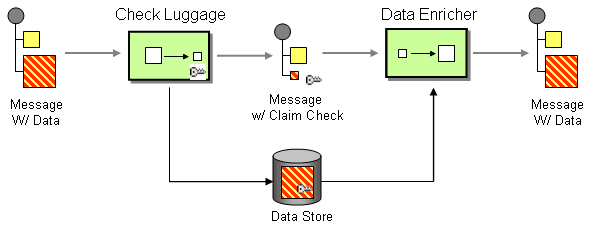

# Claim Check

The [Claim Check](http://www.enterpriseintegrationpatterns.com/patterns/messaging/StoreInLibrary.md) from the [EIP patterns](enterprise-integration-patterns.md) allows you to replace message content with a claim check (a unique key), which can be used to retrieve the message content at a later time.



It can also be useful in situations where you cannot trust the information with an outside party; in this case, you can use the Claim Check to hide the sensitive portions of data.

> **Note**
> The Camel implementation of this EIP pattern stores the message content temporarily in an internal memory store.

The Claim Check eip supports 6 options, which are listed below.

   
| Name | Description | Default | Type |
| --- | --- | --- | --- |
| **operation** | 
The claim check operation to use. The following operations are supported: Get - Gets (does not remove) the claim check by the given key. GetAndRemove - Gets and removes the claim check by the given key. Set - Sets a new (will override if key already exists) claim check with the given key. Push - Sets a new claim check on the stack (does not use key). Pop - Gets the latest claim check from the stack (does not use key).

Enum values:

-   Get
    
-   GetAndRemove
    
-   Set
    
-   Push
    
-   Pop
    


 |  | ClaimCheckOperation |
| **key** | To use a specific key for claim check id (for dynamic keys use simple language syntax as the key). |  | String |
| **filter** | Specify a filter to control what data gets merged data back from the claim check repository. The following syntax is supported: body - to aggregate the message body attachments - to aggregate all the message attachments headers - to aggregate all the message headers header:pattern - to aggregate all the message headers that matches the pattern. The following pattern rules are applied in this order: exact match, returns true wildcard match (pattern ends with a and the name starts with the pattern), returns true regular expression match, returns true otherwise returns false You can specify multiple rules separated by comma. For example, the following includes the message body and all headers starting with foo: body,header:foo. The syntax supports the following prefixes which can be used to specify include,exclude, or remove - to include (which is the default mode) - - to exclude (exclude takes precedence over include) — - to remove (remove takes precedence) For example to exclude a header name foo, and remove all headers starting with bar, -header:foo,--headers:bar Note you cannot have both include and exclude header:pattern at the same time. |  | String |
| **aggregationStrategy** | To use a custom AggregationStrategy instead of the default implementation. Notice you cannot use both custom aggregation strategy and configure data at the same time. |  | AggregationStrategy |
| **aggregationStrategyMethodName** | This option can be used to explicit declare the method name to use, when using POJOs as the AggregationStrategy. |  | String |
| **disabled** | Whether to disable this EIP from the route during build time. Once an EIP has been disabled then it cannot be enabled later at runtime. | false | Boolean |
| **description** | Sets the description of this node. |  | DescriptionDefinition |

## Claim Check Operation

When using this EIP you must specify the operation to use which can be of the following:

-   **Get** - Gets (does not remove) the claim check by the given key.
    
-   **GetAndRemove** - Gets and removes the claim check by the given key.
    
-   **Set** - Sets a new (will override if key already exists) claim check with the given key.
    
-   **Push** - Sets a new claim check on the stack (does not use key).
    
-   **Pop** - Gets the latest claim check from the stack (does not use key).
    

When using the `Get`, `GetAndRemove`, or `Set` operation you must specify a key. These operations will then store and retrieve the data using this key. You can use this to store multiple data in different keys.

The `Push` and `Pop` operations do **not** use a key but stores the data in a stack structure.

## Merging data using get or pop operation

The `Get`, `GetAndRemove` and `Pop` operations will claim data back from the claim check repository. The data is then merged with the current data on the exchange. This is done with an `AggregationStrategy`. The default strategy uses the `filter` option to easily specify what data to merge back.

The `filter` option takes a `String` value with the following syntax:

-   `body` - to aggregate the message body.
    
-   `attachments` - to aggregate all the message attachments.
    
-   `headers` - to aggregate all the message headers.
    
-   `header:pattern` - to aggregate all the message headers that matches the pattern.
    

The pattern rule supports wildcards and regular expressions:

-   wildcard match (pattern ends with a `*`, and the name starts with the pattern)
    
-   regular expression match
    

You can specify multiple rules separated by comma.

### Basic filter examples

For example to include the message body and all headers starting with _foo_:

```text
body,header:foo*
```

To only merge back the message body:

```text
body
```

To only merge back the message attachments:

```text
attachments
```

To only merge back headers:

```text
headers
```

To only merge back a header name foo:

```text
header:foo
```

If the filter rule is specified as empty or as wildcard then everything is merged.

Notice that when merging back data, any data in the Message that is not overwritten is preserved.

### Filtering with include and exclude patterns

The syntax also supports the following prefixes which can be used to specify include, exclude, or remove

-   `+` to include (which is the default mode)
    
-   `-` to exclude (exclude takes precedence over include)
    
-   `--` to remove (remove takes precedence)
    

For example to skip the message body, and merge back everything else

```text
-body
```

Or to skip the message header foo and merge back everything else

```text
-header:foo
```

You can also remove headers when merging data back. For example, to remove all headers starting with _bar_:

```text
--headers:bar*
```

Note you cannot have both include (`+`) and exclude (`-`) `header:pattern` at the same time.

## Dynamic keys

The claim check keys are static, but you can use the `simple` language syntax to define dynamic keys. For example, to use a header from the message named `myKey`:

```java
from("direct:start")
    .to("mock:a")
    .claimCheck(ClaimCheckOperation.Set, "${header.myKey}")
    .transform().constant("Bye World")
    .to("mock:b")
    .claimCheck(ClaimCheckOperation.Get, "${header.myKey}")
    .to("mock:c")
    .transform().constant("Hi World")
    .to("mock:d")
    .claimCheck(ClaimCheckOperation.Get, "${header.myKey}")
    .to("mock:e");
```

## Example

The following example shows the `Push` and `Pop` operations in action:

```java
from("direct:start")
    .to("mock:a")
    .claimCheck(ClaimCheckOperation.Push)
    .transform().constant("Bye World")
    .to("mock:b")
    .claimCheck(ClaimCheckOperation.Pop)
    .to("mock:c");
```

In the above example, imagine message body from the beginning is `Hello World`. That data is pushed on the stack of the Claim Check EIP. Then the message body is transformed to `Bye World`, which is what `mock:b` endpoint receives. When we `Pop` from the Claim Check EIP, the original message body is retrieved and merged back, so `mock:c` will retrieve the message body with `Hello World`.

Here is an example using `Get` and `Set` operations, which uses the key `foo`:

```java
from("direct:start")
    .to("mock:a")
    .claimCheck(ClaimCheckOperation.Set, "foo")
    .transform().constant("Bye World")
    .to("mock:b")
    .claimCheck(ClaimCheckOperation.Get, "foo")
    .to("mock:c")
    .transform().constant("Hi World")
    .to("mock:d")
    .claimCheck(ClaimCheckOperation.Get, "foo")
    .to("mock:e");
```

Notice how we can `Get` the same data twice using the `Get` operation as it will not remove the data. If you only want to get the data once, you can use `GetAndRemove`.

The last example shows how to use the `filter` option where we only want to get back header named `foo` or `bar`:

```java
from("direct:start")
    .to("mock:a")
    .claimCheck(ClaimCheckOperation.Push)
    .transform().constant("Bye World")
    .setHeader("foo", constant(456))
    .removeHeader("bar")
    .to("mock:b")
    // only merge in the message headers foo or bar
    .claimCheck(ClaimCheckOperation.Pop, null, "header:(foo|bar)")
    .to("mock:c");
```

### XML examples

The following example shows the `Push` and `Pop` operations in action;

```xml
<route>
  <from uri="direct:start"/>
  <to uri="mock:a"/>
  <claimCheck operation="Push"/>
  <transform>
    <constant>Bye World</constant>
  </transform>
  <to uri="mock:b"/>
  <claimCheck operation="Pop"/>
  <to uri="mock:c"/>
</route>
```

For example if the message body from the beginning is `Hello World` then that data is pushed on the stack of the Claim Check EIP. And then the message body is transformed to `Bye World`, which is what `mock:b` endpoint receives. When we `Pop` from the Claim Check EIP then the original message body is retrieved and merged back so `mock:c` will retrieve the message body with `Hello World`.

Here is an example using `Get` and `Set` operations, which uses the key `foo`:

```xml
<route>
  <from uri="direct:start"/>
  <to uri="mock:a"/>
  <claimCheck operation="Set" key="foo"/>
  <transform>
    <constant>Bye World</constant>
  </transform>
  <to uri="mock:b"/>
  <claimCheck operation="Get" key="foo"/>
  <to uri="mock:c"/>
  <transform>
    <constant>Hi World</constant>
  </transform>
  <to uri="mock:d"/>
  <claimCheck operation="Get" key="foo"/>
  <to uri="mock:e"/>
</route>
```

Notice how we can `Get` the same data twice using the `Get` operation as it will not remove the data. If you only want to get the data once, you can use `GetAndRemove`.

The last example shows how to use the `filter` option where we only want to get back header named `foo` or `bar`:

```xml
<route>
  <from uri="direct:start"/>
  <to uri="mock:a"/>
  <claimCheck operation="Push"/>
  <transform>
    <constant>Bye World</constant>
  </transform>
  <setHeader name="foo">
    <constant>456</constant>
  </setHeader>
  <removeHeader headerName="bar"/>
  <to uri="mock:b"/>
  <!-- only merge in the message headers foo or bar -->
  <claimCheck operation="Pop" filter="header:(foo|bar)"/>
  <to uri="mock:c"/>
</route>
```