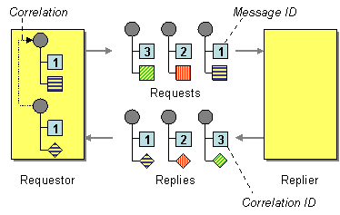

# Correlation Identifier

Camel supports the [Correlation Identifier](http://www.enterpriseintegrationpatterns.com/CorrelationIdentifier.md) from the [EIP patterns](enterprise-integration-patterns.md) by getting or setting a header on the [Message](message.md).

When working with the [ActiveMQ](../activemq-component.md) or [JMS](../jms-component.md) components the correlation identifier header is called **JMSCorrelationID**, and they handle the correlation automatically.

Other messaging systems, such as [RabbitMQ](../rabbitmq-component.md) also handles this automatic, and you should generally not have a need for using custom correlation IDs with these systems.



You can use your own correlation identifier to any message exchange to help correlate messages together to a single conversation (or business process). For example if you need to correlation messages when using web services.

The use of a correlation identifier is key to working with [Distributed Tracing](../others/tracing.md) and be useful when using [Tracer](../../../manual/tracer.md) messages to log, or testing with simulation or canned data such as with the [Mock](../mock-component.md) testing framework.

## EIPs using correlation identifiers

Some [EIP](enterprise-integration-patterns.md) patterns will spin off a sub message, and in those cases, Camel will add a correlation id on the [Exchange](../../../manual/exchange.md) as a property with they key `Exchange.CORRELATION_ID`, which links back to the source [Exchange](../../../manual/exchange.md) and its exchange id.

The following EIPs does this:

-   [Enrich](enrich-eip.md)
    
-   [Multicast](multicast-eip.md)
    
-   [Recipient List](recipientList-eip.md)
    
-   [Split](split-eip.md)
    
-   [Wire Tap](wireTap-eip.md)
    

## Example

The following example uses a request/reply pattern in the [JMS](../jms-component.md) component, where correlation identifiers are automatically handled:

```java
from("direct:start")
    .to(ExchangePattern.InOut, "jms:queue:foo")
    .to("mock:result");
```

And with XML DSL:

```xml
<route>
    <from uri="direct:start"/>
    <to pattern="InOut" uri="jms:queue:foo"/>
    <to uri="mock:result"/>
</route>
```