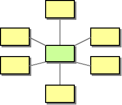

# Message Broker

Camel supports the [Message Broker](https://www.enterpriseintegrationpatterns.com/patterns/messaging/MessageBroker.md) from the [EIP patterns](enterprise-integration-patterns.md) book.

How can you decouple the destination of a message from the sender and maintain central control over the flow of messages?

Use a central Message Broker that can receive messages from multiple destinations, determine the correct destination and route the message to the correct channel.

Camel supports integration with existing message broker systems such as [ActiveMQ](../activemq-component.md), [Kafka](../kafka-component.md), [RabbitMQ](../spring-rabbitmq-component.md), and cloud queue systems such as [AWS SQS](../aws2-s3-component.md), and others.

These Camel components allows to both send and receive data from message brokers.