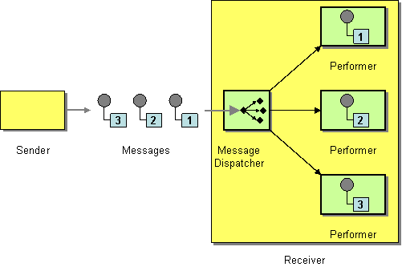

# Message Dispatcher

Camel supports the [Message Dispatcher](https://www.enterpriseintegrationpatterns.com/patterns/messaging/MessageDispatcher.md) from the [EIP patterns](enterprise-integration-patterns.md) book.

In Camel the Message Dispatcher can be achieved in different ways such as:

-   You can use a component like [JMS](../jms-component.md) with selectors to implement a [Selective Consumer](selective-consumer.md) as the Message Dispatcher implementation.
    
-   Or you can use a [Message Endpoint](message-endpoint.md) as the Message Dispatcher itself, or combine this with the [Content Based Router](choice-eip.md) as the Message Dispatcher.