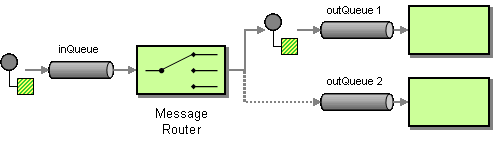

# Message Router

The [Message Router](http://www.enterpriseintegrationpatterns.com/MessageRouter.md) from the [EIP patterns](enterprise-integration-patterns.md) allows you to consume from an input destination, evaluate some predicate then choose the right output destination.



In Camel the Message Router can be archived in different ways such as:

-   You can use the [Content Based Router](choice-eip.md) to evaluate and choose the output destination.
    
-   The [Routing Slip](routingSlip-eip.md) and [Dynamic Router](dynamicRouter-eip.md) EIPs can also be used for choosing which destination to route messages.
    

The [Content Based Router](choice-eip.md) is recommended to use when you have multiple predicates to evaluate where to send the message.

The [Routing Slip](routingSlip-eip.md) and [Dynamic Router](dynamicRouter-eip.md) are arguably more advanced where you do not use predicates to choose where to route the message, but use an expression to choose where the message should go.

## Example

The following example shows how to route a request from an input direct:a endpoint to either direct:b, direct:c, or direct:d depending on the evaluation of various [Predicate](../../../manual/predicate.md):

```java
from("direct:a")
    .choice()
        .when(simple("${header.foo} == 'bar'"))
            .to("direct:b")
        .when(simple("${header.foo} == 'cheese'"))
            .to("direct:c")
        .otherwise()
            .to("direct:d");
```

And the same example using XML:

```xml
<route>
    <from uri="direct:a"/>
    <choice>
        <when>
            <simple>${header.foo} == 'bar'</simple>
            <to uri="direct:b"/>
        </when>
        <when>
            <simple>${header.foo} == 'cheese'</simple>
            <to uri="direct:c"/>
        </when>
        <otherwise>
            <to uri="direct:d"/>
        </otherwise>
    </choice>
</route>
```