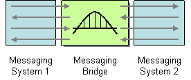

# Messaging Bridge

Camel supports the [Messaging Bridge](https://www.enterpriseintegrationpatterns.com/patterns/messaging/MessagingBridge.md) from the [EIP patterns](enterprise-integration-patterns.md).

How can multiple messaging systems be connected so that messages available on one are also available on the others?



Use a Messaging Bridge, a connection between messaging systems, to replicate messages between systems.

You can use Camel to bridge different systems using Camel [Components](../index.md) and bridge the endpoints together in a [Route](../../../manual/routes.md).

Another alternative is to bridge systems using [Change Data Capture](change-data-capture.md).

## Example

A basic bridge between two messaging systems (such as WebsphereMQ and [ActiveMQ](../activemq-component.md)) can be done with a single Camel route:

```java
from("mq:queue:foo")
  .to("activemq:queue:foo")
```

And in XML

```xml
<route>
    <from uri="mq:queue:foo"/>
    <to uri="activemq:queue:foo"/>
</route>
```