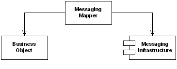

# Messaging Mapper

Camel supports the [Messaging Mapper](https://www.enterpriseintegrationpatterns.com/patterns/messaging/MessagingMapper.md) from the [EIP patterns](enterprise-integration-patterns.md) book.

How do you move data between domain objects and the messaging infrastructure while keeping the two independent of each other?

Create a separate Messaging Mapper that contains the mapping logic between the messaging infrastructure and the domain objects. Neither the objects nor the infrastructure have knowledge of the Messaging Mapper’s existence.

The Messaging Mapper accesses one or more domain objects and converts them into a message as required by the messaging channel. It also performs the opposite function, creating or updating domain objects based on incoming messages. Since the Messaging Mapper is implemented as a separate class that references the domain object(s) and the messaging layer, neither layer is aware of the other. The layers don’t even know about the Messaging Mapper.

With Camel this pattern is often implemented directly via Camel components that provides [Type Converter](../../../manual/type-converter.md)'s from the messaging infrastructure to common Java types or Java Objects representing the data model of the component in question. Combining this with the [Message Translator](message-translator.md) to have the Messaging Mapper EIP pattern.

Camel also integrates with external mapping software such as [AtlasMap](../atlasmap-component.md).