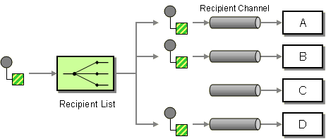

# Recipient List

Camel supports the [Recipient List](https://www.enterpriseintegrationpatterns.com/RecipientList.md) from the [EIP patterns](enterprise-integration-patterns.md).

How do we route a message to a list of dynamically specified recipients?



Define a channel for each recipient. Then use a Recipient List to inspect an incoming message, determine the list of desired recipients, and forward the message to all channels associated with the recipients in the list.

## Options

The Recipient List eip supports 16 options, which are listed below.

   
| Name | Description | Default | Type |
| --- | --- | --- | --- |
| **expression** | **Required** Expression that returns which endpoints (url) to send the message to (the recipients). If the expression return an empty value then the message is not sent to any recipients. |  | ExpressionDefinition |
| **delimiter** | Delimiter used if the Expression returned multiple endpoints. Can be turned off using the value false. The default value is ,. | , | String |
| **aggregationStrategy** | Sets the AggregationStrategy to be used to assemble the replies from the recipients, into a single outgoing message from the RecipientList. By default Camel will use the last reply as the outgoing message. You can also use a POJO as the AggregationStrategy. |  | AggregationStrategy |
| **aggregationStrategyMethodName** | This option can be used to explicit declare the method name to use, when using POJOs as the AggregationStrategy. |  | String |
| **aggregationStrategyMethodAllowNull** | If this option is false then the aggregate method is not used if there was no data to enrich. If this option is true then null values is used as the oldExchange (when no data to enrich), when using POJOs as the AggregationStrategy. | false | Boolean |
| **parallelAggregate** | If enabled then the aggregate method on AggregationStrategy can be called concurrently. Notice that this would require the implementation of AggregationStrategy to be implemented as thread-safe. By default this is false meaning that Camel synchronizes the call to the aggregate method. Though in some use-cases this can be used to archive higher performance when the AggregationStrategy is implemented as thread-safe. | false | Boolean |
| **parallelProcessing** | If enabled then sending messages to the recipients occurs concurrently. Note the caller thread will still wait until all messages has been fully processed, before it continues. Its only the sending and processing the replies from the recipients which happens concurrently. When parallel processing is enabled, then the Camel routing engin will continue processing using last used thread from the parallel thread pool. However, if you want to use the original thread that called the recipient list, then make sure to enable the synchronous option as well. | false | Boolean |
| **synchronous** | Sets whether synchronous processing should be strictly used. When enabled then the same thread is used to continue routing after the recipient list is complete, even if parallel processing is enabled. | false | Boolean |
| **timeout** | Sets a total timeout specified in millis, when using parallel processing. If the Recipient List hasn’t been able to send and process all replies within the given timeframe, then the timeout triggers and the Recipient List breaks out and continues. Notice if you provide a TimeoutAwareAggregationStrategy then the timeout method is invoked before breaking out. If the timeout is reached with running tasks still remaining, certain tasks for which it is difficult for Camel to shut down in a graceful manner may continue to run. So use this option with a bit of care. | 0 | String |
| **executorService** | To use a custom Thread Pool to be used for parallel processing. Notice if you set this option, then parallel processing is automatic implied, and you do not have to enable that option as well. |  | ExecutorService |
| **stopOnException** | Will now stop further processing if an exception or failure occurred during processing of an org.apache.camel.Exchange and the caused exception will be thrown. Will also stop if processing the exchange failed (has a fault message) or an exception was thrown and handled by the error handler (such as using onException). In all situations the recipient list will stop further processing. This is the same behavior as in pipeline, which is used by the routing engine. The default behavior is to not stop but continue processing till the end. | false | Boolean |
| **ignoreInvalidEndpoints** | Ignore the invalidate endpoint exception when try to create a producer with that endpoint. | false | Boolean |
| **streaming** | If enabled then Camel will process replies out-of-order, eg in the order they come back. If disabled, Camel will process replies in the same order as defined by the recipient list. | false | Boolean |
| **onPrepare** | Uses the Processor when preparing the org.apache.camel.Exchange to be used send. This can be used to deep-clone messages that should be send, or any custom logic needed before the exchange is send. |  | Processor |
| **cacheSize** | Sets the maximum size used by the org.apache.camel.spi.ProducerCache which is used to cache and reuse producers when using this recipient list, when uris are reused. Beware that when using dynamic endpoints then it affects how well the cache can be utilized. If each dynamic endpoint is unique then its best to turn of caching by setting this to -1, which allows Camel to not cache both the producers and endpoints; they are regarded as prototype scoped and will be stopped and discarded after use. This reduces memory usage as otherwise producers/endpoints are stored in memory in the caches. However if there are a high degree of dynamic endpoints that have been used before, then it can benefit to use the cache to reuse both producers and endpoints and therefore the cache size can be set accordingly or rely on the default size (1000). If there is a mix of unique and used before dynamic endpoints, then setting a reasonable cache size can help reduce memory usage to avoid storing too many non frequent used producers. |  | Integer |
| **shareUnitOfWork** | Shares the org.apache.camel.spi.UnitOfWork with the parent and each of the sub messages. Recipient List will by default not share unit of work between the parent exchange and each recipient exchange. This means each sub exchange has its own individual unit of work. | false | Boolean |
| **disabled** | Whether to disable this EIP from the route during build time. Once an EIP has been disabled then it cannot be enabled later at runtime. | false | Boolean |
| **description** | Sets the description of this node. |  | DescriptionDefinition |
> **Tip**
> See the `cacheSize` option for more details on _how much cache_ to use depending on how many or few unique endpoints are used.

## Exchange properties

The following exchange properties are set on each `Exchange` that are sent by the recipient list:

  
| Property | Type | Description |
| --- | --- | --- |
| `CamelRecipientListEndpoint` | `` `String` `` | Uri of the `Endpoint` that the message was sent to. |

## Using Recipient List

The Recipient List EIP allows to route **the same** message to a number of [endpoints](../../../manual/endpoint.md) and process them in a different way.

There can be 1 or more destinations, and Camel will execute them sequentially (by default). However, a parallel mode exists which allows processing messages concurrently.

The Recipient List EIP has many features and is based on the [Multicast](multicast-eip.md) EIP. For example the Recipient List EIP is capable of aggregating each message into a single _response_ message as the result after the Recipient List EIP.

### Using Static Recipient List

The following example shows how to route a request from an input queue:a endpoint to a static list of destinations, using `constant`:

```java
from("jms:queue:a")
    .recipientList(constant("seda:x,seda:y,seda:z"));
```

And in XML:

```xml
<route>
    <from uri="jms:queue:a"/>
    <recipientList>
        <constant>seda:x,seda:y,seda:z</constant>
    </recipientList>
</route>
```

### Using Dynamic Recipient List

Usually one of the main reasons for using the Recipient List pattern is that the list of recipients is dynamic and calculated at runtime.

The following example demonstrates how to create a dynamic recipient list using an [Expression](../../../manual/expression.md) (which in this case extracts a named header value dynamically) to calculate the list of endpoints; which are either of type `Endpoint` or are converted to a `String` and then resolved using the endpoint URIs (separated by comma).

In Java DSL its as easy as:

```java
from("jms:queue:a")
    .recipientList(header("foo"));
```

And in XML:

```xml
<route>
    <from uri="jms:queue:a"/>
    <recipientList>
        <header>foo</constant>
    </recipientList>
</route>
```

#### How is dynamic destinations evaluated

The dynamic list of recipients that are defined in the header must be iterable such as:

-   `java.util.Collection`
    
-   `java.util.Iterator`
    
-   arrays
    
-   `org.w3c.dom.NodeList`
    
-   a single `String` with values separated by comma (the delimiter configured)
    
-   any other type will be regarded as a single value
    

### Configuring delimiter for dynamic destinations

In XML DSL you can set the delimiter attribute for setting a delimiter to be used if the header value is a single `String` with multiple separated endpoints. By default, Camel uses comma as delimiter, but this option lets you specify a custom delimiter to use instead.

```xml
<route>
  <from uri="direct:a"/>
  <!-- use semi-colon as a delimiter for String based values -->
  <recipientList delimiter=";">
    <header>myHeader</header>
  </recipientList>
</route>
```

So if **myHeader** contains a `String` with the value `"activemq:queue:foo;activemq:topic:hello ; log:bar"` then Camel will split the `String` using the delimiter given in the XML that was comma, resulting into 3 endpoints to send to. You can use spaces between the endpoints as Camel will trim the value when it look up the endpoint to send to.

And in Java DSL, you specify the delimiter as 2nd parameter as shown below:

```java
from("direct:a")
    .recipientList(header("myHeader"), ";");
```

### Using parallel processing

The Recipient List supports `parallelProcessing` similar to what [Multicast](multicast-eip.md) and [Split](split-eip.md) EIPs have as well. When using parallel processing then a thread pool is used to have concurrent tasks sending the `Exchange` to multiple recipients concurrently.

You can enable parallel mode using `parallelProcessing` in Java as shown:

```java
from("direct:a")
    .recipientList(header("myHeader")).parallelProcessing();
```

And in XML it is an attribute on `<recipientList>`:

```xml
<route>
    <from uri="direct:a"/>
    <recipientList parallelProcessing="true">
        <header>myHeader</header>
    </recipientList>
</route>
```

> **Important**
> When parallel processing is enabled, then the Camel routing engin will continue processing using last used thread from the parallel thread pool. However, if you want to use the original thread that called the recipient list, then make sure to enable the synchronous option as well.

#### Using custom thread pool

A thread pool is only used for `parallelProcessing`. You supply your own custom thread pool via the `ExecutorServiceStrategy` (see Camel’s Threading Model), the same way you would do it for the `aggregationStrategy`. By default, Camel uses a thread pool with 10 threads (subject to change in future versions).

The Recipient List EIP will by default continue to process the entire exchange even in case one of the sub messages will throw an exception during routing.

For example if you want to route to 3 destinations and the 2nd destination fails by an exception. What Camel does by default is to process the remainder destinations. You have the chance to deal with the exception when aggregating using an `AggregationStrategy`.

But sometimes you just want Camel to stop and let the exception be propagated back, and let the Camel [Error Handler](../../../manual/error-handler.md) handle it. You can do this by specifying that it should stop in case of an exception occurred. This is done by the `stopOnException` option as shown below:

```java
from("direct:start")
    .recipientList(header("whereTo")).stopOnException()
    .to("mock:result");

    from("direct:foo").to("mock:foo");

    from("direct:bar").process(new MyProcessor()).to("mock:bar");

    from("direct:baz").to("mock:baz");
```

In this example suppose a message is sent with the header `whereTo=direct:foo,direct:bar,direct:baz` that means the recipient list sends messages to those 3 endpoints.

Now suppose that the `MyProcessor` is causing a failure and throws an exception. This means the Recipient List EIP will stop after this, and not the last route (direct:baz).

And using XML DSL you specify it as follows:

```xml
<routes>
    <route>
        <from uri="direct:start"/>
        <recipientList stopOnException="true">
            <header>whereTo</header>
        </recipientList>
        <to uri="mock:result"/>
    </route>

    <route>
        <from uri="direct:foo"/>
        <to uri="mock:foo"/>
    </route>

    <route>
        <from uri="direct:bar"/>
        <process ref="myProcessor"/>
        <to uri="mock:bar"/>
    </route>

    <route>
        <from uri="direct:baz"/>
        <to uri="mock:baz"/>
    </route>
</routes>
```

### Ignore invalid endpoints

The Recipient List supports `ignoreInvalidEndpoints` (like [Routing Slip](routingSlip-eip.md) EIP). You can use it to skip endpoints which are invalid.

```java
from("direct:a")
    .recipientList(header("myHeader")).ignoreInvalidEndpoints();
```

And in XML it is an attribute on `<recipientList>`:

```xml
<route>
    <from uri="direct:a"/>
    <recipientList ignoreInvalidEndpoints="true">
        <header>myHeader</header>
    </recipientList>
</route>
```

Then let us say the `myHeader` contains the following two endpoints `direct:foo,xxx:bar`. The first endpoint is valid and works. However, the second one is invalid and will just be ignored. Camel logs at DEBUG level about it, so you can see why the endpoint was invalid.

### Using timeout

If you use `parallelProcessing` then you can configure a total `timeout` value in millis.

Camel will then process the messages in parallel until the timeout is hit. This allows you to continue processing if one message consumer is slow. For example, you can set a timeout value of 20 sec.

> **Warning**
> Tasks may keep running
>
> If the timeout is reached with running tasks still remaining, certain tasks for which it is difficult for Camel to shut down in a graceful manner may continue to run. So use this option with a bit of care.

For example in the unit test below you can see that we multicast the message to 3 destinations. We have a timeout of 2 seconds, which means only the last two messages can be completed within the timeframe. This means we will only aggregate the last two which yields a result aggregation which outputs "BC".

```java
from("direct:start")
    .multicast(new AggregationStrategy() {
            public Exchange aggregate(Exchange oldExchange, Exchange newExchange) {
                if (oldExchange == null) {
                    return newExchange;
                }

                String body = oldExchange.getIn().getBody(String.class);
                oldExchange.getIn().setBody(body + newExchange.getIn().getBody(String.class));
                return oldExchange;
            }
        })
        .parallelProcessing().timeout(250).to("direct:a", "direct:b", "direct:c")
    // use end to indicate end of multicast route
    .end()
    .to("mock:result");

from("direct:a").delay(1000).to("mock:A").setBody(constant("A"));

from("direct:b").to("mock:B").setBody(constant("B"));

from("direct:c").to("mock:C").setBody(constant("C"));
```

By default, if a timeout occurs the `AggregationStrategy` is not invoked. However, you can implement the `timeout` method: This allows you to deal with the timeout in the `AggregationStrategy` if you really need to.

> **Note**
> Timeout is total
>
> The timeout is total, which means that after X time, Camel will aggregate the messages which have completed within the timeframe. The remainders will be cancelled. Camel will also only invoke the `timeout` method in the `TimeoutAwareAggregationStrategy` once, for the first index which caused the timeout.

### Using ExchangePattern in recipients

The recipient list will by default use the current Exchange Pattern. Though one can imagine use-cases where one wants to send a message to a recipient using a different exchange pattern. For example, you may have a route that initiates as an `InOnly` route, but want to use `InOut` exchange pattern with a recipient list. You can configure the exchange pattern directly in the recipient endpoints.

For example in the route below we pick up new files (which will be started as `InOnly`) and then route to a recipient list. As we want to use `InOut` with the ActiveMQ (JMS) endpoint we can now specify this using the `exchangePattern=InOut` option. Then the response from the JMS request/reply will then be continued routed, and thus the response is what will be stored in as a file in the outbox directory.

```java
from("file:inbox")
    // the exchange pattern is InOnly initially when using a file route
    .recipientList().constant("activemq:queue:inbox?exchangePattern=InOut")
    .to("file:outbox");
```

> **Warning**
> The recipient list will not alter the original exchange pattern. So in the example above the exchange pattern will still be `InOnly` when the message is routed to the `file:outbox endpoint`. If you want to alter the exchange pattern permanently then use `.setExchangePattern` in the route.
>
> See more details at [Event Message](event-message.md) and [Request Reply](requestReply-eip.md) EIPs.

## See Also

Because Recipient List EIP is based from the [Multicast](multicast-eip.md), then you can find more information in [Multicast](multicast-eip.md) EIP about features that is also available with Recipient List EIP.