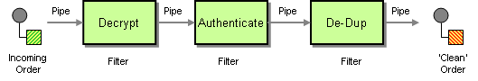

# Step

Camel supports the [Pipes and Filters](http://www.enterpriseintegrationpatterns.com/PipesAndFilters.md) from the [EIP patterns](enterprise-integration-patterns.md) in various ways.



With Camel, you can group your processing across multiple independent EIPs which can then be chained together in a logical unit, called a _step_.

A step groups together the child processors into a single composite unit. This allows to capture metrics at a group level which can make management and monitoring of Camel routes easier by using higher-level abstractions. You can also think this as a middle-level between the route and each individual processors in the routes.

You may want to do this when you have large routes and want to break up the routes into logical steps.

This means you can monitor your Camel applications and gather statistics at 4-tiers:

-   context level
    
    -   route(s) level
        
        -   step(s) level
            
            -   processor(s) level
                
            
        
    

## Options

The Step eip supports 1 options, which are listed below.

   
| Name | Description | Default | Type |
| --- | --- | --- | --- |
| **disabled** | Whether to disable this EIP from the route during build time. Once an EIP has been disabled then it cannot be enabled later at runtime. | false | Boolean |
| **description** | Sets the description of this node. |  | DescriptionDefinition |

## Using Step EIP

In Java, you use `step` to group together sub nodes as shown:

```java
from("activemq:SomeQueue")
    .step("foo")
      .bean("foo")
      .to("acitvemq:OutputQueue")
    .end()
    .to("direct:bar");
```

As you can see this groups together `.bean("foo")` and `.to("acitvemq:OutputQueue")` into a logical unit with the name foo.

In XML you use the `<step>` tag:

```xml
<route>
  <from uri="activemq:SomeQueue"/>
  <step id="foo">
    <bean ref="foo"/>
    <to uri="activemq:OutputQueue"/>
  </step>
  <to uri="direct:bar"/>
</route>
```

You can have multiple steps:

```java
from("activemq:SomeQueue")
    .step("foo")
      .bean("foo")
      .to("acitvemq:OutputQueue")
    .end()
    .step("bar")
      .bean("something")
      .to("log:Something")
    .end()
```

And in XML

```xml
<route>
  <from uri="activemq:SomeQueue"/>
  <step id="foo">
    <bean ref="foo"/>
    <to uri="activemq:OutputQueue"/>
  </step>
  <step id="bar">
    <bean ref="something"/>
    <to uri="log:Something"/>
  </step>
</route>
```

### JMX Management of Step EIP

Each Step EIP is registered in JMX under the `type=steps` tree, which allows to monitor all the steps in the CamelContext. It is also possible to dump statistics in XML format by the `dumpStepStatsAsXml` operations on the `CamelContext` or `Route` mbeans.