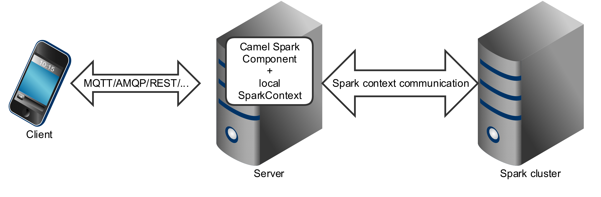
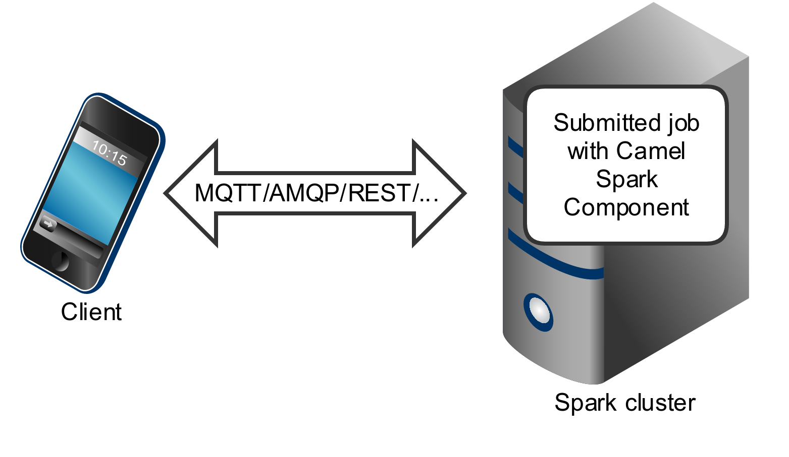

# Spark

> **Warning**
> **Deprecated:** This spark is deprecated and may be removed in a future release.

**Since Camel 2.17**

**Only producer is supported**

This documentation page covers the [Apache Spark](http://spark.apache.org/) component for the Apache Camel. The main purpose of the Spark integration with Camel is to provide a bridge between Camel connectors and Spark tasks. In particular Camel connector provides a way to route message from various transports, dynamically choose a task to execute, use incoming message as input data for that task and finally deliver the results of the execution back to the Camel pipeline.

## Supported architectural styles

Spark component can be used as a driver application deployed into an application server (or executed as a fat jar).



Spark component can also be submitted as a job directly into the Spark cluster.



While Spark component is primary designed to work as a _long running job_ serving as a bridge between Spark cluster and the other endpoints, you can also use it as a _fire-once_ short job.

## Running Spark in OSGi servers

Currently, the Spark component doesn’t support execution in the OSGi container. Spark has been designed to be executed as a fat jar, usually submitted as a job to a cluster. For those reasons running Spark in an OSGi server is at least challenging and is not support by Camel as well.

## URI format

Currently, the Spark component supports only producers - it is intended to invoke a Spark job and return results. You can call RDD, data frame or Hive SQL job.

**Spark URI format**

spark:{rdd|dataframe|hive}

## Configuring Options

Camel components are configured on two separate levels:

-   component level
    
-   endpoint level
    

### Configuring Component Options

The component level is the highest level which holds general and common configurations that are inherited by the endpoints. For example a component may have security settings, credentials for authentication, urls for network connection and so forth.

Some components only have a few options, and others may have many. Because components typically have pre configured defaults that are commonly used, then you may often only need to configure a few options on a component; or none at all.

Configuring components can be done with the [Component DSL](../../manual/component-dsl.md), in a configuration file (application.properties|yaml), or directly with Java code.

### Configuring Endpoint Options

Where you find yourself configuring the most is on endpoints, as endpoints often have many options, which allows you to configure what you need the endpoint to do. The options are also categorized into whether the endpoint is used as consumer (from) or as a producer (to), or used for both.

Configuring endpoints is most often done directly in the endpoint URI as path and query parameters. You can also use the [Endpoint DSL](../../manual/Endpoint-dsl.md) and [DataFormat DSL](../../manual/dataformat-dsl.md) as a _type safe_ way of configuring endpoints and data formats in Java.

A good practice when configuring options is to use [Property Placeholders](../../manual/using-propertyplaceholder.md), which allows to not hardcode urls, port numbers, sensitive information, and other settings. In other words placeholders allows to externalize the configuration from your code, and gives more flexibility and reuse.

The following two sections lists all the options, firstly for the component followed by the endpoint.

## Component Options

The Spark component supports 4 options, which are listed below.

   
| Name | Description | Default | Type |
| --- | --- | --- | --- |
| **lazyStartProducer** (producer) | Whether the producer should be started lazy (on the first message). By starting lazy you can use this to allow CamelContext and routes to startup in situations where a producer may otherwise fail during starting and cause the route to fail being started. By deferring this startup to be lazy then the startup failure can be handled during routing messages via Camel’s routing error handlers. Beware that when the first message is processed then creating and starting the producer may take a little time and prolong the total processing time of the processing. | false | boolean |
| **rdd** (producer) | RDD to compute against. |  | JavaRDDLike |
| **rddCallback** (producer) | Function performing action against an RDD. |  | RddCallback |
| **autowiredEnabled** (advanced) | Whether autowiring is enabled. This is used for automatic autowiring options (the option must be marked as autowired) by looking up in the registry to find if there is a single instance of matching type, which then gets configured on the component. This can be used for automatic configuring JDBC data sources, JMS connection factories, AWS Clients, etc. | true | boolean |

## Endpoint Options

The Spark endpoint is configured using URI syntax:

spark:endpointType

with the following path and query parameters:

### Path Parameters (1 parameters)

   
| Name | Description | Default | Type |
| --- | --- | --- | --- |
| **endpointType** (producer) | 
**Required** Type of the endpoint (rdd, dataframe, hive).

Enum values:

-   rdd
    
-   dataframe
    
-   hive
    


 |  | EndpointType |

### Query Parameters (6 parameters)

   
| Name | Description | Default | Type |
| --- | --- | --- | --- |
| **collect** (producer) | Indicates if results should be collected or counted. | true | boolean |
| **dataFrame** (producer) | DataFrame to compute against. |  | Dataset |
| **dataFrameCallback** (producer) | Function performing action against an DataFrame. |  | DataFrameCallback |
| **rdd** (producer) | RDD to compute against. |  | JavaRDDLike |
| **rddCallback** (producer) | Function performing action against an RDD. |  | RddCallback |
| **lazyStartProducer** (producer (advanced)) | Whether the producer should be started lazy (on the first message). By starting lazy you can use this to allow CamelContext and routes to startup in situations where a producer may otherwise fail during starting and cause the route to fail being started. By deferring this startup to be lazy then the startup failure can be handled during routing messages via Camel’s routing error handlers. Beware that when the first message is processed then creating and starting the producer may take a little time and prolong the total processing time of the processing. | false | boolean |

## Message Headers

The Spark component supports 4 message header(s), which is/are listed below:

   
| Name | Description | Default | Type |
| --- | --- | --- | --- |
| **CAMEL\_SPARK\_RDD** (producer) Constant: [`SPARK_RDD_HEADER`](https://javadoc.io/doc/org.apache.camel/camel-spark/latest/org/apache/camel/component/spark/SparkConstants.html#SPARK_RDD_HEADER) | The RDD. |  | Object |
| **CAMEL\_SPARK\_RDD\_CALLBACK** (producer) Constant: [`SPARK_RDD_CALLBACK_HEADER`](https://javadoc.io/doc/org.apache.camel/camel-spark/latest/org/apache/camel/component/spark/SparkConstants.html#SPARK_RDD_CALLBACK_HEADER) | The function performing action against an RDD. |  | RddCallback |
| **CAMEL\_SPARK\_DATAFRAME** (producer) Constant: [`SPARK_DATAFRAME_HEADER`](https://javadoc.io/doc/org.apache.camel/camel-spark/latest/org/apache/camel/component/spark/SparkConstants.html#SPARK_DATAFRAME_HEADER) | The data frame to compute against. |  | Dataset |
| **CAMEL\_SPARK\_DATAFRAME\_CALLBACK** (producer) Constant: [`SPARK_DATAFRAME_CALLBACK_HEADER`](https://javadoc.io/doc/org.apache.camel/camel-spark/latest/org/apache/camel/component/spark/SparkConstants.html#SPARK_DATAFRAME_CALLBACK_HEADER) | The function performing action against a data frame. |  | DataFrameCallback |

## RDD jobs

To invoke an RDD job, use the following URI:

**Spark RDD producer**

spark:rdd?rdd=#testFileRdd&rddCallback=#transformation

 Where \`rdd\` option refers to the name of an RDD instance (subclass of
\`org.apache.spark.api.java.JavaRDDLike\`) from a Camel registry, while
\`rddCallback\` refers to the implementation
of \`org.apache.camel.component.spark.RddCallback\` interface (also from a
registry). RDD callback provides a single method used to apply incoming
messages against the given RDD. Results of callback computations are
saved as a body to an exchange.

**Spark RDD callback**

```java
public interface RddCallback<T> {
    T onRdd(JavaRDDLike rdd, Object... payloads);
}
```

The following snippet demonstrates how to send message as an input to the job and return results:

**Calling spark job**

```java
String pattern = "job input";
long linesCount = producerTemplate.requestBody("spark:rdd?rdd=#myRdd&rddCallback=#countLinesContaining", pattern, long.class);
```

The RDD callback for the snippet above registered as Spring bean could look as follows:

**Spark RDD callback**

```java
@Bean
RddCallback<Long> countLinesContaining() {
    return new RddCallback<Long>() {
        Long onRdd(JavaRDDLike rdd, Object... payloads) {
            String pattern = (String) payloads[0];
            return rdd.filter({line -> line.contains(pattern)}).count();
        }
    }
}
```

The RDD definition in Spring could looks as follows:

**Spark RDD definition**

```java
@Bean
JavaRDDLike myRdd(JavaSparkContext sparkContext) {
  return sparkContext.textFile("testrdd.txt");
}
```

### Void RDD callbacks

If your RDD callback doesn’t return any value back to a Camel pipeline, you can either return `null` value or use `VoidRddCallback` base class:

**Spark RDD definition**

```java
@Bean
RddCallback<Void> rddCallback() {
  return new VoidRddCallback() {
        @Override
        public void doOnRdd(JavaRDDLike rdd, Object... payloads) {
            rdd.saveAsTextFile(output.getAbsolutePath());
        }
    };
}
```

### Converting RDD callbacks

If you know what type of the input data will be sent to the RDD callback, you can use `ConvertingRddCallback` and let Camel to automatically convert incoming messages before inserting those into the callback:

**Spark RDD definition**

```java
@Bean
RddCallback<Long> rddCallback(CamelContext context) {
  return new ConvertingRddCallback<Long>(context, int.class, int.class) {
            @Override
            public Long doOnRdd(JavaRDDLike rdd, Object... payloads) {
                return rdd.count() * (int) payloads[0] * (int) payloads[1];
            }
        };
    };
}
```

### Annotated RDD callbacks

Probably the easiest way to work with the RDD callbacks is to provide class with method marked with `@RddCallback` annotation:

**Annotated RDD callback definition**

```java
import static org.apache.camel.component.spark.annotations.AnnotatedRddCallback.annotatedRddCallback;

@Bean
RddCallback<Long> rddCallback() {
    return annotatedRddCallback(new MyTransformation());
}

...

import org.apache.camel.component.spark.annotation.RddCallback;

public class MyTransformation {

    @RddCallback
    long countLines(JavaRDD<String> textFile, int first, int second) {
        return textFile.count() * first * second;
    }

}
```

If you will pass CamelContext to the annotated RDD callback factory method, the created callback will be able to convert incoming payloads to match the parameters of the annotated method:

**Body conversions for annotated RDD callbacks**

```java
import static org.apache.camel.component.spark.annotations.AnnotatedRddCallback.annotatedRddCallback;

@Bean
RddCallback<Long> rddCallback(CamelContext camelContext) {
    return annotatedRddCallback(new MyTransformation(), camelContext);
}

...


import org.apache.camel.component.spark.annotation.RddCallback;

public class MyTransformation {

    @RddCallback
    long countLines(JavaRDD<String> textFile, int first, int second) {
        return textFile.count() * first * second;
    }

}

...

// Convert String "10" to integer
long result = producerTemplate.requestBody("spark:rdd?rdd=#rdd&rddCallback=#rddCallback" Arrays.asList(10, "10"), long.class);
```

## DataFrame jobs

Instead of working with RDDs Spark component can work with DataFrames as well.

To invoke an DataFrame job, use the following URI:

**Spark RDD producer**

spark:dataframe?dataFrame=#testDataFrame&dataFrameCallback=#transformation

Where `dataFrame` option refers to the name of an DataFrame instance (`instances of org.apache.spark.sql.Dataset and org.apache.spark.sql.Row`) from a Camel registry, while `dataFrameCallback` refers to the implementation of `org.apache.camel.component.spark.DataFrameCallback` interface (also from a registry). DataFrame callback provides a single method used to apply incoming messages against the given DataFrame. Results of callback computations are saved as a body to an exchange.

**Spark RDD callback**

```java
public interface DataFrameCallback<T> {
    T onDataFrame(Dataset<Row> dataFrame, Object... payloads);
}
```

The following snippet demonstrates how to send message as an input to a job and return results:

**Calling spark job**

```java
String model = "Micra";
long linesCount = producerTemplate.requestBody("spark:dataFrame?dataFrame=#cars&dataFrameCallback=#findCarWithModel", model, long.class);
```

The DataFrame callback for the snippet above registered as Spring bean could look as follows:

**Spark RDD callback**

```java
@Bean
RddCallback<Long> findCarWithModel() {
    return new DataFrameCallback<Long>() {
        @Override
        public Long onDataFrame(Dataset<Row> dataFrame, Object... payloads) {
            String model = (String) payloads[0];
            return dataFrame.where(dataFrame.col("model").eqNullSafe(model)).count();
        }
    };
}
```

The DataFrame definition in Spring could looks as follows:

**Spark RDD definition**

```java
@Bean
Dataset<Row> cars(HiveContext hiveContext) {
    Dataset<Row> jsonCars = hiveContext.read().json("/var/data/cars.json");
    jsonCars.registerTempTable("cars");
    return jsonCars;
}
```

## Hive jobs

Instead of working with RDDs or DataFrame Spark component can also receive Hive SQL queries as payloads. To send Hive query to Spark component, use the following URI:

**Spark RDD producer**

spark:hive

The following snippet demonstrates how to send message as an input to a job and return results:

**Calling spark job**

```java
long carsCount = template.requestBody("spark:hive?collect=false", "SELECT * FROM cars", Long.class);
List<Row> cars = template.requestBody("spark:hive", "SELECT * FROM cars", List.class);
```

The table we want to execute query against should be registered in a HiveContext before we query it. For example in Spring such registration could look as follows:

**Spark RDD definition**

```java
@Bean
Dataset<Row> cars(HiveContext hiveContext) {
     jsonCars = hiveContext.read().json("/var/data/cars.json");
    jsonCars.registerTempTable("cars");
    return jsonCars;
}
```

## Spring Boot Auto-Configuration

When using spark with Spring Boot make sure to use the following Maven dependency to have support for auto configuration:

```xml
<dependency>
  <groupId>org.apache.camel.springboot</groupId>
  <artifactId>camel-spark-starter</artifactId>
  <version>x.x.x</version>
  <!-- use the same version as your Camel core version -->
</dependency>
```

The component supports 5 options, which are listed below.

   
| Name | Description | Default | Type |
| --- | --- | --- | --- |
| **camel.component.spark.autowired-enabled** | Whether autowiring is enabled. This is used for automatic autowiring options (the option must be marked as autowired) by looking up in the registry to find if there is a single instance of matching type, which then gets configured on the component. This can be used for automatic configuring JDBC data sources, JMS connection factories, AWS Clients, etc. | true | Boolean |
| **camel.component.spark.enabled** | Whether to enable auto configuration of the spark component. This is enabled by default. |  | Boolean |
| **camel.component.spark.lazy-start-producer** | Whether the producer should be started lazy (on the first message). By starting lazy you can use this to allow CamelContext and routes to startup in situations where a producer may otherwise fail during starting and cause the route to fail being started. By deferring this startup to be lazy then the startup failure can be handled during routing messages via Camel’s routing error handlers. Beware that when the first message is processed then creating and starting the producer may take a little time and prolong the total processing time of the processing. | false | Boolean |
| **camel.component.spark.rdd** | RDD to compute against. The option is a org.apache.spark.api.java.JavaRDDLike type. |  | JavaRDDLike |
| **camel.component.spark.rdd-callback** | Function performing action against an RDD. The option is a org.apache.camel.component.spark.RddCallback type. |  | RddCallback |