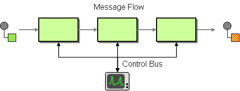

# Control Bus

**Since Camel 2.11**

**Only producer is supported**

The [Control Bus](http://www.eaipatterns.com/ControlBus.md) from the EIP patterns allows for the integration system to be monitored and managed from within the framework.



Use a Control Bus to manage an enterprise integration system. The Control Bus uses the same messaging mechanism used by the application data, but uses separate channels to transmit data that is relevant to the management of components involved in the message flow.

In Camel, you can manage and monitor the application:

-   using JMX.
    
-   by using a Java API from the `CamelContext`.
    
-   from the `org.apache.camel.api.management` package.
    
-   using the event notifier.
    
-   using the ControlBus component.
    

The ControlBus component provides easy management of Camel applications based on the [Control Bus](#) EIP pattern. For example, by sending a message to an endpoint, you can control the lifecycle of routes, or gather performance statistics.

controlbus:command\[?options\]

Where `command` can be any string to identify which type of command to use.

## Commands

 
| Command | Description |
| --- | --- |
| `route` | To control routes using the `routeId` and `action` parameter. |
| `language` | Allows you to specify a [Language](language-component.md) to use for evaluating the message body. If there is any result from the evaluation, then the result is put in the message body. |

## Configuring Options

Camel components are configured on two separate levels:

-   component level
    
-   endpoint level
    

### Configuring Component Options

At the component level, you set general and shared configurations that are, then, inherited by the endpoints. It is the highest configuration level.

For example, a component may have security settings, credentials for authentication, urls for network connection and so forth.

Some components only have a few options, and others may have many. Because components typically have pre-configured defaults that are commonly used, then you may often only need to configure a few options on a component; or none at all.

You can configure components using:

-   the [Component DSL](../../manual/component-dsl.md).
    
-   in a configuration file (`application.properties`, `*.yaml` files, etc).
    
-   directly in the Java code.
    

### Configuring Endpoint Options

You usually spend more time setting up endpoints because they have many options. These options help you customize what you want the endpoint to do. The options are also categorized into whether the endpoint is used as a consumer (_from_), as a producer (_to_), or both.

Configuring endpoints is most often done directly in the endpoint URI as _path_ and _query_ parameters. You can also use the [Endpoint DSL](../../manual/Endpoint-dsl.md) and [DataFormat DSL](../../manual/dataformat-dsl.md) as a _type safe_ way of configuring endpoints and data formats in Java.

A good practice when configuring options is to use [Property Placeholders](../../manual/using-propertyplaceholder.md).

Property placeholders provide a few benefits:

-   They help prevent using hardcoded urls, port numbers, sensitive information, and other settings.
    
-   They allow externalizing the configuration from the code.
    
-   They help the code to become more flexible and reusable.
    

The following two sections list all the options, firstly for the component followed by the endpoint.

## Component Options

The Control Bus component supports 2 options, which are listed below.

   
| Name | Description | Default | Type |
| --- | --- | --- | --- |
| **lazyStartProducer** (producer) | Whether the producer should be started lazy (on the first message). By starting lazy you can use this to allow CamelContext and routes to startup in situations where a producer may otherwise fail during starting and cause the route to fail being started. By deferring this startup to be lazy then the startup failure can be handled during routing messages via Camel’s routing error handlers. Beware that when the first message is processed then creating and starting the producer may take a little time and prolong the total processing time of the processing. | false | boolean |
| **autowiredEnabled** (advanced) | Whether autowiring is enabled. This is used for automatic autowiring options (the option must be marked as autowired) by looking up in the registry to find if there is a single instance of matching type, which then gets configured on the component. This can be used for automatic configuring JDBC data sources, JMS connection factories, AWS Clients, etc. | true | boolean |

## Endpoint Options

The Control Bus endpoint is configured using URI syntax:

controlbus:command:language

With the following _path_ and _query_ parameters:

### Path Parameters (2 parameters)

   
| Name | Description | Default | Type |
| --- | --- | --- | --- |
| **command** (producer) | 
**Required** Command can be either route or language.

Enum values:

-   route
    
-   language
    


 |  | String |
| **language** (producer) | 

Allows you to specify the name of a Language to use for evaluating the message body. If there is any result from the evaluation, then the result is put in the message body.

Enum values:

-   bean
    
-   constant
    
-   csimple
    
-   datasonnet
    
-   exchangeProperty
    
-   file
    
-   groovy
    
-   header
    
-   hl7terser
    
-   java
    
-   joor
    
-   jq
    
-   jsonpath
    
-   mvel
    
-   ognl
    
-   python
    
-   ref
    
-   simple
    
-   spel
    
-   tokenize
    
-   xpath
    
-   xquery
    
-   xtokenize
    


 |  | Language |

### Query Parameters (6 parameters)

   
| Name | Description | Default | Type |
| --- | --- | --- | --- |
| **action** (producer) | 
To denote an action that can be either: start, stop, or status. To either start or stop a route, or to get the status of the route as output in the message body. You can use suspend and resume to either suspend or resume a route. You can use stats to get performance statics returned in XML format; the routeId option can be used to define which route to get the performance stats for, if routeId is not defined, then you get statistics for the entire CamelContext. The restart action will restart the route. And the fail action will stop and mark the route as failed (stopped due to an exception).

Enum values:

-   start
    
-   stop
    
-   fail
    
-   suspend
    
-   resume
    
-   restart
    
-   status
    
-   stats
    


 |  | String |
| **async** (producer) | Whether to execute the control bus task asynchronously. Important: If this option is enabled, then any result from the task is not set on the Exchange. This is only possible if executing tasks synchronously. | false | boolean |
| **loggingLevel** (producer) | 

Logging level used for logging when task is done, or if any exceptions occurred during processing the task.

Enum values:

-   TRACE
    
-   DEBUG
    
-   INFO
    
-   WARN
    
-   ERROR
    
-   OFF
    


 | INFO | LoggingLevel |
| **restartDelay** (producer) | The delay in millis to use when restarting a route. | 1000 | int |
| **routeId** (producer) | To specify a route by its id. The special keyword current indicates the current route. |  | String |
| **lazyStartProducer** (producer (advanced)) | Whether the producer should be started lazy (on the first message). By starting lazy you can use this to allow CamelContext and routes to startup in situations where a producer may otherwise fail during starting and cause the route to fail being started. By deferring this startup to be lazy then the startup failure can be handled during routing messages via Camel’s routing error handlers. Beware that when the first message is processed then creating and starting the producer may take a little time and prolong the total processing time of the processing. | false | boolean |

## Examples

### Using route command

The route command allows you to do common tasks on a given route very easily. For example, to start a route, you can send an empty message to this endpoint:

```java
template.sendBody("controlbus:route?routeId=foo&action=start", null);
```

To get the status of the route, you can do:

```java
String status = template.requestBody("controlbus:route?routeId=foo&action=status", null, String.class);
```

### Getting performance statistics

This requires JMX to be enabled (it is enabled by default) then you can get the performance statics per route, or for the CamelContext. For example, to get the statics for a route named foo, we can use:

```java
String xml = template.requestBody("controlbus:route?routeId=foo&action=stats", null, String.class);
```

The returned statics is in XML format. It is the same data you can get from JMX with the `dumpRouteStatsAsXml` operation on the `ManagedRouteMBean`.

To get statics for the entire `CamelContext` you just omit the routeId parameter as shown below:

```java
String xml = template.requestBody("controlbus:route?action=stats", null, String.class);
```

### Using Simple language

You can use the [Simple](languages/simple-language.md) language with the control bus. For example, to stop a specific route, you can send a message to the `"controlbus:language:simple"` endpoint containing the following message:

```java
template.sendBody("controlbus:language:simple", "${camelContext.getRouteController().stopRoute('myRoute')}");
```

As this is a void operation, no result is returned. However, if you want the route status, you can use:

```java
String status = template.requestBody("controlbus:language:simple", "${camelContext.getRouteController().getRouteStatus('myRoute')}", String.class);
```

It’s easier to use the `route` command to control lifecycle of routes. The `language` command allows you to execute a language script that has stronger powers such as [Groovy](languages/groovy-language.md) or to some extend the [Simple](languages/simple-language.md) language.

For example, to shut down Apache Camel itself, you can do:

```java
template.sendBody("controlbus:language:simple?async=true", "${camelContext.stop()}");
```

We use `async=true` to stop Camel asynchronously as otherwise we would be trying to stop Camel while it was in-flight processing the message we sent to the control bus component.

> **Tip**
> You can also use other languages such as [Groovy](languages/groovy-language.md), etc.

## Spring Boot Auto-Configuration

When using controlbus with Spring Boot make sure to use the following Maven dependency to have support for auto configuration:

```xml
<dependency>
  <groupId>org.apache.camel.springboot</groupId>
  <artifactId>camel-controlbus-starter</artifactId>
  <version>x.x.x</version>
  <!-- use the same version as your Camel core version -->
</dependency>
```

The component supports 3 options, which are listed below.

   
| Name | Description | Default | Type |
| --- | --- | --- | --- |
| **camel.component.controlbus.autowired-enabled** | Whether autowiring is enabled. This is used for automatic autowiring options (the option must be marked as autowired) by looking up in the registry to find if there is a single instance of matching type, which then gets configured on the component. This can be used for automatic configuring JDBC data sources, JMS connection factories, AWS Clients, etc. | true | Boolean |
| **camel.component.controlbus.enabled** | Whether to enable auto configuration of the controlbus component. This is enabled by default. |  | Boolean |
| **camel.component.controlbus.lazy-start-producer** | Whether the producer should be started lazy (on the first message). By starting lazy you can use this to allow CamelContext and routes to startup in situations where a producer may otherwise fail during starting and cause the route to fail being started. By deferring this startup to be lazy then the startup failure can be handled during routing messages via Camel’s routing error handlers. Beware that when the first message is processed then creating and starting the producer may take a little time and prolong the total processing time of the processing. | false | Boolean |