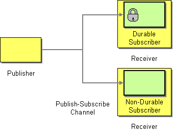

# Durable Subscriber

Camel supports the [Durable Subscriber](https://www.enterpriseintegrationpatterns.com/patterns/messaging/DurableSubscription.md) from the [EIP patterns](enterprise-integration-patterns.md) book.

Camel supports the Durable Subscriber from the EIP patterns using components, such as the [JMS](../jms-component.md) or [Kafka](../kafka-component.md) component, which supports publish & subscribe using topics with support for non-durable and durable subscribers.



## Example

Here is a simple example of creating durable subscribers to a JMS topic:

-   Java
    
-   XML
    

```java
from("direct:start")
  .to("activemq:topic:foo");

from("activemq:topic:foo?clientId=1&durableSubscriptionName=bar1")
  .to("mock:result1");

from("activemq:topic:foo?clientId=2&durableSubscriptionName=bar2")
  .to("mock:result2");
```

```xml
<routes>
    <route>
        <from uri="direct:start"/>
        <to uri="activemq:topic:foo"/>
    </route>

    <route>
        <from uri="activemq:topic:foo?clientId=1&amp;durableSubscriptionName=bar1"/>
        <to uri="mock:result1"/>
    </route>

    <route>
        <from uri="activemq:topic:foo?clientId=2&amp;durableSubscriptionName=bar2"/>
        <to uri="mock:result2"/>
    </route>
</routes>
```