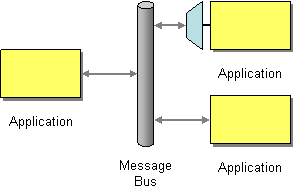

# Message Bus

Camel supports the [Message Bus](https://www.enterpriseintegrationpatterns.com/MessageBus.md) from the [EIP patterns](enterprise-integration-patterns.md). You could view Camel as a Message Bus itself as it allows producers and consumers to be decoupled.



A messaging system such as Apache ActiveMQ can be used as a Message Bus.

## Example

The following demonstrates how the Camel message bus can be used to ingest a message into the bus with the [JMS](../jms-component.md) component.

-   Java
    
-   XML
    

```java
from("file:inbox")
    .to("jms:inbox");
```

```xml
<route>
    <from uri="file:inbox"/>
    <to uri="jms:inbox"/>
</route>
```