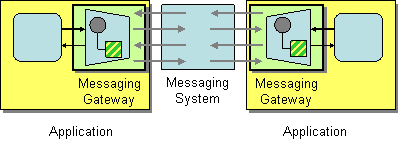

# Messaging Gateway

Camel supports the [Messaging Gateway](https://www.enterpriseintegrationpatterns.com/patterns/messaging/MessagingGateway.md) from the [EIP patterns](enterprise-integration-patterns.md) book.

How do you encapsulate access to the messaging system from the rest of the application?

Use a Messaging Gateway, a class that wraps messaging-specific method calls and exposes domain-specific methods to the application.

Camel has several endpoint components that support the Messaging Gateway from the EIP patterns. Components like [Bean](../bean-component.md) provide a way to bind a Java interface to the message exchange.

Another approach is to use `@Produce` annotations ([POJO Producing](../../../manual/pojo-producing.md)) which also can be used to hide Camel APIs and thereby encapsulate access, acting as a Messaging Gateway EIP solution.