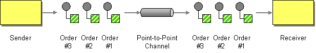

# Point to Point Channel

Camel supports the [Point to Point Channel](http://www.enterpriseintegrationpatterns.com/PointToPointChannel.md) from the [EIP patterns](enterprise-integration-patterns.md).

An application is using Messaging to make remote procedure calls (RPC) or transfer documents.

How can the caller be sure that exactly one receiver will receive the document or perform the call?



Send the message on a Point-to-Point Channel, which ensures that only one receiver will receive a particular message.

The Point to Point Channel is supported in Camel by messaging based [Components](../index.md), such as:

-   [AMQP](../amqp-component.md) for working with AMQP Queues
    
-   [ActiveMQ](../jms-component.md), or [JMS](../jms-component.md) for working with JMS Queues
    
-   [SEDA](../seda-component.md) for internal Camel seda queue based messaging
    
-   [Spring RabbitMQ](../spring-rabbitmq-component.md) for working with AMQP Queues (RabbitMQ)
    

There is also messaging based in the cloud from cloud providers such as Amazon, Google and Azure.

> **Tip**
> See also the related [Publish Scribe Channel](publish-subscribe-channel.md) EIP

## Example

The following example demonstrates point to point messaging using the [JMS](../jms-component.md) component:

-   Java
    
-   XML
    

```java
from("direct:start")
    .to("jms:queue:foo");

from("jms:queue:foo")
    .to("bean:foo");
```

```xml
<routes>
    <route>
        <from uri="direct:start"/>
        <to uri="jms:queue:foo"/>
    </route>
    <route>
        <from uri="jms:queue:foo"/>
        <to uri="bean:foo"/>
    </route>
</routes>
```