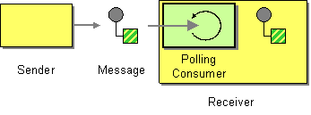

# Polling Consumer

Camel supports implementing the [Polling Consumer](http://www.enterpriseintegrationpatterns.com/PollingConsumer.md) from the [EIP patterns](enterprise-integration-patterns.md).

An application needs to consume Messages, but it wants to control when it consumes each message.

How can an application consume a message when the application is ready?



The application should use a Polling Consumer, one that explicitly makes a call when it wants to receive a message.

In Camel the `PollingConsumer` is represented by the [PollingConsumer](https://github.com/apache/camel/blob/main/core/camel-api/src/main/java/org/apache/camel/PollingConsumer.java) interface.

You can get hold of a `PollingConsumer` in several ways in Camel:

-   Use [Poll Enrich](pollEnrich-eip.md) EIP
    
-   Create a `PollingConsumer` instance via the [Endpoint.createPollingConsumer()](https://github.com/apache/camel/blob/main/core/camel-api/src/main/java/org/apache/camel/Endpoint.java) method.
    
-   Use the [ConsumerTemplate](../../../manual/consumertemplate.md) to poll on demand.
    

## Using Polling Consumer

If you need to use Polling Consumer from within a route, then the [Poll Enrich](pollEnrich-eip.md) EIP can be used.

On the other hand, if you need to use Polling Consumer programmatically, then using [ConsumerTemplate](../../../manual/consumertemplate.md) is a good choice.

And if you want to use the lower level Camel APIs, then you can create the `PollingConsumer` instance to be used.

### Using Polling Consumer from Java

You can programmatically create an instance of `PollingConsumer` from any endpoint as shown below:

```java
Endpoint endpoint = context.getEndpoint("activemq:my.queue");
PollingConsumer consumer = endpoint.createPollingConsumer();
Exchange exchange = consumer.receive();
```

### PollingConsumer API

There are three main polling methods on [PollingConsumer](https://github.com/apache/camel/blob/main/core/camel-api/src/main/java/org/apache/camel/PollingConsumer.java):

 
| Method name | Description |
| --- | --- |
| [PollingConsumer.receive()](https://github.com/apache/camel/blob/main/core/camel-api/src/main/java/org/apache/camel/PollingConsumer.java) | Waits until a message is available and then returns it; potentially blocking forever |
| [PollingConsumer.receive(long)](https://github.com/apache/camel/blob/main/core/camel-api/src/main/java/org/apache/camel/PollingConsumer.java) | Attempts to receive a message exchange, waiting up to the given timeout and returning null if no message exchange could be received within the time available |
| [PollingConsumer.receiveNoWait()](https://github.com/apache/camel/blob/main/core/camel-api/src/main/java/org/apache/camel/PollingConsumer.java) | Attempts to receive a message exchange immediately without waiting and returning null if a message exchange is not available yet |

### Two kinds of Polling Consumer implementations

In Camel there are two kinds of `PollingConsumer` implementations:

-   _Custom_: Some components have their own custom implementation of `PollingConsumer` which is optimized for the given component.
    
-   _Default_: `EventDrivenPollingConsumer` is the default implementation otherwise.
    

The `EventDrivenPollingConsumer` supports the following options:

  
| Option | Default | Description |
| --- | --- | --- |
| `pollingConsumerQueueSize` | `1000` | The queue size for the internal hand-off queue between the polling consumer and producers sending data into the queue. |
| `pollingConsumerBlockWhenFull` | `true` | Whether to block any producer if the internal queue is full. |
| `pollingConsumerBlockTimeout` | 0 | To use a timeout (in milliseconds) when the producer is blocked if the internal queue is full. If the value is `0` or negative then no timeout is in use. If a timeout is triggered then a `ExchangeTimedOutException` is thrown. |

You can configure these options in endpoints [URIs](../../../manual/uris.md), such as shown below:

```java
Endpoint endpoint =
context.getEndpoint("file:inbox?pollingConsumerQueueSize=50");
PollingConsumer consumer = endpoint.createPollingConsumer();
Exchange exchange = consumer.receive(5000);
```