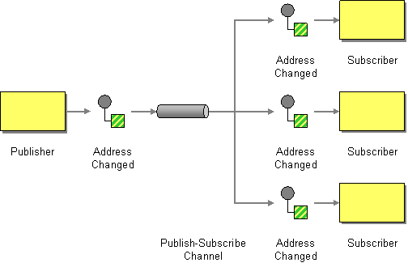

# Publish Subscribe Channel

Camel supports the [Publish-Subscribe Channel](http://www.enterpriseintegrationpatterns.com/PublishSubscribeChannel.md) from the [EIP patterns](enterprise-integration-patterns.md).

How can the sender broadcast an event to all interested receivers?



Send the event on a Publish-Subscribe Channel, which delivers a copy of a particular event to each receiver.

The Publish-Subscribe Channel is supported in Camel by messaging based [Components](../index.md), such as:

-   [AMQP](../amqp-component.md) for working with AMQP Queues
    
-   [ActiveMQ](../jms-component.md), or [JMS](../jms-component.md) for working with JMS Queues
    
-   [SEDA](../seda-component.md) for internal Camel seda queue based messaging
    
-   [Spring RabbitMQ](../spring-rabbitmq-component.md) for working with AMQP Queues (RabbitMQ)
    

There is also messaging based in the cloud from cloud providers such as Amazon, Google and Azure.

> **Tip**
> See also the related [Point to Point Channel](point-to-point-channel.md) EIP

## Example

The following example demonstrates publish subscriber messaging using the [JMS](../jms-component.md) component with JMS topics:

-   Java
    
-   XML
    

```java
from("direct:start")
    .to("jms:topic:cheese");

from("jms:topic:cheese")
    .to("bean:foo");

from("jms:topic:cheese")
    .to("bean:bar");
```

```xml
<routes>
    <route>
        <from uri="direct:start"/>
        <to uri="jms:queue:foo"/>
    </route>
    <route>
        <from uri="jms:queue:foo"/>
        <to uri="bean:foo"/>
    </route>
</routes>
```