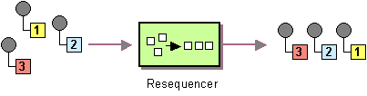

# Resequence

Camel supports the [Resequencer](http://www.enterpriseintegrationpatterns.com/Resequencer.md) from the [EIP patterns](enterprise-integration-patterns.md).

How can we get a stream of related but out-of-sequence messages back into the correct order?



Use a stateful filter, a Resequencer, to collect and re-order messages so that they can be published to the output channel in a specified order.

The Resequencer implementation in Camel uses an [Expression](../../../manual/expression.md) as the `Comparator` to re-order the messages. By using the expression, then the messages can easily be re-ordered by a message header or another piece of the message.

Camel supports two re-sequencing algorithms:

-   [Batch Resequencing](batchConfig-eip.md) - **Default mode**: collects messages into a batch, sorts the messages and sends them to their output.
    
-   [Stream Resequencing](streamConfig-eip.md) - re-orders (continuous) message streams based on the detection of gaps between messages.
    

By default, the Resequencer does not support duplicate messages and will only keep the last message, in case a message arrives with the same message expression. However, in the batch mode you can enable it to allow duplicates.

## Options

The Resequence eip supports 0 options, which are listed below.

   
| Name | Description | Default | Type |
| --- | --- | --- | --- |
| **description** | Sets the description of this node. |  | String |
| **disabled** | Disables this EIP from the route. | false | Boolean |
| **expression** | **Required** Expression to use for re-ordering the messages, such as a header with a sequence number. |  | ExpressionDefinition |
| **resequencerConfig** | **Required** To configure the resequencer in using either batch or stream configuration. Will by default use batch configuration. |  | ResequencerConfig |
| **outputs** | **Required** |  | List |

## Exchange properties

The Resequence eip has no exchange properties.

## Batch Resequencing

The following example shows how to use the Resequencer in [batch mode](batchConfig-eip.md) (default), so that messages are sorted in order of the message body.

That is messages are collected into a batch (either by a maximum number of messages per batch or using a timeout) then they are sorted, and sent out, to continue being routed.

In the example below, we re-order the message based on the content of the message body. The default batch modes will collect up to 100 messages per batch, or timeout every second.

-   Java
    
-   XML
    

```java
from("direct:start")
    .resequence().body()
    .to("mock:result");
```

This is equivalent to:

```java
from("direct:start")
    .resequence(body()).batch()
    .to("mock:result");
```

```xml
<route>
    <from uri="direct:start"/>
    <resequence>
        <simple>${body}</simple>
        <to uri="mock:result"/>
    </resequence>
</route>
```

The batch resequencer can be further configured via the `size()` and `timeout()` methods:

-   Java
    
-   XML
    

```java
from("direct:start")
    .resequence(body()).batch().size(300).timeout(4000L)
    .to("mock:result")
```

```xml
<route>
    <from uri="direct:start"/>
    <resequence>
        <batchConfig batchSize="300" batchTimeout="4000"/>
        <simple>${body}</simple>
        <to uri="mock:result"/>
    </resequence>
</route>
```

This sets the batch size to 300 and the batch timeout to 4000 ms (by default, the batch size is 100, and the timeout is 1000 ms).

So the above example will reorder messages in order of their bodies. Typically, you’d use a header rather than the body to order things; or maybe a part of the body. So you could replace this expression with:

-   Java
    
-   XML
    

```java
from("direct:start")
    .resequence(header("mySeqNo"))
    .to("mock:result")
```

```xml
<route>
    <from uri="direct:start"/>
    <resequence>
        <header>mySeqNo</header>
        <to uri="mock:result"/>
    </resequence>
</route>
```

This reorders messages using a custom sequence number with the header name mySeqNo.

### Allow Duplicates

When allowing duplicates, then the resequencer retains the duplicate message instead of keeping only the last duplicated message.

In batch mode, you can turn on duplicates as follows:

-   Java
    
-   XML
    

```java
from("direct:start")
    .resequence(header("mySeqNo")).allowDuplicates()
    .to("mock:result")
```

```xml
<route>
    <from uri="direct:start"/>
    <resequence>
        <batchConfig allowDuplicates="true"/>
        <header>mySeqNo</header>
        <to uri="mock:result"/>
    </resequence>
</route>
```

### Reverse Ordering

You can reverse the expression ordering. By default, the order is based on `0..9,A..Z`, which would let messages with low numbers be ordered first, and thus also outgoing first. In some cases, you want to reverse the ordering.

In batch mode, you can turn on reverse as follows:

-   Java
    
-   XML
    

```java
from("direct:start")
    .resequence(header("mySeqNo")).reverse()
    .to("mock:result")
```

```xml
<route>
    <from uri="direct:start"/>
    <resequence>
        <batchConfig reverse="true"/>
        <header>mySeqNo</header>
        <to uri="mock:result"/>
    </resequence>
</route>
```

### Ignoring invalid messages

The Resequencer throws a `CamelExchangeException` if the incoming Exchange is not valid for the resequencer such as, the expression cannot be evaluated due to a missing header.

You can ignore these kinds of errors, and let the Resequencer skip the invalid Exchange.

To do this, you do as follows:

-   Java
    
-   XML
    

```java
from("direct:start")
    .resequence(header("seqno")).batch()
        // ignore invalid exchanges (they are discarded)
        .ignoreInvalidExchanges()
    .to("mock:result");
```

```xml
<route>
    <from uri="direct:start"/>
    <resequence>
        <batchConfig ignoreInvalidExchanges="true"/>
        <header>seqno</header>
        <to uri="mock:result"/>
    </resequence>
</route>
```

This option is available for both batch and stream mode.

### Resequence JMS messages based on JMSPriority

It’s now much easier to use the Resequencer to resequence messages from JMS queues based on JMSPriority. For that to work, you need to use the two new options `allowDuplicates` and `reverse`.

```java
from("jms:queue:foo")
    // sort by JMSPriority by allowing duplicates (the message can have the same JMSPriority)
    // and use reverse ordering so 9 is the first output (most important), and 0 is the last
    // use batch mode and fire every 3rd second
    .resequence(header("JMSPriority")).batch().timeout(3000).allowDuplicates().reverse()
    .to("mock:result");
```

Notice this is **only** possible in the `batch` mode of the Resequencer.

## Stream Resequencing

In streaming mode, then the Resequencer will send out messages as soon as possible when a message with the next expected sequence number arrived.

The streaming mode requires the messages to be re-ordered based on integer numeric values that are ordered 1,2,3…​N.

The following example uses the header seqnum for the ordering:

-   Java
    
-   XML
    

```java
from("direct:start")
  .resequence(header("seqnum")).stream()
  .to("mock:result");
```

```xml
<route>
    <from uri="direct:start"/>
    <resequence>
        <streamConfig/>
        <header>seqno</header>
        <to uri="mock:result"/>
    </resequence>
</route>
```

The Resequencer keeps a backlog of pending messages in a backlog. The default capacity is 1000 elements, which can be configured:

-   Java
    
-   XML
    

```java
from("direct:start")
    .resequence(header("seqnum")).stream().capacity(5000).timeout(4000)
    .to("mock:result")
```

```xml
<route>
    <from uri="direct:start"/>
    <resequence>
        <streamConfig capacity="5000" timeout="4000"/>
        <header>seqno</header>
        <to uri="mock:result"/>
    </resequence>
</route>
```

This uses a capacity of 5000 elements. And the timeout has been set to 4 seconds. In case of a timeout, then the resequencer disregards the current expected sequence number, and moves to the next expected number.

### How streaming mode works?

The stream-processing resequencer algorithm is based on the detection of gaps in a message stream rather than on a fixed batch size. Gap detection in combination with timeouts removes the constraint of having to know the number of messages of a sequence (i.e., the batch size) in advance. Messages must contain a unique sequence number for which a predecessor and a successor are known.

For example, a message with the sequence number 3 has a predecessor message with the sequence number 2 and a successor message with the sequence number 4. The message sequence 2,3,5 has a gap because the successor of 3 is missing. The resequencer therefore has to retain message 5 until message 4 arrives (or a timeout occurs).

If the maximum time difference between messages (with successor/predecessor relationship with respect to the sequence number) in a message stream is known, then the Resequencer timeout parameter should be set to this value.

In this case, it is guaranteed that all messages of a stream are delivered in correct order to the next processor. The lower the timeout value is compared to the out-of-sequence time difference, the higher is the probability for out-of-sequence messages delivered by this Resequencer. Large timeout values should be supported by sufficiently high capacity values. The capacity parameter is used to prevent the Resequencer from running out of memory.

### Using custom streaming mode sequence expression

By default, the stream Resequencer expects long sequence numbers, but other sequence numbers types can be supported as well by providing a custom expression.

```java
public class MyFileNameExpression implements Expression {

    public String getFileName(Exchange exchange) {
        return exchange.getIn().getBody(String.class);
    }

    public Object evaluate(Exchange exchange) {
        // parser the file name with YYYYMMDD-DNNN pattern
        String fileName = getFileName(exchange);
        String[] files = fileName.split("-D");
        Long answer = Long.parseLong(files[0]) * 1000 + Long.parseLong(files[1]);
        return answer;
    }

    public <T> T evaluate(Exchange exchange, Class<T> type) {
        Object result = evaluate(exchange);
        return exchange.getContext().getTypeConverter().convertTo(type, result);
    }
}
```

And then you can use this expression in a Camel route:

```java
from("direct:start")
    .resequence(new MyFileNameExpression()).stream().timeout(2000)
    .to("mock:result");
```

### Rejecting old messages

Rejecting old messages is used to prevent out of order messages from being sent, regardless of the event that delivered messages downstream (capacity, timeout, etc).

If enabled, the Resequencer will throw a `MessageRejectedException` when an incoming Exchange is _older_ (based on the `Comparator`) than the last message delivered.

This provides an extra level of control in regard to delayed message ordering.

In the example below, old messages are rejected:

-   Java
    
-   XML
    

```java
from("direct:start")
    .resequence(header("seqno")).stream().timeout(1000).rejectOld()
    .to("mock:result");
```

```xml
<route>
    <from uri="direct:start"/>
    <resequence>
        <streamConfig rejectOld="true" timeout="1000"/>
        <header>seqno</header>
        <to uri="mock:result"/>
    </resequence>
</route>
```

If an old message is detected then Camel throws `MessageRejectedException`.