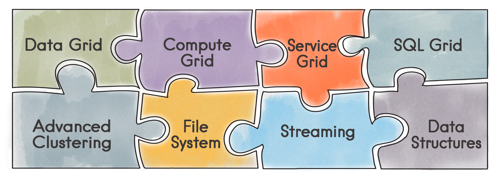

# Ignite

**Since Camel 2.17**

[Apache Ignite](https://ignite.apache.org/) In-Memory Data Fabric is a high performance, integrated and distributed in-memory platform for computing and transacting on large-scale data sets in real-time, orders of magnitude faster than possible with traditional disk-based or flash technologies. It is designed to deliver uncompromised performance for a wide set of in-memory computing use cases from high-performance computing, to the industry’s most advanced data grid, highly available service grid, and streaming. See all [features](https://ignite.apache.org/features.md).



## Ignite components

See the following for usage of each component:

[Ignite Cache](ignite-cache-component.md)

Perform cache operations on an Ignite cache or consume changes from a continuous query.

[Ignite Compute](ignite-compute-component.md)

Run compute operations on an Ignite cluster.

[Ignite Events](ignite-events-component.md)

Receive events from an Ignite cluster by creating a local event listener.

[Ignite ID Generator](ignite-idgen-component.md)

Interact with Ignite Atomic Sequences and ID Generators .

[Ignite Messaging](ignite-messaging-component.md)

Send and receive messages from an Ignite topic.

[Ignite Queues](ignite-queue-component.md)

Interact with Ignite Queue data structures.

[Ignite Sets](ignite-set-component.md)

Interact with Ignite Set data structures.

## Installation

To use this component, add the following dependency to your `pom.xml`:

```xml
<dependency>
    <groupId>org.apache.camel</groupId>
    <artifactId>camel-ignite</artifactId>
    <version>${camel.version}</version> <!-- use the same version as your Camel core version -->
</dependency>
```

## Initializing the Ignite component

Each instance of the Ignite component is associated with an underlying `org.apache.ignite.Ignite` instance. You can interact with two Ignite clusters by initializing two instances of the Ignite component and binding them to different `IgniteConfigurations`. There are three ways to initialize the Ignite component:

-   By passing in an existing `org.apache.ignite.Ignite` instance. Here’s an example using Spring config:
    

```xml
<bean name="ignite" class="org.apache.camel.component.ignite.IgniteComponent">
   <property name="ignite" ref="ignite" />
</bean>
```

-   By passing in an IgniteConfiguration, either constructed programmatically or through inversion of control (e.g., Spring, etc). Here’s an example using Spring config:
    

```xml
<bean name="ignite" class="org.apache.camel.component.ignite.IgniteComponent">
   <property name="igniteConfiguration">
      <bean class="org.apache.ignite.configuration.IgniteConfiguration">
         [...]
      </bean>
   </property>
</bean>
```

-   By passing in a URL, InputStream or String URL to a Spring-based configuration file. In all three cases, you inject them in the same property called configurationResource. Here’s an example using Spring config:
    

```xml
<bean name="ignite" class="org.apache.camel.component.ignite.IgniteComponent">
   <property name="configurationResource" value="file:[...]/ignite-config.xml" />
</bean>
```

Additionally, if using Camel programmatically, there are several convenience static methods in IgniteComponent that return a component out of these configuration options:

-   `IgniteComponent#fromIgnite(Ignite)`
    
-   `IgniteComponent#fromConfiguration(IgniteConfiguration)`
    
-   `IgniteComponent#fromInputStream(InputStream)`
    
-   `IgniteComponent#fromUrl(URL)`
    
-   `IgniteComponent#fromLocation(String)`
    

You may use those methods to quickly create an IgniteComponent with your chosen configuration technique.

## General options

All endpoints share the following options:

     
| Option | Type | Default value | Description | propagateIncomingBodyIfNoReturnValue | boolean |
| --- | --- | --- | --- | --- | --- |
| true | If the underlying Ignite operation returns void (no return type), this flag determines whether the producer will copy the _IN_ body into the _OUT_ body. | treatCollectionsAsCacheObjects | boolean | false | Some Ignite operations can deal with multiple elements at once, if passed a Collection. Enabling this option will treat Collections as a single object, invoking the operation variant for cardinality 1. |

## Spring Boot Auto-Configuration

When using ignite with Spring Boot make sure to use the following Maven dependency to have support for auto configuration:

```xml
<dependency>
  <groupId>org.apache.camel.springboot</groupId>
  <artifactId>camel-ignite-starter</artifactId>
  <version>x.x.x</version>
  <!-- use the same version as your Camel core version -->
</dependency>
```

The component supports 37 options, which are listed below.

   
| Name | Description | Default | Type |
| --- | --- | --- | --- |
| **camel.component.ignite-cache.autowired-enabled** | Whether autowiring is enabled. This is used for automatic autowiring options (the option must be marked as autowired) by looking up in the registry to find if there is a single instance of matching type, which then gets configured on the component. This can be used for automatic configuring JDBC data sources, JMS connection factories, AWS Clients, etc. | true | Boolean |
| **camel.component.ignite-cache.bridge-error-handler** | Allows for bridging the consumer to the Camel routing Error Handler, which mean any exceptions (if possible) occurred while the Camel consumer is trying to pickup incoming messages, or the likes, will now be processed as a message and handled by the routing Error Handler. Important: This is only possible if the 3rd party component allows Camel to be alerted if an exception was thrown. Some components handle this internally only, and therefore bridgeErrorHandler is not possible. In other situations we may improve the Camel component to hook into the 3rd party component and make this possible for future releases. By default the consumer will use the org.apache.camel.spi.ExceptionHandler to deal with exceptions, that will be logged at WARN or ERROR level and ignored. | false | Boolean |
| **camel.component.ignite-cache.enabled** | Whether to enable auto configuration of the ignite-cache component. This is enabled by default. |  | Boolean |
| **camel.component.ignite-cache.ignite** | To use an existing Ignite instance. The option is a org.apache.ignite.Ignite type. |  | Ignite |
| **camel.component.ignite-cache.ignite-configuration** | Allows the user to set a programmatic ignite configuration. The option is a org.apache.ignite.configuration.IgniteConfiguration type. |  | IgniteConfiguration |
| **camel.component.ignite-cache.lazy-start-producer** | Whether the producer should be started lazy (on the first message). By starting lazy you can use this to allow CamelContext and routes to startup in situations where a producer may otherwise fail during starting and cause the route to fail being started. By deferring this startup to be lazy then the startup failure can be handled during routing messages via Camel’s routing error handlers. Beware that when the first message is processed then creating and starting the producer may take a little time and prolong the total processing time of the processing. | false | Boolean |
| **camel.component.ignite-compute.autowired-enabled** | Whether autowiring is enabled. This is used for automatic autowiring options (the option must be marked as autowired) by looking up in the registry to find if there is a single instance of matching type, which then gets configured on the component. This can be used for automatic configuring JDBC data sources, JMS connection factories, AWS Clients, etc. | true | Boolean |
| **camel.component.ignite-compute.enabled** | Whether to enable auto configuration of the ignite-compute component. This is enabled by default. |  | Boolean |
| **camel.component.ignite-compute.ignite** | To use an existing Ignite instance. The option is a org.apache.ignite.Ignite type. |  | Ignite |
| **camel.component.ignite-compute.ignite-configuration** | Allows the user to set a programmatic ignite configuration. The option is a org.apache.ignite.configuration.IgniteConfiguration type. |  | IgniteConfiguration |
| **camel.component.ignite-compute.lazy-start-producer** | Whether the producer should be started lazy (on the first message). By starting lazy you can use this to allow CamelContext and routes to startup in situations where a producer may otherwise fail during starting and cause the route to fail being started. By deferring this startup to be lazy then the startup failure can be handled during routing messages via Camel’s routing error handlers. Beware that when the first message is processed then creating and starting the producer may take a little time and prolong the total processing time of the processing. | false | Boolean |
| **camel.component.ignite-events.autowired-enabled** | Whether autowiring is enabled. This is used for automatic autowiring options (the option must be marked as autowired) by looking up in the registry to find if there is a single instance of matching type, which then gets configured on the component. This can be used for automatic configuring JDBC data sources, JMS connection factories, AWS Clients, etc. | true | Boolean |
| **camel.component.ignite-events.bridge-error-handler** | Allows for bridging the consumer to the Camel routing Error Handler, which mean any exceptions (if possible) occurred while the Camel consumer is trying to pickup incoming messages, or the likes, will now be processed as a message and handled by the routing Error Handler. Important: This is only possible if the 3rd party component allows Camel to be alerted if an exception was thrown. Some components handle this internally only, and therefore bridgeErrorHandler is not possible. In other situations we may improve the Camel component to hook into the 3rd party component and make this possible for future releases. By default the consumer will use the org.apache.camel.spi.ExceptionHandler to deal with exceptions, that will be logged at WARN or ERROR level and ignored. | false | Boolean |
| **camel.component.ignite-events.enabled** | Whether to enable auto configuration of the ignite-events component. This is enabled by default. |  | Boolean |
| **camel.component.ignite-events.ignite** | To use an existing Ignite instance. The option is a org.apache.ignite.Ignite type. |  | Ignite |
| **camel.component.ignite-events.ignite-configuration** | Allows the user to set a programmatic ignite configuration. The option is a org.apache.ignite.configuration.IgniteConfiguration type. |  | IgniteConfiguration |
| **camel.component.ignite-idgen.autowired-enabled** | Whether autowiring is enabled. This is used for automatic autowiring options (the option must be marked as autowired) by looking up in the registry to find if there is a single instance of matching type, which then gets configured on the component. This can be used for automatic configuring JDBC data sources, JMS connection factories, AWS Clients, etc. | true | Boolean |
| **camel.component.ignite-idgen.enabled** | Whether to enable auto configuration of the ignite-idgen component. This is enabled by default. |  | Boolean |
| **camel.component.ignite-idgen.ignite** | To use an existing Ignite instance. The option is a org.apache.ignite.Ignite type. |  | Ignite |
| **camel.component.ignite-idgen.ignite-configuration** | Allows the user to set a programmatic ignite configuration. The option is a org.apache.ignite.configuration.IgniteConfiguration type. |  | IgniteConfiguration |
| **camel.component.ignite-idgen.lazy-start-producer** | Whether the producer should be started lazy (on the first message). By starting lazy you can use this to allow CamelContext and routes to startup in situations where a producer may otherwise fail during starting and cause the route to fail being started. By deferring this startup to be lazy then the startup failure can be handled during routing messages via Camel’s routing error handlers. Beware that when the first message is processed then creating and starting the producer may take a little time and prolong the total processing time of the processing. | false | Boolean |
| **camel.component.ignite-messaging.autowired-enabled** | Whether autowiring is enabled. This is used for automatic autowiring options (the option must be marked as autowired) by looking up in the registry to find if there is a single instance of matching type, which then gets configured on the component. This can be used for automatic configuring JDBC data sources, JMS connection factories, AWS Clients, etc. | true | Boolean |
| **camel.component.ignite-messaging.bridge-error-handler** | Allows for bridging the consumer to the Camel routing Error Handler, which mean any exceptions (if possible) occurred while the Camel consumer is trying to pickup incoming messages, or the likes, will now be processed as a message and handled by the routing Error Handler. Important: This is only possible if the 3rd party component allows Camel to be alerted if an exception was thrown. Some components handle this internally only, and therefore bridgeErrorHandler is not possible. In other situations we may improve the Camel component to hook into the 3rd party component and make this possible for future releases. By default the consumer will use the org.apache.camel.spi.ExceptionHandler to deal with exceptions, that will be logged at WARN or ERROR level and ignored. | false | Boolean |
| **camel.component.ignite-messaging.enabled** | Whether to enable auto configuration of the ignite-messaging component. This is enabled by default. |  | Boolean |
| **camel.component.ignite-messaging.ignite** | To use an existing Ignite instance. The option is a org.apache.ignite.Ignite type. |  | Ignite |
| **camel.component.ignite-messaging.ignite-configuration** | Allows the user to set a programmatic ignite configuration. The option is a org.apache.ignite.configuration.IgniteConfiguration type. |  | IgniteConfiguration |
| **camel.component.ignite-messaging.lazy-start-producer** | Whether the producer should be started lazy (on the first message). By starting lazy you can use this to allow CamelContext and routes to startup in situations where a producer may otherwise fail during starting and cause the route to fail being started. By deferring this startup to be lazy then the startup failure can be handled during routing messages via Camel’s routing error handlers. Beware that when the first message is processed then creating and starting the producer may take a little time and prolong the total processing time of the processing. | false | Boolean |
| **camel.component.ignite-queue.autowired-enabled** | Whether autowiring is enabled. This is used for automatic autowiring options (the option must be marked as autowired) by looking up in the registry to find if there is a single instance of matching type, which then gets configured on the component. This can be used for automatic configuring JDBC data sources, JMS connection factories, AWS Clients, etc. | true | Boolean |
| **camel.component.ignite-queue.enabled** | Whether to enable auto configuration of the ignite-queue component. This is enabled by default. |  | Boolean |
| **camel.component.ignite-queue.ignite** | To use an existing Ignite instance. The option is a org.apache.ignite.Ignite type. |  | Ignite |
| **camel.component.ignite-queue.ignite-configuration** | Allows the user to set a programmatic ignite configuration. The option is a org.apache.ignite.configuration.IgniteConfiguration type. |  | IgniteConfiguration |
| **camel.component.ignite-queue.lazy-start-producer** | Whether the producer should be started lazy (on the first message). By starting lazy you can use this to allow CamelContext and routes to startup in situations where a producer may otherwise fail during starting and cause the route to fail being started. By deferring this startup to be lazy then the startup failure can be handled during routing messages via Camel’s routing error handlers. Beware that when the first message is processed then creating and starting the producer may take a little time and prolong the total processing time of the processing. | false | Boolean |
| **camel.component.ignite-set.autowired-enabled** | Whether autowiring is enabled. This is used for automatic autowiring options (the option must be marked as autowired) by looking up in the registry to find if there is a single instance of matching type, which then gets configured on the component. This can be used for automatic configuring JDBC data sources, JMS connection factories, AWS Clients, etc. | true | Boolean |
| **camel.component.ignite-set.enabled** | Whether to enable auto configuration of the ignite-set component. This is enabled by default. |  | Boolean |
| **camel.component.ignite-set.ignite** | To use an existing Ignite instance. The option is a org.apache.ignite.Ignite type. |  | Ignite |
| **camel.component.ignite-set.ignite-configuration** | Allows the user to set a programmatic ignite configuration. The option is a org.apache.ignite.configuration.IgniteConfiguration type. |  | IgniteConfiguration |
| **camel.component.ignite-set.lazy-start-producer** | Whether the producer should be started lazy (on the first message). By starting lazy you can use this to allow CamelContext and routes to startup in situations where a producer may otherwise fail during starting and cause the route to fail being started. By deferring this startup to be lazy then the startup failure can be handled during routing messages via Camel’s routing error handlers. Beware that when the first message is processed then creating and starting the producer may take a little time and prolong the total processing time of the processing. | false | Boolean |