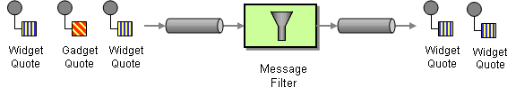

# Filter

The [Message Filter](http://www.enterpriseintegrationpatterns.com/Filter.md) from the [EIP patterns](enterprise-integration-patterns.md) allows you to filter messages.

How can a component avoid receiving uninteresting messages?



Use a special kind of Message Router, a Message Filter, to eliminate undesired messages from a channel based on a set of criteria.

The message filter implemented in Camel is similar to `if (predicate) { block }` in Java. The filter will **include** the message if the predicate evaluated to `true`.

## EIP options

The Filter eip supports 0 options, which are listed below.

   
| Name | Description | Default | Type |
| --- | --- | --- | --- |
| **note** | Sets the note of this node. |  | String |
| **description** | Sets the description of this node. |  | String |
| **disabled** | Disables this EIP from the route. | false | Boolean |
| **expression** | **Required** Expression to determine if the message should be filtered or not. If the expression returns an empty value or false then the message is filtered (dropped), otherwise the message is continued being routed. |  | ExpressionDefinition |
| **statusPropertyName** | Name of exchange property to use for storing the status of the filtering. Setting this allows to know if the filter predicate evaluated as true or false. |  | String |
| **outputs** | **Required** |  | List |

## Exchange properties

The Filter eip has no exchange properties.

## Example

The Camel [Simple](../languages/simple-language.md) language is great to use with the Filter EIP when routing is based on the content of the message, such as checking message headers.

-   Java
    
-   XML
    

```java
from("direct:a")
    .filter(simple("${header.foo} == 'bar'"))
        .to("direct:bar")
    .end()
    .to("direct:b")
```

```xml
<route>
    <from uri="direct:a"/>
    <filter>
        <simple>${header.foo} == 'bar'</simple>
        <to uri="direct:bar"/>
    </filter>
    <to uri="direct:b"/>
</route>
```

You can use many languages as the predicate, such as [XPath](../languages/xpath-language.md):

-   Java
    
-   XML
    

```java
from("direct:start").
        filter().xpath("/person[@name='James']").
        to("mock:result");
```

```xml
<route>
    <from uri="direct:start"/>
    <filter>
        <xpath>/person[@name='James']</xpath>
        <to uri="mock:result"/>
    </filter>
</route>
```

Here is another example of calling a [method on a bean](../languages/bean-language.md) to define the filter behavior:

```java
from("direct:start")
    .filter().method(MyBean.class, "isGoldCustomer")
      .to("mock:gold")
    .end()
    .to("mock:all");
```

And then bean can have a method that returns a `boolean` as the predicate:

```java
public static class MyBean {

    public boolean isGoldCustomer(@Header("level") String level) {
        return level.equals("gold");
    }

}
```

And in XML we can call the bean in `<method>` where we can specify the FQN class name of the bean as shown:

```xml
<route>
    <from uri="direct:start"/>
    <filter>
        <method type="com.foo.MyBean" method="isGoldCustomer"/>
        <to uri="mock:gold"/>
    </filter>
    <to uri="mock:all"/>
</route>
```

### Filtering with status property

To know whether an `Exchange` was filtered or not, then you can choose to specify a name of a property to store on the exchange with the result (boolean), using `statusPropertyName` as shown below:

-   Java
    
-   XML
    

```java
from("direct:start")
    .filter().method(MyBean.class, "isGoldCustomer").statusPropertyName("gold")
      .to("mock:gold")
    .end()
    .to("mock:all");
```

```xml
<route>
    <from uri="direct:start"/>
    <filter statusPropertyName="gold">
        <method type="com.foo.MyBean" method="isGoldCustomer"/>
        <to uri="mock:gold"/>
    </filter>
    <to uri="mock:all"/>
</route>
```

In the example above then Camel will store an exchange property with key `gold` with the result of the filtering, whether it was `true` or `false`.

### Filtering and stopping

When using the Message Filter EIP, then it only applies to its children.

For example, in the previous example:

```xml
<route>
    <from uri="direct:start"/>
    <filter>
        <method type="com.foo.MyBean" method="isGoldCustomer"/>
        <to uri="mock:gold"/>
    </filter>
    <to uri="mock:all"/>
</route>
```

Then for a message that is a gold customer will be routed to both `mock:gold` and `mock:all` (predicate is true). However, for a non-gold message (predicate is false) then the message will not be routed in the filter block, but will be routed to mock:all.

Sometimes you may want to stop routing for messages that were filtered. To do this, you can use the [Stop](stop-eip.md) EIP as shown:

```xml
<route>
    <from uri="direct:start"/>
    <filter>
        <method type="com.foo.MyBean" method="isGoldCustomer"/>
        <to uri="mock:gold"/>
        <stop/>
    </filter>
    <to uri="mock:all"/>
</route>
```