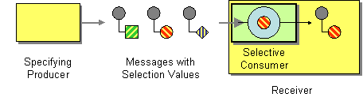

# Selective Consumer

Camel supports the [Selective Consumer](https://www.enterpriseintegrationpatterns.com/patterns/messaging/MessageSelector.md) from the [EIP patterns](enterprise-integration-patterns.md) book.

How can a message consumer select which messages it wishes to receive?



Make the consumer a Selective Consumer, one that filteres the messages delivered by its channel so that it only receives the ones that match its criteria.

## Using Selecting Consumer

In Camel, the Selective Consumer EIP is implemented in two ways:

-   Using [Components](../index.md) which supports message selecting.
    
-   Using the [Filter](filter-eip.md) EIP as message selecting.
    

### Selective Consumer using Components

The first solution is to provide a Message Selector to the underlying URIs when creating your consumer. For example, when using [JMS](../jms-component.md), you can specify a JMS selector parameter so that the message broker will only deliver messages matching your criteria.

-   Java
    
-   XML
    

```java
from("jms:queue:hello?selector=color='red'")
  .to("bean:red");
```

```xml
<route>
  <from uri="jms:queue:hello?selector=color='red'"/>
  <to uri="bean:red"/>
</route>
```

### Selective Consumer using Filter EIP

The other approach is to use a [Message Filter](filter-eip.md) which is applied; if the filter matches the message, your "consumer" is invoked as shown in the following example:

-   Java
    
-   XML
    

```java
from("seda:colors")
    .filter(header("color").isEqualTo("red"))
        .to("bean:red")
```

```xml
<route>
    <from uri="seda:colors"/>
    <filter>
        <simple>${header.color} == 'red'</xpath>
        <to uri="bean:red"/>
    </filter>
</route>
```