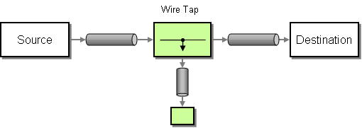

# Wire Tap

[Wire Tap](http://www.enterpriseintegrationpatterns.com/WireTap.md) from the [EIP patterns](enterprise-integration-patterns.md) allows you to route messages to a separate location while they are being forwarded to the ultimate destination.



## Options

The Wire Tap eip supports 1 options, which are listed below.

   
| Name | Description | Default | Type |
| --- | --- | --- | --- |
| **note** | Sets the note of this node. |  | String |
| **description** | Sets the description of this node. |  | String |
| **disabled** | Disables this EIP from the route. | false | Boolean |
| **copy** | Uses a copy of the original exchange. | true | Boolean |
| **dynamicUri** | Whether the uri is dynamic or static. If the uri is dynamic then the simple language is used to evaluate a dynamic uri to use as the wire-tap destination, for each incoming message. This works similar to how the toD EIP pattern works. If static then the uri is used as-is as the wire-tap destination. | true | Boolean |
| **onPrepare** | Uses the Processor when preparing the org.apache.camel.Exchange to be sent. This can be used to deep-clone messages that should be sent, or any custom logic needed before the exchange is sent. |  | Processor |
| **executorService** | Uses a custom thread pool. |  | ExecutorService |
| **uri** | **Required** The uri of the endpoint to send to. The uri can be dynamic computed using the org.apache.camel.language.simple.SimpleLanguage expression. |  | String |
| **variableSend** | To use a variable as the source for the message body to send. This makes it handy to use variables for user data and to easily control what data to use for sending and receiving. Important: When using send variable then the message body is taken from this variable instead of the current message, however the headers from the message will still be used as well. In other words, the variable is used instead of the message body, but everything else is as usual. |  | String |
| **variableReceive** | To use a variable as the source for the message body to send. This makes it handy to use variables for user data and to easily control what data to use for sending and receiving. Important: When using send variable then the message body is taken from this variable instead of the current Message , however the headers from the Message will still be used as well. In other words, the variable is used instead of the message body, but everything else is as usual. |  | String |
| **pattern** | 
Sets the optional ExchangePattern used to invoke this endpoint.

Enum values:

-   InOnly
    
-   InOut
    


 |  | ExchangePattern |
| **cacheSize** | Sets the maximum size used by the org.apache.camel.spi.ProducerCache which is used to cache and reuse producers when using this recipient list, when uris are reused. Beware that when using dynamic endpoints then it affects how well the cache can be utilized. If each dynamic endpoint is unique then its best to turn off caching by setting this to -1, which allows Camel to not cache both the producers and endpoints; they are regarded as prototype scoped and will be stopped and discarded after use. This reduces memory usage as otherwise producers/endpoints are stored in memory in the caches. However if there are a high degree of dynamic endpoints that have been used before, then it can benefit to use the cache to reuse both producers and endpoints and therefore the cache size can be set accordingly or rely on the default size (1000). If there is a mix of unique and used before dynamic endpoints, then setting a reasonable cache size can help reduce memory usage to avoid storing too many non frequent used producers. |  | Integer |
| **ignoreInvalidEndpoint** | Whether to ignore invalid endpoint URIs and skip sending the message. | false | Boolean |
| **allowOptimisedComponents** | Whether to allow components to optimise toD if they are org.apache.camel.spi.SendDynamicAware . | true | Boolean |
| **autoStartComponents** | Whether to auto startup components when toD is starting up. | true | Boolean |

## Exchange properties

The Wire Tap eip supports 1 exchange properties, which are listed below.

The exchange properties are set on the `Exchange` by the EIP, unless otherwise specified in the description. This means those properties are available after this EIP has completed processing the `Exchange`.

   
| Name | Description | Default | Type |
| --- | --- | --- | --- |
| **CamelToEndpoint** | Endpoint URI where this Exchange is being sent to. |  | String |

## Wire Tap

Camel’s Wire Tap will copy the original [Exchange](../../../manual/exchange.md) and set its [Exchange Pattern](../../../manual/exchange-pattern.md) to **`InOnly`**, as we want the tapped [Exchange](../../../manual/exchange.md) to be sent in a fire and forget style. The tapped [Exchange](../../../manual/exchange.md) is then sent in a separate thread, so it can run in parallel with the original. Beware that only the `Exchange` is copied - Wire Tap won’t do a deep clone (unless you specify a custom processor via **`onPrepare`** which does that). So all copies could share objects from the original `Exchange`.

### Using Wire Tap

In the example below, the exchange is wire tapped to the direct:tap route. This route delays message 1 second before continuing. This is because it allows you to see that the tapped message is routed independently of the original route, so that you would see log:result happens before log:tap

-   Java
    
-   XML
    
-   YAML
    

```java
from("direct:start")
    .to("log:foo")
    .wireTap("direct:tap")
    .to("log:result");

from("direct:tap")
    .delay(1000).setBody().constant("Tapped")
    .to("log:tap");
```

```xml
<routes>

  <route>
    <from uri="direct:start"/>
    <wireTap uri="direct:tap"/>
    <to uri="log:result"/>
  </route>

  <route>
    <from uri="direct:tap"/>
    <to uri="log:log"/>
  </route>

</routes>
```

```yaml
- from:
    uri: direct:start
    steps:
      - wireTap:
         uri: direct:tap
      - to:
          uri: log:result
- from:
    uri: direct:tap
    steps:
      - to:
          uri: log:log
```

### Wire tapping with dynamic URIs

For example, to wire tap to a dynamic URI, then the URI uses the [Simple](../languages/simple-language.md) language that allows to construct dynamic URIs.

For example, to wire tap to a JMS queue where the header ID is part of the queue name:

-   Java
    
-   XML
    
-   YAML
    

```java
from("direct:start")
    .wireTap("jms:queue:backup-${header.id}")
    .to("bean:doSomething");
```

```xml
<route>
  <from uri="direct:start"/>
  <wireTap uri="jms:queue:backup-${header.id}"/>
  <to uri="bean:doSomething"/>
</route>
```

```yaml
- from:
    uri: direct:start
    steps:
      - wireTap:
          uri: jms:queue:backup-${header.id}
      - to:
          uri: bean:doSomething
```

## WireTap Thread Pools

The WireTap uses a thread pool to process the tapped messages. This thread pool will by default use the settings detailed in the [Threading Model](../../../manual/threading-model.md).

In particular, when the pool is exhausted (with all threads used), further wiretaps will be executed synchronously by the calling thread. To remedy this, you can configure an explicit thread pool on the Wire Tap having either a different rejection policy, a larger worker queue, or more worker threads.

## Wire tapping Streaming based messages

If you Wire Tap a stream message body, then you should consider enabling [Stream caching](../../../manual/stream-caching.md) to ensure the message body can be read at each endpoint.

See more details at [Stream caching](../../../manual/stream-caching.md).