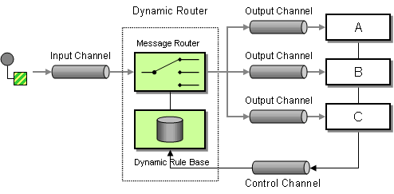

# Dynamic Router

The [Dynamic Router](http://www.enterpriseintegrationpatterns.com/DynamicRouter.md) from the [EIP patterns](enterprise-integration-patterns.md) allows you to route messages while avoiding the dependency of the router on all possible destinations while maintaining its efficiency.



## Options

The Dynamic Router eip supports the following options which are listed below.

   
| Name | Description | Default | Type |
| --- | --- | --- | --- |
| **note** | The note for this node. |  | String |
| **description** | The description for this node. |  | String |
| **disabled** | Whether to disable this EIP from the route during build time. Once an EIP has been disabled then it cannot be enabled later at runtime. | false | Boolean |
| **expression** | **Required** The expression to compute the next endpoint URI to route to. The expression is called iteratively until it returns null to indicate the end of routing. |  | ExpressionDefinition |
| **uriDelimiter** | The delimiter used to separate endpoint URIs when the expression returns multiple endpoints. Default is comma. | , | String |
| **ignoreInvalidEndpoints** | If enabled then invalid endpoint URIs are ignored and logged instead of throwing an exception. | false | Boolean |
| **cacheSize** | Configures the cache size for ProducerCache which caches producers for reuse. The default cache size is 1000. Set to -1 to turn off caching. |  | Integer |
| **allowedSchemes** | Sets an optional comma-separated allow-list of component schemes that the dynamic recipient may resolve to (e.g. http,https). When set, a dynamic endpoint whose scheme is not in the list is rejected. This is a defence-in-depth restriction, useful for low-code / Kamelet deployments; by default (unset) any scheme is allowed. |  | String |

## Exchange properties

The Dynamic Router eip has no exchange properties.

## Dynamic Router

The Dynamic Router is similar to the [Routing Slip](routingSlip-eip.md) EIP, but with the slip evaluated dynamically _on-the-fly_. The [Routing Slip](routingSlip-eip.md) on the other hand evaluates the slip only once in the beginning.

The Dynamic Router sets the exchange property (`Exchange.SLIP_ENDPOINT`) with the current slip. This allows you to know how far we have processed in the overall slip.

## Example

You can use the `dynamicRouter` as shown below:

-   Java
    
-   XML
    
-   YAML
    

```java
from("direct:start")
    // use a bean as the dynamic router
    .dynamicRouter(method(MySlipBean.class, "slip"));
```

```xml
<route>
    <from uri="direct:start"/>
    <dynamicRouter>
        <!-- use a method call on a bean as dynamic router -->
        <method beanType="com.foo.MySlipBean" method="slip"/>
    </dynamicRouter>
</route>
```

```yaml
- route:
    from:
      uri: direct:start
      steps:
        - dynamicRouter:
            expression:
              method:
                beanType: com.foo.MySlipBean
                method: slip
```

Which will call a [Bean Method](../languages/bean-language.md) to compute the slip _on-the-fly_. The bean could be implemented as follows:

```java
/**
 * Use this method to compute dynamic where we should route next.
 *
 * @param body the message body
 * @return endpoints to go, or <tt>null</tt> to indicate the end
 */
public String slip(String body) {
    bodies.add(body);
    invoked++;

    if (invoked == 1) {
        return "mock:a";
    } else if (invoked == 2) {
        return "mock:b,mock:c";
    } else if (invoked == 3) {
        return "direct:foo";
    } else if (invoked == 4) {
        return "mock:result";
    }

    // no more so return null
    return null;
}
```

> **Warning**
> **Beware** You must ensure the expression used for the `dynamicRouter` such as a bean, will return `null` to indicate the end. Otherwise, the `dynamicRouter` will keep repeating endlessly.

### Thread safety beans

Mind that this example is only for show and tell. The current implementation is not thread safe. You would have to store the state on the `Exchange`, to ensure thread safety, as shown below:

```java
/**
 * Use this method to compute dynamic where we should route next.
 *
 * @param body the message body
 * @param properties the exchange properties where we can store state between invocations
 * @return endpoints to go, or <tt>null</tt> to indicate the end
 */
public String slip(String body, @ExchangeProperties Map<String, Object> properties) {
    bodies.add(body);

    // get the state from the exchange properties and keep track how many times
    // we have been invoked
    int invoked = 0;
    Object current = properties.get("invoked");
    if (current != null) {
        invoked = Integer.parseInt(current.toString());
    }
    invoked++;
    // and store the state back on the properties
    properties.put("invoked", invoked);

    if (invoked == 1) {
        return "mock:a";
    } else if (invoked == 2) {
        return "mock:b,mock:c";
    } else if (invoked == 3) {
        return "direct:foo";
    } else if (invoked == 4) {
        return "mock:result";
    }

    // no more so return null
    return null;
}
```

You could also store state as message headers, but they are not guaranteed to be preserved during routing, whereas properties on the Exchange are.

## @DynamicRouter annotation

You can also use [Bean Integration](../../../manual/bean-integration.md) with the `@DynamicRouter` annotation, on a Java bean method.

In the example below the `route` method would then be invoked repeatedly as the message is processed dynamically. The idea is to return the next endpoint uri where to go, and to return `null` to end. You can return multiple endpoints if you like, just as the [Routing Slip](routingSlip-eip.md), where each endpoint is separated by a comma.

```java
public class MyDynamicRouter {

    @Consume(uri = "activemq:foo")
    @DynamicRouter
    public String route(@XPath("/customer/id") String customerId, @Header("Location") String location, Document body) {
        // Query a database to find the best match of the endpoint based on the input parameters
        // return the next endpoint uri, where to go. Return null to indicate the end.
    }
}
```

The parameters on the `route` method is bound to information from the Exchange using [Bean Parameter Binding](../../../manual/bean-binding.md).