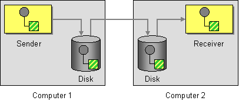

# Guaranteed Delivery

Camel supports the [Guaranteed Delivery](http://www.enterpriseintegrationpatterns.com/GuaranteedMessaging.md) from the [EIP patterns](enterprise-integration-patterns.md) using among others the following components:

-   [File](../file-component.md) for using file systems as a persistent store of messages
    
-   [JMS](../jms-component.md) when using persistent delivery, the default, for working with JMS queues and topics for high performance, clustering and load balancing
    
-   [Kafka](../kafka-component.md) when using persistent delivery for working with streaming events for high performance, clustering and load balancing
    
-   [JPA](../jpa-component.md) for using a database as a persistence layer, or use any of the other database components such as [SQL](../sql-component.md), [JDBC](../jdbc-component.md), or [MyBatis](../mybatis-component.md)
    



## Example

The following example demonstrates illustrates the use of [Guaranteed Delivery](http://www.enterpriseintegrationpatterns.com/GuaranteedMessaging.md) within the [JMS](../jms-component.md) component.

By default, a message is not considered successfully delivered until the recipient has persisted the message locally guaranteeing its receipt in the event the destination becomes unavailable.

-   Java
    
-   XML
    
-   YAML
    

```java
from("direct:start")
    .to("jms:queue:foo");
```

```xml
<route>
    <from uri="direct:start"/>
    <to uri="jms:queue:foo"/>
</route>
```

```yaml
- route:
    from:
      uri: direct:start
      steps:
        - to:
            uri: jms:queue:foo
```