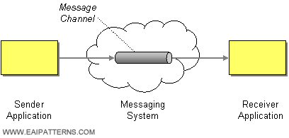

# Message Channel

Camel supports the [Message Channel](http://www.enterpriseintegrationpatterns.com/MessageChannel.md) from the [EIP patterns](enterprise-integration-patterns.md).

The Message Channel is an internal implementation detail of the `Endpoint` interface, where all interactions of the channel is via the [Endpoint](https://www.javadoc.io/doc/org.apache.camel/camel-api/current/org/apache/camel/Endpoint.md).



## Example

In [JMS](../jms-component.md), Message Channels are represented by topics and queues such as the following:

```text
jms:queue:foo
```

The following shows a little route snippet:

-   Java
    
-   XML
    
-   YAML
    

```java
from("file:foo")
    .to("jms:queue:foo")
```

```xml
<route>
  <from uri="file:foo"/>
  <to uri="jms:queue:foo"/>
</route>
```

```yaml
- route:
    from:
      uri: file:foo
      steps:
        - to:
            uri: jms:queue:foo
```