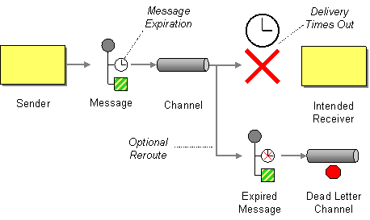

# Message Expiration

Camel supports the [Message Expiration](https://www.enterpriseintegrationpatterns.com/patterns/messaging/MessageExpiration.md) from the [EIP patterns](enterprise-integration-patterns.md).

How can a sender indicate when a message should be considered stale and thus should not be processed?



Set the Message Expiration to specify a time limit how long the message is viable.

Message expiration is supported by some Camel components such as [JMS](../jms-component.md), which uses _time-to-live_ to specify for how long the message is valid.

> **Important**
> When using message expiration, then mind about keeping the systems clocks' synchronized among the systems.

## Example

A message should expire after 5 seconds:

-   Java
    
-   XML
    
-   YAML
    

```java
from("direct:cheese")
  .to("jms:queue:cheese?timeToLive=5000");
```

```xml
<route>
    <from uri="direct:cheese"/>
    <to uri="jms:queue:cheese?timeToLive=5000"/>
</route>
```

```yaml
- route:
    from:
      uri: direct:cheese
      steps:
        - to:
            uri: jms:queue:cheese
            parameters:
              timeToLive: 5000
```