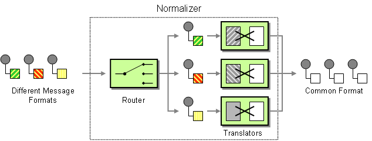

# Normalizer

Camel supports the [Normalizer](https://www.enterpriseintegrationpatterns.com/patterns/messaging/Normalizer.md) from the [EIP patterns](enterprise-integration-patterns.md) book.

The normalizer pattern is used to process messages that are semantically equivalent, but arrive in different formats. The normalizer transforms the incoming messages into a common format.



In Apache Camel, you can implement the normalizer pattern by combining a [Content-Based Router](choice-eip.md), which detects the incoming message’s format, with a collection of different [Message Translators](message-translator.md), which transform the different incoming formats into a common format.

## Example

This example shows a Message Normalizer that converts two types of XML messages into a common format. Messages in this common format are then routed.

-   Java
    
-   XML
    
-   YAML
    

```java
// we need to normalize two types of incoming messages
from("direct:start")
    .choice()
        .when().xpath("/employee").to("bean:normalizer?method=employeeToPerson")
        .when().xpath("/customer").to("bean:normalizer?method=customerToPerson")
    .end()
    .to("mock:result");
```

```xml
<camelContext xmlns="http://camel.apache.org/schema/spring">
  <route>
    <from uri="direct:start"/>
    <choice>
      <when>
        <xpath>/employee</xpath>
        <to uri="bean:normalizer?method=employeeToPerson"/>
      </when>
      <when>
        <xpath>/customer</xpath>
        <to uri="bean:normalizer?method=customerToPerson"/>
      </when>
    </choice>
    <to uri="mock:result"/>
  </route>
</camelContext>

<bean id="normalizer" class="org.apache.camel.processor.MyNormalizer"/>
```

```yaml
- route:
    from:
      uri: direct:start
      steps:
        - choice:
            when:
              - expression:
                  xpath:
                    expression: /employee
                steps:
                  - to:
                      uri: bean:normalizer
                      parameters:
                        method: employeeToPerson
              - expression:
                  xpath:
                    expression: /customer
                steps:
                  - to:
                      uri: bean:normalizer
                      parameters:
                        method: customerToPerson
        - to:
            uri: mock:result
```

In this case, we’re using a Java [Bean](../bean-component.md) as the normalizer.

The class looks like this:

```java
// Java
public class MyNormalizer {

    public void employeeToPerson(Exchange exchange, @XPath("/employee/name/text()") String name) {
        exchange.getMessage().setBody(createPerson(name));
    }

    public void customerToPerson(Exchange exchange, @XPath("/customer/@name") String name) {
        exchange.getMessage().setBody(createPerson(name));
    }

    private String createPerson(String name) {
        return "<person name=\" + name + \"/>";
    }
}
```

In case there are many incoming formats, then the [Content Based Router](choice-eip.md) may end up with too many choices. In this situation, then an alternative is to use [Dynamic to](toD-eip.md) that computes a [Bean](../bean-component.md) endpoint, to be called that acts as [Message Translator](message-translator.md).