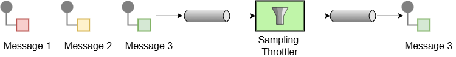

# Sample

A sampling throttler allows you to extract a sample of the exchanges from the traffic through a route.



The Sample EIP selects a single message in a given time period or every nth message. This selected message is allowed to pass through, and all other messages are stopped.

## Options

The Sample eip supports the following options which are listed below.

   
| Name | Description | Default | Type |
| --- | --- | --- | --- |
| **note** | The note for this node. |  | String |
| **description** | The description for this node. |  | String |
| **disabled** | Whether to disable this EIP from the route during build time. Once an EIP has been disabled then it cannot be enabled later at runtime. | false | Boolean |
| **samplePeriod** | The period between samples, using a time-based approach. Default is 1 second. | 1000 | String |
| **messageFrequency** | The frequency of samples as a message count, using a message-frequency approach. For example, a value of 5 means every 5th message is sampled. |  | Long |

## Exchange properties

The Sample eip has no exchange properties.

## Using Sample EIP

In the example below, we sample one message per second (default time period):

-   Java
    
-   XML
    
-   YAML
    

```java
from("direct:sample")
    .sample()
    .to("direct:sampled");
```

```xml
<route>
    <from uri="direct:sample"/>
    <sample/>
    <to uri="direct:sampled"/>
</route>
```

```yaml
- route:
    from:
      uri: direct:sample
      steps:
        - sample: {}
        - to:
            uri: direct:sampled
```

### Sampling using time period

The default time period is 1 second, but this can easily be configured. For example, to sample one message per 5 seconds, you can do:

-   Java
    
-   XML
    
-   YAML
    

```java
from("direct:sample")
    .sample(Duration.ofSeconds(5))
    .to("direct:sampled");
```

```xml
<route>
    <from uri="direct:sample"/>
    <sample samplePeriod="5s"/>
    <to uri="direct:sampled"/>
</route>
```

```yaml
- route:
    from:
      uri: direct:sample
      steps:
        - sample:
            samplePeriod: 5s
        - to:
            uri: direct:sampled
```

### Sampling using message frequency

The Sample EIP can also be configured to sample based on frequency instead of a time period.

For example, to sample every 10th message you can do:

-   Java
    
-   XML
    
-   YAML
    

```java
from("direct:sample")
    .sample(10)
    .to("direct:sampled");
```

```xml
<route>
    <from uri="direct:sample"/>
    <sample messageFrequency="10"/>
    <to uri="direct:sampled"/>
</route>
```

```yaml
- route:
    from:
      uri: direct:sample
      steps:
        - sample:
            messageFrequency: 10
        - to:
            uri: direct:sampled
```

### Sampling with wiretap

The sampling throttler will stop all exchanges not included in the sample. This may be undesirable if you want to perform custom processing on the sample while still allowing all 10 messages to flow to an endpoint after the sample EIP.

For this use case, you can combine the sample EIP with wiretap EIP. In the example below, we sample every 10th message and send it to direct:sampleProcessing, while all 10 messages are still sent to direct:regularProcessing.

-   Java
    
-   XML
    
-   YAML
    

```java
from("direct:start")
  .wireTap("direct:sample")
  .to("direct:regularProcessing");

from("direct:sample")
  .sample(10)
  .to("direct:sampleProcessing");
```

```xml
<route>
    <from uri="direct:start"/>
    <wireTap uri="direct:sample"/>
    <to uri="direct:regularProcessing"/>
</route>

<route>
    <from uri="direct:sample"/>
    <sample messageFrequency="10"/>
    <to uri="direct:sampleProcessing"/>
</route>
```

```yaml
- route:
    from:
      uri: direct:start
      steps:
        - wireTap:
            uri: direct:sample
        - to:
            uri: direct:regularProcessing
- route:
    from:
      uri: direct:sample
      steps:
        - sample:
            messageFrequency: 10
        - to:
            uri: direct:sampleProcessing
```