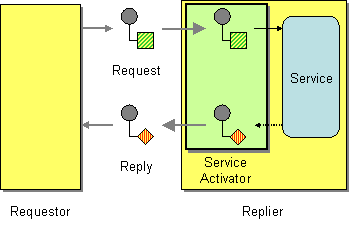

# Service Activator

Camel supports the [Service Activator](https://www.enterpriseintegrationpatterns.com/patterns/messaging/MessagingAdapter.md) from the [EIP patterns](enterprise-integration-patterns.md) book.

How can an application design a service to be invoked both via various messaging technologies and via non-messaging techniques?



Design a Service Activator that connects the messages on the channel to the service being accessed.

Camel has several [Components](../index.md) that support the Service Activator EIP.

Components like [Bean](../bean-component.md) and [CXF](../bean-component.md) provide a way to bind the message [Exchange](../../../manual/exchange.md) to a Java interface/service where the route defines the endpoints and wires it up to the bean.

In addition, you can use the [Bean Integration](../../../manual/bean-integration.md) to wire messages to a bean using Java annotation.

## Example

Here is a simple example of using a [Direct](../direct-component.md) endpoint to create a messaging interface to a POJO [Bean](../bean-component.md) service.

-   Java
    
-   XML
    
-   YAML
    

```java
from("direct:invokeMyService")
  .to("bean:myService");
```

```xml
<route>
  <from uri="direct:invokeMyService"/>
  <to uri="bean:myService"/>
</route>
```

```yaml
- route:
    from:
      uri: direct:invokeMyService
      steps:
        - to:
            uri: bean:myService
```