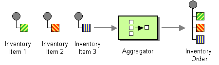

# Aggregate

The [Aggregator](http://www.enterpriseintegrationpatterns.com/Aggregator.md) from the [EIP patterns](enterprise-integration-patterns.md) allows you to combine a number of messages into a single message.

How do we combine the results of individual, but related, messages so that they can be processed as a whole?



Use a stateful filter, an Aggregator, to collect and store individual messages until a complete set of related messages has been received. Then, the Aggregator publishes a single message distilled from the individual messages.

The aggregator is one of the most complex EIP and has many features and configurations.

The logic for combing messages together is _correlated_ in buckets based on a _correlation key_. Messages with the same correlation key are aggregated together, using an `AggregationStrategy`.

## Aggregate options

The Aggregate eip supports the following options which are listed below.

   
| Name | Description | Default | Type |
| --- | --- | --- | --- |
| **note** | The note for this node. |  | String |
| **description** | The description for this node. |  | String |
| **disabled** | Whether to disable this EIP from the route during build time. Once an EIP has been disabled then it cannot be enabled later at runtime. | false | Boolean |
| **correlationExpression** | The expression used to calculate the correlation key to use for aggregation. Exchanges with the same correlation key are aggregated together. If the correlation key cannot be evaluated an Exception is thrown. |  | ExpressionSubElementDefinition |
| **completionPredicate** | A predicate to indicate when an aggregated exchange is complete. If not specified and the AggregationStrategy implements Predicate, it will be used as the completionPredicate. |  | ExpressionSubElementDefinition |
| **completionTimeoutExpression** | Time in millis that an aggregated exchange should be inactive before its complete (timeout), evaluated as an expression allowing dynamic timeout values. |  | ExpressionSubElementDefinition |
| **completionSizeExpression** | Number of messages aggregated before the aggregation is complete, evaluated as an expression allowing dynamic size values. |  | ExpressionSubElementDefinition |
| **optimisticLockRetryPolicy** | Configures retry settings when using optimistic locking. |  | OptimisticLockRetryPolicyDefinition |
| **parallelProcessing** | When completed exchanges are sent out of the aggregator, this option indicates whether Camel should use a thread pool with multiple threads for concurrency. | false | Boolean |
| **optimisticLocking** | Turns on optimistic locking, which requires the aggregation repository to implement OptimisticLockingAggregationRepository. | false | Boolean |
| **optimisticLockingSyncRetry** | When optimistic locking is enabled, retries happen synchronously in the same thread instead of being scheduled on a background thread. This preserves transaction context for repositories that require single-thread transactional guarantees. | false | Boolean |
| **executorService** | Reference to a custom thread pool to use for parallel processing and sending out aggregated exchanges. |  | ExecutorService |
| **timeoutCheckerExecutorService** | Reference to a custom thread pool for the background completion timeout checker. |  | ScheduledExecutorService |
| **aggregateController** | Reference to an AggregateController to allow external sources to control this aggregator. |  | AggregateController |
| **aggregationRepository** | Reference to the AggregationRepository to use. By default uses MemoryAggregationRepository. |  | AggregationRepository |
| **aggregationStrategy** | The AggregationStrategy to use. Required. Merges each incoming exchange with the existing already merged exchanges. At first call the oldExchange parameter is null. |  | AggregationStrategy |
| **aggregationStrategyMethodName** | The method name to use when using a POJO as the AggregationStrategy. |  | String |
| **aggregationStrategyMethodAllowNull** | If true then null is used as the oldExchange at the very first aggregation, when using POJOs as the AggregationStrategy. | false | Boolean |
| **completionSize** | Number of messages aggregated before the aggregation is complete. Can also be set as an expression via completionSizeExpression. |  | Integer |
| **completionInterval** | A repeating period by which the aggregator will complete all current aggregated exchanges. Cannot be used together with completionTimeout. |  | String |
| **completionTimeout** | Time that an aggregated exchange should be inactive before its complete (timeout). Cannot be used together with completionInterval. |  | String |
| **completionTimeoutCheckerInterval** | Interval in millis for the background task that checks for completion timeouts. Default is 1000 (1 second). | 1000 | String |
| **completionFromBatchConsumer** | Enables batch completion mode where aggregation completes based on the total number of exchanges reported by a batch consumer. Cannot be used together with discardOnAggregationFailure. | false | Boolean |
| **completionOnNewCorrelationGroup** | Enables completion on all previous groups when a new incoming correlation group starts. Only one correlation group can be in progress at a time. | false | Boolean |
| **eagerCheckCompletion** | If enabled then the completion predicate evaluates against the incoming exchange. Otherwise it evaluates against the aggregated exchange. | false | Boolean |
| **ignoreInvalidCorrelationKeys** | If enabled then a correlation key that cannot be evaluated is logged and ignored, instead of throwing an exception. | false | Boolean |
| **closeCorrelationKeyOnCompletion** | Closes a correlation key when its complete. Late arriving exchanges with a closed correlation key will throw a ClosedCorrelationKeyException. The value is the maximum cache size of closed keys. Use 0 for unbounded. |  | Integer |
| **discardOnCompletionTimeout** | If enabled then the aggregated message is discarded (dropped) on completion timeout instead of being sent out of the aggregator. | false | Boolean |
| **discardOnAggregationFailure** | If enabled then the partly aggregated message is discarded when aggregation failed (an exception was thrown from AggregationStrategy). Cannot be used together with completionFromBatchConsumer. | false | Boolean |
| **forceCompletionOnStop** | If enabled then all current aggregated exchanges are completed when the context is stopped. | false | Boolean |
| **completeAllOnStop** | If enabled then waits to complete all current and partial (pending) aggregated exchanges when the context is stopped, ensuring the aggregation repository is empty before shutdown. | false | Boolean |
| **outputs** | **Required** |  | List |

## Exchange properties

The Aggregate eip supports the following exchange properties which are listed below.

The exchange properties are set on the `Exchange` by the EIP, unless otherwise specified in the description. This means those properties are available after this EIP has completed processing the `Exchange`.

   
| Name | Description | Default | Type |
| --- | --- | --- | --- |
| **CamelAggregatedSize** | Number of exchanges that was grouped together. |  | int |
| **CamelAggregatedTimeout** | The time in millis this group will timeout. |  | long |
| **CamelAggregatedCompletedBy** | Enum that tell how this group was completed. |  | String |
| **CamelAggregatedCorrelationKey** | The correlation key for this aggregation group. |  | String |
| **CamelAggregationCompleteCurrentGroup** | Input property. Set to true to force completing the current group. This allows to overrule any existing completion predicates, sizes, timeouts etc, and complete the group. |  | boolean |
| **CamelAggregationCompleteAllGroups** | Input property. Set to true to force completing all the groups (excluding this message). This allows to overrule any existing completion predicates, sizes, timeouts etc, and complete the group. This message is considered a signal message only, the message headers/contents will not be processed otherwise. Instead use CamelAggregationCompleteAllGroupsInclusive if this message should be included in the aggregator. |  | boolean |
| **CamelAggregationCompleteAllGroupsInclusive** | Input property. Set to true to force completing all the groups (including this message). This allows to overrule any existing completion predicates, sizes, timeouts etc, and complete the group. |  | boolean |

## Worker pools

The aggregate EIP will always use a worker pool used to process all the outgoing messages from the aggregator. The worker pool is determined accordingly:

-   If a custom `ExecutorService` has been configured, then this is used as worker pool.
    
-   If `parallelProcessing=true` then a _default_ worker pool (is 10 worker threads by default) is created. However, the thread pool size and other configurations can be configured using _thread pool profiles_.
    
-   Otherwise, a single threaded worker pool is created.
    
-   To achieve synchronous aggregation, use an instance of `SynchronousExecutorService` for the `executorService` option. The aggregated output will execute in the same thread that called the aggregator.
    

## Aggregating

The `AggregationStrategy` is used for aggregating the old, and the new exchanges together into a single exchange; that becomes the next old, when the next message is aggregated, and so forth.

Possible implementations include performing some kind of combining or delta processing. For instance, adding line items together into an invoice or just using the newest exchange and removing old exchanges such as for state tracking or market data prices, where old values are of little use.

Notice the aggregation strategy is a mandatory option and must be provided to the aggregator.

> **Important**
> In the aggregate method, do not create a new exchange instance to return, instead return either the old or new exchange from the input parameters; favor returning the old exchange whenever possible.

Here are a few example `AggregationStrategy` implementations that should help you create your own custom strategy.

_Java-only: example AggregationStrategy implementations_

```java
//simply combines Exchange String body values using '+' as a delimiter
class StringAggregationStrategy implements AggregationStrategy {

    public Exchange aggregate(Exchange oldExchange, Exchange newExchange) {
        if (oldExchange == null) {
            return newExchange;
        }

        String oldBody = oldExchange.getIn().getBody(String.class);
        String newBody = newExchange.getIn().getBody(String.class);
        oldExchange.getIn().setBody(oldBody + "+" + newBody);
        return oldExchange;
    }
}

//simply combines Exchange body values into an ArrayList<Object>
class ArrayListAggregationStrategy implements AggregationStrategy {

    public Exchange aggregate(Exchange oldExchange, Exchange newExchange) {
        Object newBody = newExchange.getIn().getBody();
        ArrayList<Object> list = null;
        if (oldExchange == null) {
            list = new ArrayList<Object>();
            list.add(newBody);
            newExchange.getIn().setBody(list);
            return newExchange;
        } else {
            list = oldExchange.getIn().getBody(ArrayList.class);
            list.add(newBody);
            return oldExchange;
        }
    }
}
```

> **Tip**
> The `org.apache.camel.builder.AggregationStrategies` is a builder that can be used for creating commonly used aggregation strategies without having to create a class.

### Aggregate by grouping exchanges

In the route below we group all the exchanges together using `GroupedExchangeAggregationStrategy`:

_Java-only: using GroupedExchangeAggregationStrategy_

```java
from("direct:start")
    // aggregates all using the same expression and group the
    // exchanges, so we get one single exchange containing all
    // the others
    .aggregate(new GroupedExchangeAggregationStrategy()).constant(true)
    // wait for 0.5 seconds to aggregate
    .completionTimeout(500L).to("mock:result");
```

As a result we have one outgoing `Exchange` being routed to the `"mock:result"` endpoint. The exchange is a holder containing all the incoming Exchanges.

The output of the aggregator will then contain the exchanges grouped together in a list as shown below:

_Java-only: retrieving grouped exchanges from message body_

```java
List<Exchange> grouped = exchange.getMessage().getBody(List.class);
```

### Aggregating into a List

If you want to aggregate some value from the messages `<V>` into a `List<V>` then you can use the `org.apache.camel.processor.aggregate.AbstractListAggregationStrategy` abstract class.

The completed Exchange sent out of the aggregator will contain the `List<V>` in the message body.

For example, to aggregate a `List<Integer>` you can extend this class as shown below, and implement the `getValue` method:

_Java-only: extending AbstractListAggregationStrategy_

```java
public class MyListOfNumbersStrategy extends AbstractListAggregationStrategy<Integer> {

    @Override
    public Integer getValue(Exchange exchange) {
        // the message body contains a number, so return that as-is
        return exchange.getIn().getBody(Integer.class);
    }
}
```

The `org.apache.camel.builder.AggregationStrategies` is a builder that can be used for creating commonly used aggregation strategies without having to create a class.

The previous example can also be built using the builder as shown:

_Java-only: using AggregationStrategies builder_

```java
AggregationStrategy agg = AggregationStrategies.flexible(Integer.class)
    .accumulateInCollection(ArrayList.class)
    .pick(body());
```

### Aggregating on timeout

Camel invokes the `timeout` method on `AggregationStrategy` when the timeout occurs. Notice that the values for index and total parameters will be -1, and the timeout parameter will be provided only if configured as a fixed value. You must **not** throw any exceptions from the `timeout` method.

### Aggregate with persistent repository

The aggregator provides a pluggable repository which you can implement your own `org.apache.camel.spi.AggregationRepository`.

If you need a persistent repository, then Camel provides numerous implementations, such as from the [Caffeine](../caffeine-cache-component.md), [CassandraQL](../cql-component.md), [EHCache](../ehcache-component.md), [Infinispan](../infinispan-component.md), [JCache](../jcache-component.md), [LevelDB](../others/leveldb.md), [Redis](../others/redis.md), or [SQL](../sql-component.md) components.

## Completion

When aggregation [Exchange](../../../manual/exchange.md)s at some point, you need to indicate that the aggregated exchanges are complete, so they can be sent out of the aggregator. Camel allows you to indicate completion in various ways as follows:

-   _completionTimeout_: Is an inactivity timeout in that is triggered if no new exchanges have been aggregated for that particular correlation key within the period.
    
-   _completionInterval_: Once every X period all the current aggregated exchanges are completed.
    
-   _completionSize_: Is a number indicating that after X aggregated exchanges its complete.
    
-   _completionPredicate_: Runs a [Predicate](../../../manual/predicate.md) when a new exchange is aggregated to determine if we are complete or not. The configured aggregationStrategy can implement the Predicate interface and will be used as the completionPredicate if no completionPredicate is configured. The configured aggregationStrategy can override the `preComplete` method and will be used as the completionPredicate in pre-complete check mode. See further below for more details.
    
-   _completionFromBatchConsumer_: Special option for [Batch Consumer](../../../manual/batch-consumer.md), which allows you to complete when all the messages from the batch have been aggregated.
    
-   _forceCompletionOnStop_: Indicates to complete all current aggregated exchanges when the context is stopped
    
-   _AggregateController_: which allows to use an external source (`AggregateController` implementation) to complete groups or all groups. This can be done using Java or JMX API.
    

All the different completions are per correlation key. You can combine them in any way you like. It’s basically the first that triggers that wins. So you can use a completion size together with a completion timeout. Only completionTimeout and completionInterval cannot be used at the same time.

Completion is mandatory and must be configured on the aggregation.

### Pre-completion mode

There can be use-cases where you want the incoming [Exchange](../../../manual/exchange.md) to determine if the correlation group should pre-complete, and then the incoming [Exchange](../../../manual/exchange.md) is starting a new group from scratch. The pre-completion mode must be enabled by the `AggregationStrategy` by overriding the `canPreComplete` method to return a `true` value.

When pre-completion is enabled then the `preComplete` method is invoked:

_Java-only: preComplete method signature_

```java
/**
 * Determines if the aggregation should complete the current group, and start a new group, or the aggregation
 * should continue using the current group.
 *
 * @param oldExchange the oldest exchange (is <tt>null</tt> on first aggregation as we only have the new exchange)
 * @param newExchange the newest exchange (can be <tt>null</tt> if there was no data possible to acquire)
 * @return <tt>true</tt> to complete current group and start a new group, or <tt>false</tt> to keep using current
 */
boolean preComplete(Exchange oldExchange, Exchange newExchange);
```

If the `preComplete` method returns `true`, then the existing correlation group is completed (without aggregating the incoming exchange (`newExchange`). Then the `newExchange` is used to start the correlation group from scratch, so the group would contain only that new incoming exchange. This is known as pre-completion mode.

The `newExchange` contains the following exchange properties, which can be used to determine whether to pre complete.

  
| Property | Type | Description |
| --- | --- | --- |
| `CamelAggregatedSize` | `` `int` `` | The total number of messages aggregated. |
| `CamelAggregatedCorrelationKey` | `` `String` `` | The correlation identifier as a `String`. |

When the aggregation is in _pre-completion_ mode, then only the following completions are in use:

-   _completionTimeout_ or _completionInterval_ can also be used as fallback completions
    
-   any other completions are not used (such as by size, from batch consumer, etc.)
    
-   _eagerCheckCompletion_ is implied as `true`, but the option has no effect
    

### Completion AggregationStrategy

Camel invokes the `onComplete` on `AggregationStrategy` method when the aggregated `Exchange` is completed. This allows you to do any last minute custom logic such as to clean up some resources, or additional work on the exchange as it’s now completed. You must **not** throw any exceptions from the `onCompletion` method.

### Completing the current group decided from the AggregationStrategy

The `AggregationStrategy` supports checking for the exchange property (`Exchange.AGGREGATION_COMPLETE_CURRENT_GROUP`) on the returned `Exchange` that contains a boolean to indicate if the current group should be completed. This allows to overrule any existing completion predicates / sizes / timeouts etc., and complete the group.

For example, the following logic will complete the group if the message body size is larger than 5. This is done by setting the exchange property `Exchange.AGGREGATION_COMPLETE_CURRENT_GROUP` to `true`.

_Java-only: completing current group from AggregationStrategy_

```java
public final class MyCompletionStrategy implements AggregationStrategy {
    @Override
    public Exchange aggregate(Exchange oldExchange, Exchange newExchange) {
        if (oldExchange == null) {
            return newExchange;
        }
        String body = oldExchange.getIn().getBody(String.class) + "+"
            + newExchange.getIn().getBody(String.class);
        oldExchange.getIn().setBody(body);
        if (body.length() >= 5) {
            oldExchange.setProperty(Exchange.AGGREGATION_COMPLETE_CURRENT_GROUP, true);
        }
        return oldExchange;
    }
}
```

### Completing all previous group decided from the AggregationStrategy

The `AggregationStrategy` checks an exchange property, from the returned exchange, indicating if all previous groups should be completed.

This allows to overrule any existing completion predicates / sizes / timeouts etc., and complete all the existing previous group.

The following logic will complete all the previous groups, and start a new aggregation group.

This is done by setting the property `Exchange.AGGREGATION_COMPLETE_ALL_GROUPS` to `true` on the returned exchange.

_Java-only: completing all previous groups from AggregationStrategy_

```java
public final class MyCompletionStrategy implements AggregationStrategy {
    @Override
    public Exchange aggregate(Exchange oldExchange, Exchange newExchange) {
        if (oldExchange == null) {
            // we start a new correlation group, so complete all previous groups
            newExchange.setProperty(Exchange.AGGREGATION_COMPLETE_ALL_GROUPS, true);
            return newExchange;
        }

        String body1 = oldExchange.getIn().getBody(String.class);
        String body2 = newExchange.getIn().getBody(String.class);

        oldExchange.getIn().setBody(body1 + body2);
        return oldExchange;
    }
}
```

### Manually force the completion of all aggregated Exchanges immediately

You can manually trigger completion of all current aggregated exchanges by sending an exchange containing the exchange property `Exchange.AGGREGATION_COMPLETE_ALL_GROUPS` set to `true`. The message is considered a signal message only, the message headers/contents will not be processed otherwise.

You can alternatively set the exchange property `Exchange.AGGREGATION_COMPLETE_ALL_GROUPS_INCLUSIVE` to `true` to trigger completion of all groups after processing the current message.

### Using a controller to force the aggregator to complete

The `org.apache.camel.processor.aggregate.AggregateController` allows you to control the aggregate at runtime using Java or JMX API. This can be used to force completing groups of exchanges, or query its current runtime statistics.

The aggregator provides a default implementation if no custom one has been configured, which can be accessed using `getAggregateController()` method. Though it may be easier to configure a controller in the route using `aggregateController` as shown below:

-   Java
    
-   XML
    
-   YAML
    

```java
private AggregateController controller = new DefaultAggregateController();

from("direct:start")
   .aggregate(header("id"), new MyAggregationStrategy())
      .completionSize(10).id("myAggregator")
      .aggregateController(controller)
      .to("mock:aggregated");
```

```xml
<bean id="myController" class="org.apache.camel.processor.aggregate.DefaultAggregateController"/>

<camelContext xmlns="http://camel.apache.org/schema/spring">
    <route>
        <from uri="direct:start"/>
        <aggregate aggregationStrategy="myAppender" completionSize="10"
                   aggregateController="myController">
            <correlationExpression>
                <header>id</header>
            </correlationExpression>
            <to uri="mock:result"/>
        </aggregate>
    </route>
</camelContext>
```

```yaml
- route:
    from:
      uri: direct:start
      steps:
        - aggregate:
            aggregateController: myController
            aggregationStrategy: myAppender
            completionSize: 10
            correlationExpression:
              header:
                expression: id
            steps:
              - to:
                  uri: mock:result
```

Then there is API on `AggregateController` to force completion. For example, to complete a group with key foo:

_Java-only: forcing completion of a group via AggregateController_

```java
int groups = controller.forceCompletionOfGroup("foo");
```

The returned value is the number of groups completed. A value of 1 is returned if the foo group existed, otherwise 0 is returned.

There is also a method to complete all groups:

_Java-only: forcing completion of all groups_

```java
int groups = controller.forceCompletionOfAllGroups();
```

There is also JMX API on the aggregator which is available under the processors node in the Camel JMX tree.

## Aggregating with Beans

To use the `AggregationStrategy` you had to implement the `org.apache.camel.AggregationStrategy` interface, which means your logic would be tied to the Camel API. You can use a bean for the logic and let Camel adapt to your bean. To use a bean, then a convention must be followed:

-   there must be a public method to use
    
-   the method must not be void
    
-   the method can be static or non-static
    
-   the method must have two or more parameters
    
-   the parameters are paired, so the first half is applied to the `oldExchange`, and the reminder half is for the `newExchange`. Therefore, there must be an equal number of parameters, e.g., 2, 4, 6, etc.
    

The paired methods are expected to be ordered as follows:

-   the first parameter is the message body
    
-   optional, the second parameter is a `Map` of the headers
    
-   optional, the third parameter is a `Map` of the exchange properties
    

This convention is best explained with some examples.

In the method below, we have only two parameters, so the first parameter is the body of the `oldExchange`, and the second is paired to the body of the `newExchange`:

_Java-only: bean method with two parameters_

```java
public String append(String existing, String next) {
    return existing + next;
}
```

In the method below, we have only four parameters, so the first parameter is the body of the `oldExchange`, and the second is the `Map` of the `oldExchange` headers, and the third is paired to the body of the `newExchange`, and the fourth parameter is the `Map` of the `newExchange` headers:

_Java-only: bean method with four parameters_

```java
public String append(String existing, Map existingHeaders, String next, Map nextHeaders) {
    return existing + next;
}
```

And finally, if we have six parameters, that includes the exchange properties:

_Java-only: bean method with six parameters_

```java
public String append(String existing, Map existingHeaders, Map existingProperties,
                     String next, Map nextHeaders, Map nextProperties) {
    return existing + next;
}
```

To use this with the aggregate EIP, we can use a bean with the aggregate logic as follows:

_Java-only: bean class for aggregation_

```java
public class MyBodyAppender {

    public String append(String existing, String next) {
        return next + existing;
    }

}
```

And then in the Camel route we create an instance of our bean, and then refer to the bean in the route using `bean` method from `org.apache.camel.builder.AggregationStrategies` as shown:

-   Java
    
-   XML
    
-   YAML
    

```java
private MyBodyAppender appender = new MyBodyAppender();

public void configure() throws Exception {
    from("direct:start")
        .aggregate(constant(true), AggregationStrategies.bean(appender, "append"))
            .completionSize(3)
            .to("mock:result");
}
```

```xml
<bean id="myAppender" class="com.foo.MyBodyAppender"/>

<camelContext xmlns="http://camel.apache.org/schema/spring">
    <route>
        <from uri="direct:start"/>
        <aggregate aggregationStrategy="myAppender" aggregationStrategyMethodName="append" completionSize="3">
            <correlationExpression>
                <constant>true</constant>
            </correlationExpression>
            <to uri="mock:result"/>
        </aggregate>
    </route>
</camelContext>
```

```yaml
- route:
    from:
      uri: direct:start
      steps:
        - aggregate:
            aggregationStrategy: myAppender
            aggregationStrategyMethodName: append
            completionSize: 3
            correlationExpression:
              constant:
                expression: "true"
            steps:
              - to:
                  uri: mock:result
```

In Java DSL, you can also provide the bean class type directly:

_Java-only: using AggregationStrategies.bean with class type_

```java
public void configure() throws Exception {
    from("direct:start")
        .aggregate(constant(true), AggregationStrategies.bean(MyBodyAppender.class, "append"))
            .completionSize(3)
            .to("mock:result");
}
```

And if the bean has only one method, we do not need to specify the name of the method:

_Java-only: using AggregationStrategies.bean without method name_

```java
public void configure() throws Exception {
    from("direct:start")
        .aggregate(constant(true), AggregationStrategies.bean(MyBodyAppender.class))
            .completionSize(3)
            .to("mock:result");
}
```

And the `append` method could be static:

_Java-only: bean class with static method_

```java
public class MyBodyAppender {

    public static String append(String existing, String next) {
        return next + existing;
    }

}
```

When using XML or YAML DSL, you can also specify the bean class directly in `aggregationStrategy` using the `#class:` syntax as shown:

-   XML
    
-   YAML
    

```xml
<route>
    <from uri="direct:start"/>
    <aggregate aggregationStrategy="#class:com.foo.MyBodyAppender" aggregationStrategyMethodName="append" completionSize="3">
        <correlationExpression>
            <constant>true</constant>
        </correlationExpression>
        <to uri="mock:result"/>
    </aggregate>
</route>
```

```yaml
- route:
    from:
      uri: direct:start
      steps:
        - aggregate:
            aggregationStrategy: "#class:com.foo.MyBodyAppender"
            aggregationStrategyMethodName: append
            completionSize: 3
            correlationExpression:
              constant:
                expression: "true"
            steps:
              - to:
                  uri: mock:result
```

### Aggregating when no data

When using bean as `AggregationStrategy`, then the method is **only** invoked when there is data to be aggregated, meaning that the message body is not `null`. In cases where you want to have the method invoked, even when there are no data (message body is `null`), then set the `strategyMethodAllowNull` to `true`.

When using beans, this can be configured a bit easier using the `beanAllowNull` method from `AggregationStrategies` as shown:

_Java-only: using AggregationStrategies.beanAllowNull_

```java
public void configure() throws Exception {
    from("direct:start")
        .pollEnrich("seda:foo", 1000, AggregationStrategies.beanAllowNull(appender, "append"))
            .to("mock:result");
}
```

Then the `append` method in the bean would need to deal with the situation that `newExchange` can be `null`:

_Java-only: bean class handling null values_

```java
public class MyBodyAppender {

    public String append(String existing, String next) {
        if (next == null) {
            return "NewWasNull" + existing;
        } else {
            return existing + next;
        }
    }

}
```

In the example above we use the [Content Enricher](content-enricher.md) EIP using `pollEnrich`. The `newExchange` will be `null` in the situation we could not get any data from the "seda:foo" endpoint, and a timeout was hit after 1 second.

So if we need to do special merge logic, we would need to set `setAllowNullNewExchange=true`. If we didn’t do this, then on timeout the append method would normally not be invoked, meaning the [Content Enricher](content-enricher.md) did not merge/change the message.

In XML and YAML DSL you would configure the `strategyMethodAllowNull` option and set it to `true` as shown below:

-   XML
    
-   YAML
    

```xml
<camelContext xmlns="http://camel.apache.org/schema/spring">
    <route>
        <from uri="direct:start"/>
        <aggregate aggregationStrategy="myAppender"
                   aggregationStrategyMethodName="append"
                   aggregationStrategyMethodAllowNull="true"
                   completionSize="3">
            <correlationExpression>
                <constant>true</constant>
            </correlationExpression>
            <to uri="mock:result"/>
        </aggregate>
    </route>
</camelContext>
```

```yaml
- route:
    from:
      uri: direct:start
      steps:
        - aggregate:
            aggregationStrategy: myAppender
            aggregationStrategyMethodName: append
            aggregationStrategyMethodAllowNull: true
            completionSize: 3
            correlationExpression:
              constant:
                expression: "true"
            steps:
              - to:
                  uri: mock:result
```

### Aggregating with different body types

When, for example, using `strategyMethodAllowNull` as `true`, then the parameter type of the message bodies does not have to be the same. For example suppose we want to aggregate from a `com.foo.User` type to a `List<String>` that contains the name of the user. We could code a bean as follows:

_Java-only: bean class aggregating different body types_

```java
public final class MyUserAppender {

    public List addUsers(List names, User user) {
        if (names == null) {
            names = new ArrayList();
        }
        names.add(user.getName());
        return names;
    }
}
```

Notice that the return type is a `List` which we want to contain the name of the users. The first parameter is the `List` of names, and the second parameter is the incoming `com.foo.User` type.

### Aggregating after large split

If you use the [Split](split-eip.md) EIP before this aggregator then beware that if you use a completion condition, such as `completionSize(1)`, then this can lead to the current thread being over utilized and its thread-stack becoming very large. This can cause the JVM to throw `StackOverflowException`.

The reason is that the same thread is both doing the large split, the aggregation, and also the completion of the aggregator all in the same thread. This can lead to deep thread-stacks. To avoid this, you can ensure the aggregator uses a different thread to process the completion routing, by enabling `parallelProcessing(true)`.