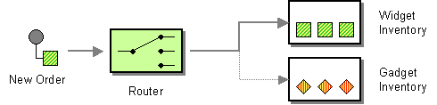

# Choice

The [Content-Based Router](http://www.enterpriseintegrationpatterns.com/ContentBasedRouter.md) from the [EIP patterns](enterprise-integration-patterns.md) allows you to route messages to the correct destination based on the contents of the message exchanges.



## Choice options

The Choice eip supports 0 options, which are listed below.

   
| Name | Description | Default | Type |
| --- | --- | --- | --- |
| **note** | Sets the note of this node. |  | String |
| **description** | Sets the description of this node. |  | String |
| **disabled** | Disables this EIP from the route. | false | Boolean |
| **when** | Sets the when nodes. |  | List |
| **otherwise** | Sets the otherwise node. |  | OtherwiseDefinition |
| **precondition** | Indicates whether this Choice EIP is in precondition mode or not. If so its branches (when/otherwise) are evaluated during startup to keep at runtime only the branch that matched. | false | Boolean |

## Exchange properties

The Choice eip has no exchange properties.

## Example

The Camel [Simple](../languages/simple-language.md) language is great to use with the Choice EIP when routing is based on the content of the message, such as checking message headers.

-   Java
    
-   XML
    
-   YAML
    

```java
from("direct:a")
    .choice()
        .when(simple("${header.foo} == 'bar'"))
            .to("direct:b")
        .when(simple("${header.foo} == 'cheese'"))
            .to("direct:c")
        .otherwise()
            .to("direct:d");
```

```xml
<route>
    <from uri="direct:a"/>
    <choice>
        <when>
            <simple>${header.foo} == 'bar'</simple>
            <to uri="direct:b"/>
        </when>
        <when>
            <simple>${header.foo} == 'cheese'</simple>
            <to uri="direct:c"/>
        </when>
        <otherwise>
            <to uri="direct:d"/>
        </otherwise>
    </choice>
</route>
```

```yaml
- route:
    from:
      uri: direct:a
      steps:
        - choice:
            when:
              - expression:
                  simple:
                    expression: "${header.foo} == 'bar'"
                steps:
                  - to:
                      uri: direct:b
              - expression:
                  simple:
                    expression: "${header.foo} == 'cheese'"
                steps:
                  - to:
                      uri: direct:c
            otherwise:
              steps:
                - to:
                    uri: direct:d
```

### Why can I not use otherwise in Java DSL?

When using the Choice EIP in the Java DSL you may have a situation where the compiler will not accept `when()` or `otherwise()` statements.

For example, as shown in the route below where we use the [Load Balancer](loadBalance-eip.md) EIP inside the Choice EIP in the first when:

**Code will not compile**

_Java-only: incorrect use of loadBalance inside choice_

```java
from("direct:start")
    .choice()
        .when(body().contains("Camel"))
            .loadBalance().roundRobin().to("mock:foo").to("mock:bar")
        .otherwise()
            .to("mock:result");
```

Well, the first issue is that the [Load Balancer](loadBalance-eip.md) EIP uses the additional routing to know what to use in the load balancing. In this example, that would be:

_Java-only: load balancer routing snippet_

```java
.to("mock:foo").to("mock:bar")
```

To indicate when the balancing stops, you should use `.end()` to denote the end. So the route is updated as follows:

**Code will still not compile**

_Java-only: using end() does not fix the compilation issue_

```java
from("direct:start")
    .choice()
        .when(body().contains("Camel"))
            .loadBalance().roundRobin().to("mock:foo").to("mock:bar").end()
        .otherwise()
            .to("mock:result");
```

However, the code will still not compile.

The reason is we have stretched how far we can take the good old Java language in terms of [DSL](../../../manual/dsl.md). In a more dynamic or modern language such as Groovy you would be able to let it be stack based, so the `.end()` will pop the last type of the stack, and you would return to the scope of the Choice EIP.

That’s not doable in Java. So we need to help Java a bit, which you do by using `.endChoice()`, which tells Camel to "pop the stack" and return to the scope of the Choice EIP.

**Code compiles**

_Java-only: using endChoice() to fix the compilation issue_

```java
from("direct:start")
    .choice()
        .when(body().contains("Camel"))
            .loadBalance().roundRobin().to("mock:foo").to("mock:bar").endChoice()
        .otherwise()
            .to("mock:result");
```

You only need to use `.endChoice()` when using certain [EIP](enterprise-integration-patterns.md)s which often have additional methods to configure or as part of the EIP itself. For example, the [Split](split-eip.md) EIP has a sub-route which denotes the routing of each _split_ message. You would also have to use `.endChoice()` to indicate the end of the sub-route and to return to the Choice EIP.

#### Still problems

If there are still problems, then you can split your route into multiple routes, and link them together using the [Direct](../direct-component.md) component.

There can be some combinations of [EIP](enterprise-integration-patterns.md)s that can hit limits in how far we can take the fluent builder DSL with generics you can do in Java programming language.

## Precondition Mode

In precondition mode, the Choice EIP is an optimized [Content-Based Router](http://www.enterpriseintegrationpatterns.com/ContentBasedRouter.md) that selects a single branch (when/otherwise) during startup, and always executes the same branch. This allows optimizing the runtime Camel to avoid this evaluation process for every message; because they are supposed to always be routed on the same branch.

> **Note**
> Because the Choice EIP in precondition mode evaluates the predicates during startup, then the predicates cannot be based on the content of the message. Therefore, the predicates would often be based on property placeholders, JVM system properties, or OS Environment variables.

The Choice EIP in precondition mode combined with [Route Templates](../../../manual/route-template.md) allows for more flexible templates, as the template parameters can be used as the predicates in the Choice EIP. This means that the Choice EIP in precondition mode is fully parameterized, but is optimized for the best runtime performance.

### Example

The Camel [Simple](../languages/simple-language.md) language is great to use with the Choice EIP in precondition mode to select a specific branch based on [property placeholders](../../../manual/using-propertyplaceholder.md).

Here we select from the Switch the first predicate that matches. So if there is a property placeholder with the key `foo` then it is selected, and so on. Notice how we can use `{{?foo}}` to mark the property placeholder as optional.

-   Java
    
-   XML
    
-   YAML
    

```java
from("direct:a")
    .choice().precondition()
        .when(simple("{{?foo}}")).to("direct:foo")
        .when(simple("{{?bar}}")).to("direct:bar")
        .otherwise().to("direct:other");
```

```xml
<route>
    <from uri="direct:a"/>
    <choice precondition="true">
        <when>
            <simple>{{?foo}}</simple>
            <to uri="direct:foo"/>
        </when>
        <when>
            <simple>{{?bar}}</simple>
            <to uri="direct:bar"/>
        </when>
        <otherwise>
            <to uri="direct:other"/>
        </otherwise>
    </choice>
</route>
```

```yaml
- route:
    from:
      uri: direct:a
      steps:
        - choice:
            precondition: true
            when:
              - expression:
                  simple:
                    expression: "{{?foo}}"
                steps:
                  - to:
                      uri: direct:foo
              - expression:
                  simple:
                    expression: "{{?bar}}"
                steps:
                  - to:
                      uri: direct:bar
            otherwise:
              steps:
                - to:
                    uri: direct:other
```

> **Tip**
> Otherwise, it is optional, and if none of the predicate matches, then no branches are selected.