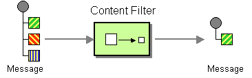

# Content Filter

Camel supports the [Content Filter](http://www.enterpriseintegrationpatterns.com/ContentFilter.md) from the [EIP patterns](enterprise-integration-patterns.md) using one of the following mechanisms in the routing logic to transform content from the inbound message.



-   Using a [Message Translator](message-translator.md)
    
-   Invoking a [Bean](bean-eip.md) with the filtering programmed in Java
    
-   Using a [Processor](../../../manual/processor.md) with the filtering programmed in Java
    
-   Using an [Expression](../../../manual/expression.md)
    

## Message Content filtering using a Processor

In this example, we add our own [Processor](../../../manual/processor.md) using explicit Java to filter the message:

```java
from("direct:start")
    .process(new Processor() {
        public void process(Exchange exchange) {
            String body = exchange.getMessage().getBody(String.class);
            // do something with the body
            // and replace it back
            exchange.getMessage().setBody(body);
        }
    })
    .to("mock:result");
```

In the Java code above we used an inlined `Processor` which is harder to do with XML or YAML DSL. A good practice is to use a class for your custom `Processor` which can then be referenced in the DSL:

```java
@BindToRegistry("myProcessor")
public class MyProcessor implements Processor {

    @Override
    public void process(Exchange exchange) {
        String body = exchange.getMessage().getBody(String.class);
        // do something with the body
        // and replace it back
        exchange.getMessage().setBody(body);
    }
}
```

Then you can refer to this processor by its id.

-   Java
    
-   XML
    
-   YAML
    

```java
from("direct:start")
    .process("myProcessor")
    .to("mock:result");
```

```xml
<route>
    <from uri="direct:start"/>
    <process ref="myProcessor"/>
    <to uri="mock:result"/>
</route>
```

```yaml
- route:
    from:
      uri: direct
      parameters:
        name: start
      steps:
        - process:
            ref: myProcessor
        - to:
            uri: mock
            parameters:
              name: result
```

## Message Content filtering using a Bean EIP

We can use [Bean EIP](bean-eip.md) to use any Java method on any bean to act as a content filter:

-   Java
    
-   XML
    
-   YAML
    

```java
from("activemq:My.Queue")
    .bean("myBeanName", "doFilter")
    .to("activemq:Another.Queue");
```

```xml
<route>
    <from uri="activemq:Input"/>
    <bean ref="myBeanName" method="doFilter"/>
    <to uri="activemq:Output"/>
</route>
```

```yaml
- route:
    from:
      uri: activemq:Input
      steps:
        - bean:
            ref: myBeanName
            method: doFilter
        - to:
            uri: activemq:Output
```

## Message Content filtering using expression

Some languages like [XPath](../languages/xpath-language.md), and [XQuery](../languages/xquery-language.md) can be used to transform and filter content from messages.

In the example we use xpath to filter a XML message to select all the `<foo><bar>` elements:

-   Java
    
-   XML
    
-   YAML
    

```java
from("activemq:Input")
  .setBody().xpath("//foo:bar")
  .to("activemq:Output");
```

```xml
<route>
  <from uri="activemq:Input"/>
  <setBody>
    <xpath>//foo:bar</xpath>
  </setBody>
  <to uri="activemq:Output"/>
</route>
```

```yaml
- route:
    from:
      uri: activemq:Input
      steps:
        - setBody:
            expression:
              xpath: //foo:bar
        - to:
            uri: activemq:Output
```