# EIPs

Camel supports most of the [Enterprise Integration Patterns](http://www.eaipatterns.com/toc.md) from the excellent book by Gregor Hohpe and Bobby Woolf.

## Messaging Systems

<table class="tableblock frame-all grid-all stretch"><colgroup><col> <col> <col></colgroup><tbody><tr><td class="tableblock halign-left valign-top">

</td><td class="tableblock halign-left valign-top"><a href="message-channel.html" class="xref page">Message Channel</a></td><td class="tableblock halign-left valign-top">How does one application communicate with another using messaging?</td></tr><tr><td class="tableblock halign-left valign-top">

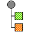

</td><td class="tableblock halign-left valign-top"><a href="message.html" class="xref page">Message</a></td><td class="tableblock halign-left valign-top">How can two applications be connected by a message channel exchange a piece of information?</td></tr><tr><td class="tableblock halign-left valign-top">

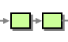

</td><td class="tableblock halign-left valign-top"><a href="pipeline-eip.html" class="xref page">Pipes and Filters</a></td><td class="tableblock halign-left valign-top">How can we perform complex processing on a message while maintaining independence and flexibility?</td></tr><tr><td class="tableblock halign-left valign-top">

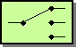

</td><td class="tableblock halign-left valign-top"><a href="message-router.html" class="xref page">Message Router</a></td><td class="tableblock halign-left valign-top">How can you decouple individual processing steps so that messages can be passed to different filters depending on a set of conditions?</td></tr><tr><td class="tableblock halign-left valign-top">

</td><td class="tableblock halign-left valign-top"><a href="message-translator.html" class="xref page">Message Translator</a></td><td class="tableblock halign-left valign-top">How can systems using different data formats communicate with each other using messaging?</td></tr><tr><td class="tableblock halign-left valign-top">

</td><td class="tableblock halign-left valign-top"><a href="message-endpoint.html" class="xref page">Message Endpoint</a></td><td class="tableblock halign-left valign-top">How does an application connect to a messaging channel to send and receive messages?</td></tr></tbody></table>

## Messaging Channels

<table class="tableblock frame-all grid-all stretch"><colgroup><col> <col> <col></colgroup><tbody><tr><td class="tableblock halign-left valign-top">

</td><td class="tableblock halign-left valign-top"><a href="point-to-point-channel.html" class="xref page">Point to Point Channel</a></td><td class="tableblock halign-left valign-top">How can the caller be sure that exactly one receiver will receive the document or perform the call?</td></tr><tr><td class="tableblock halign-left valign-top">

</td><td class="tableblock halign-left valign-top"><a href="publish-subscribe-channel.html" class="xref page">Publish Subscribe Channel</a></td><td class="tableblock halign-left valign-top">How can the sender broadcast an event to all interested receivers?</td></tr><tr><td class="tableblock halign-left valign-top">

</td><td class="tableblock halign-left valign-top"><a href="dead-letter-channel.html" class="xref page">Dead Letter Channel</a></td><td class="tableblock halign-left valign-top">What will the messaging system do with a message it cannot deliver?</td></tr><tr><td class="tableblock halign-left valign-top">

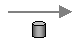

</td><td class="tableblock halign-left valign-top"><a href="guaranteed-delivery.html" class="xref page">Guaranteed Delivery</a></td><td class="tableblock halign-left valign-top">How can the sender make sure that a message will be delivered, even if the messaging system fails?</td></tr><tr><td class="tableblock halign-left valign-top">

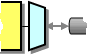

</td><td class="tableblock halign-left valign-top"><a href="channel-adapter.html" class="xref page">Channel Adapter</a></td><td class="tableblock halign-left valign-top">How can you connect an application to the messaging system so that it can send and receive messages?</td></tr><tr><td class="tableblock halign-left valign-top">

</td><td class="tableblock halign-left valign-top"><a href="messaging-bridge.html" class="xref page">Messaging Bridge</a></td><td class="tableblock halign-left valign-top">How can multiple messaging systems be connected so that messages available on one are also available on the others?</td></tr><tr><td class="tableblock halign-left valign-top">

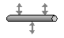

</td><td class="tableblock halign-left valign-top"><a href="message-bus.html" class="xref page">Message Bus</a></td><td class="tableblock halign-left valign-top">What is an architecture that enables separate applications to work together, but in a de-coupled fashion such that applications can be easily added or removed without affecting the others?</td></tr><tr><td class="tableblock halign-left valign-top">

</td><td class="tableblock halign-left valign-top"><a href="change-data-capture.html" class="xref page">Change Data Capture</a></td><td class="tableblock halign-left valign-top">Data synchronization by capturing changes made to a database, and apply those changes to another system.</td></tr></tbody></table>

## Message Construction

<table class="tableblock frame-all grid-all stretch"><colgroup><col> <col> <col></colgroup><tbody><tr><td class="tableblock halign-left valign-top">

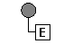

</td><td class="tableblock halign-left valign-top"><a href="event-message.html" class="xref page">Event Message</a></td><td class="tableblock halign-left valign-top">How can messaging be used to transmit events from one application to another?</td></tr><tr><td class="tableblock halign-left valign-top">

</td><td class="tableblock halign-left valign-top"><a href="requestReply-eip.html" class="xref page">Request Reply</a></td><td class="tableblock halign-left valign-top">When an application sends a message, how can it get a response from the receiver?</td></tr><tr><td class="tableblock halign-left valign-top">

</td><td class="tableblock halign-left valign-top"><a href="return-address.html" class="xref page">Return Address</a></td><td class="tableblock halign-left valign-top">How does a replier know where to send the reply?</td></tr><tr><td class="tableblock halign-left valign-top">

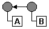

</td><td class="tableblock halign-left valign-top"><a href="correlation-identifier.html" class="xref page">Correlation Identifier</a></td><td class="tableblock halign-left valign-top">How does a requestor that has received a reply know which request this is the reply for?</td></tr><tr><td class="tableblock halign-left valign-top">

</td><td class="tableblock halign-left valign-top"><a href="message-expiration.html" class="xref page">Message Expiration</a></td><td class="tableblock halign-left valign-top">How can a sender indicate when a message should be considered stale and thus shouldn’t be processed?</td></tr></tbody></table>

## Message Routing

<table class="tableblock frame-all grid-all stretch"><colgroup><col> <col> <col></colgroup><tbody><tr><td class="tableblock halign-left valign-top">

</td><td class="tableblock halign-left valign-top"><a href="choice-eip.html" class="xref page">Content-Based Router</a></td><td class="tableblock halign-left valign-top">How do we handle a situation where the implementation of a single logical function (e.g., inventory check) is spread across multiple physical systems?</td></tr><tr><td class="tableblock halign-left valign-top">

</td><td class="tableblock halign-left valign-top"><a href="filter-eip.html" class="xref page">Message Filter</a></td><td class="tableblock halign-left valign-top">How can a component avoid receiving uninteresting messages?</td></tr><tr><td class="tableblock halign-left valign-top">

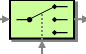

</td><td class="tableblock halign-left valign-top"><a href="dynamicRouter-eip.html" class="xref page">Dynamic Router</a></td><td class="tableblock halign-left valign-top">How can you avoid the dependency of the router on all possible destinations while maintaining its efficiency?</td></tr><tr><td class="tableblock halign-left valign-top">

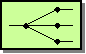

</td><td class="tableblock halign-left valign-top"><a href="recipientList-eip.html" class="xref page">Recipient List</a></td><td class="tableblock halign-left valign-top">How do we route a message to a list of (static or dynamically) specified recipients?</td></tr><tr><td class="tableblock halign-left valign-top">

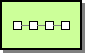

</td><td class="tableblock halign-left valign-top"><a href="routingSlip-eip.html" class="xref page">Routing Slip</a></td><td class="tableblock halign-left valign-top">How do we route a message consecutively through a series of processing steps when the sequence of steps is not known at design-time and may vary for each message?</td></tr><tr><td class="tableblock halign-left valign-top">

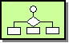

</td><td class="tableblock halign-left valign-top"><a href="process-manager.html" class="xref page">Process Manager</a></td><td class="tableblock halign-left valign-top">How do we route a message through multiple processing steps when the required steps may not be known at design-time and may not be sequential?</td></tr><tr><td class="tableblock halign-left valign-top">

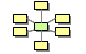

</td><td class="tableblock halign-left valign-top"><a href="message-broker.html" class="xref page">Message Broker</a></td><td class="tableblock halign-left valign-top">How can you decouple the destination of a message from the sender and maintain central control over the flow of messages?</td></tr><tr><td class="tableblock halign-left valign-top">

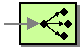

</td><td class="tableblock halign-left valign-top"><a href="multicast-eip.html" class="xref page">Multicast</a></td><td class="tableblock halign-left valign-top">How can I route a message to a number of endpoints at the same time?</td></tr><tr><td class="tableblock halign-left valign-top">

</td><td class="tableblock halign-left valign-top"><a href="loadBalance-eip.html" class="xref page">Load Balancer</a></td><td class="tableblock halign-left valign-top">How can I balance load across a number of endpoints?</td></tr><tr><td class="tableblock halign-left valign-top">

</td><td class="tableblock halign-left valign-top"><a href="kamelet-eip.html" class="xref page">Kamelet</a></td><td class="tableblock halign-left valign-top">How can I call Kamelets (route templates)?</td></tr><tr><td class="tableblock halign-left valign-top">

</td><td class="tableblock halign-left valign-top"><a href="sample-eip.html" class="xref page">Sampling</a></td><td class="tableblock halign-left valign-top">How can I sample one message out of many in a given period to avoid downstream route does not get overloaded?</td></tr></tbody></table>

## Load Balancing Strategies

<table class="tableblock frame-all grid-all stretch"><colgroup><col> <col> <col></colgroup><tbody><tr><td class="tableblock halign-left valign-top">

</td><td class="tableblock halign-left valign-top"><a href="failoverLoadBalancer-eip.html" class="xref page">Failover Load Balancer</a></td><td class="tableblock halign-left valign-top">Tries the next endpoint in case of failure.</td></tr><tr><td class="tableblock halign-left valign-top">

</td><td class="tableblock halign-left valign-top"><a href="roundRobinLoadBalancer-eip.html" class="xref page">Round Robin Load Balancer</a></td><td class="tableblock halign-left valign-top">Distributes messages across endpoints in a round robin fashion.</td></tr><tr><td class="tableblock halign-left valign-top">

</td><td class="tableblock halign-left valign-top"><a href="randomLoadBalancer-eip.html" class="xref page">Random Load Balancer</a></td><td class="tableblock halign-left valign-top">Distributes messages across endpoints randomly.</td></tr><tr><td class="tableblock halign-left valign-top">

</td><td class="tableblock halign-left valign-top"><a href="weightedLoadBalancer-eip.html" class="xref page">Weighted Load Balancer</a></td><td class="tableblock halign-left valign-top">Distributes messages across endpoints using weighted ratios.</td></tr><tr><td class="tableblock halign-left valign-top">

</td><td class="tableblock halign-left valign-top"><a href="stickyLoadBalancer-eip.html" class="xref page">Sticky Load Balancer</a></td><td class="tableblock halign-left valign-top">Routes messages to the same endpoint based on a correlation expression.</td></tr><tr><td class="tableblock halign-left valign-top">

</td><td class="tableblock halign-left valign-top"><a href="topicLoadBalancer-eip.html" class="xref page">Topic Load Balancer</a></td><td class="tableblock halign-left valign-top">Sends the message to all endpoints (like a topic).</td></tr><tr><td class="tableblock halign-left valign-top">

</td><td class="tableblock halign-left valign-top"><a href="customLoadBalancer-eip.html" class="xref page">Custom Load Balancer</a></td><td class="tableblock halign-left valign-top">Uses a custom load balancing implementation.</td></tr></tbody></table>

## Splitting and Aggregation

<table class="tableblock frame-all grid-all stretch"><colgroup><col> <col> <col></colgroup><tbody><tr><td class="tableblock halign-left valign-top">

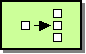

</td><td class="tableblock halign-left valign-top"><a href="split-eip.html" class="xref page">Splitter</a></td><td class="tableblock halign-left valign-top">How can we process a message if it contains multiple elements, each of which may have to be processed in a different way?</td></tr><tr><td class="tableblock halign-left valign-top">

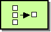

</td><td class="tableblock halign-left valign-top"><a href="aggregate-eip.html" class="xref page">Aggregator</a></td><td class="tableblock halign-left valign-top">How do we combine the results of individual, but related, messages so that they can be processed as a whole?</td></tr><tr><td class="tableblock halign-left valign-top">

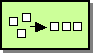

</td><td class="tableblock halign-left valign-top"><a href="resequence-eip.html" class="xref page">Resequencer</a></td><td class="tableblock halign-left valign-top">How can we get a stream of related but out-of-sequence messages back into the correct order?</td></tr><tr><td class="tableblock halign-left valign-top">

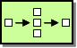

</td><td class="tableblock halign-left valign-top"><a href="composed-message-processor.html" class="xref page">Composed Message Processor</a></td><td class="tableblock halign-left valign-top">How can you maintain the overall message flow when processing a message consisting of multiple elements, each of which may require different processing?</td></tr><tr><td class="tableblock halign-left valign-top">

</td><td class="tableblock halign-left valign-top"><a href="scatter-gather.html" class="xref page">Scatter-Gather</a></td><td class="tableblock halign-left valign-top">How do you maintain the overall message flow when a message needs to be sent to multiple recipients, each of which may send a reply?</td></tr></tbody></table>

## Message Transformation

<table class="tableblock frame-all grid-all stretch"><colgroup><col> <col> <col></colgroup><tbody><tr><td class="tableblock halign-left valign-top">

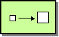

</td><td class="tableblock halign-left valign-top"><a href="content-enricher.html" class="xref page">Content Enricher</a></td><td class="tableblock halign-left valign-top">How do we communicate with another system if the message originator does not have all the required data items available?</td></tr><tr><td class="tableblock halign-left valign-top">

</td><td class="tableblock halign-left valign-top"><a href="enrich-eip.html" class="xref page">Enrich</a></td><td class="tableblock halign-left valign-top">Enriches the message with data from a secondary resource using a request-reply pattern.</td></tr><tr><td class="tableblock halign-left valign-top">

</td><td class="tableblock halign-left valign-top"><a href="pollEnrich-eip.html" class="xref page">Poll Enrich</a></td><td class="tableblock halign-left valign-top">Enriches the message with data obtained by polling a consumer endpoint.</td></tr><tr><td class="tableblock halign-left valign-top">

</td><td class="tableblock halign-left valign-top"><a href="poll-eip.html" class="xref page">Poll</a></td><td class="tableblock halign-left valign-top">Polls a message from an endpoint for later use in the routing.</td></tr><tr><td class="tableblock halign-left valign-top">

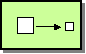

</td><td class="tableblock halign-left valign-top"><a href="content-filter-eip.html" class="xref page">Content Filter</a></td><td class="tableblock halign-left valign-top">How do you simplify dealing with a large message when you are interested only in a few data items?</td></tr><tr><td class="tableblock halign-left valign-top">

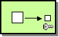

</td><td class="tableblock halign-left valign-top"><a href="claimCheck-eip.html" class="xref page">Claim Check</a></td><td class="tableblock halign-left valign-top">How can we reduce the data volume of a message sent across the system without sacrificing information content?</td></tr><tr><td class="tableblock halign-left valign-top">

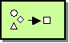

</td><td class="tableblock halign-left valign-top"><a href="normalizer.html" class="xref page">Normalizer</a></td><td class="tableblock halign-left valign-top">How do you process messages that are semantically equivalent, but arrive in a different format?</td></tr><tr><td class="tableblock halign-left valign-top">

</td><td class="tableblock halign-left valign-top"><a href="sort-eip.html" class="xref page">Sort</a></td><td class="tableblock halign-left valign-top">How can I sort the body of a message?</td></tr><tr><td class="tableblock halign-left valign-top">

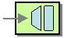

</td><td class="tableblock halign-left valign-top"><a href="script-eip.html" class="xref page">Script</a></td><td class="tableblock halign-left valign-top">How do I execute a script which may not change the message?</td></tr><tr><td class="tableblock halign-left valign-top">

</td><td class="tableblock halign-left valign-top"><a href="validate-eip.html" class="xref page">Validate</a></td><td class="tableblock halign-left valign-top">How can I validate a message?</td></tr></tbody></table>

## Message Data Manipulation

<table class="tableblock frame-all grid-all stretch"><colgroup><col> <col> <col></colgroup><tbody><tr><td class="tableblock halign-left valign-top">

</td><td class="tableblock halign-left valign-top"><a href="setBody-eip.html" class="xref page">Set Body</a></td><td class="tableblock halign-left valign-top">Sets the message body to the result of an expression.</td></tr><tr><td class="tableblock halign-left valign-top">

</td><td class="tableblock halign-left valign-top"><a href="setHeader-eip.html" class="xref page">Set Header</a></td><td class="tableblock halign-left valign-top">Sets a single message header to the result of an expression.</td></tr><tr><td class="tableblock halign-left valign-top">

</td><td class="tableblock halign-left valign-top"><a href="setHeaders-eip.html" class="xref page">Set Headers</a></td><td class="tableblock halign-left valign-top">Sets multiple message headers at the same time.</td></tr><tr><td class="tableblock halign-left valign-top">

</td><td class="tableblock halign-left valign-top"><a href="setProperty-eip.html" class="xref page">Set Property</a></td><td class="tableblock halign-left valign-top">Sets an exchange property to the result of an expression.</td></tr><tr><td class="tableblock halign-left valign-top">

</td><td class="tableblock halign-left valign-top"><a href="setVariable-eip.html" class="xref page">Set Variable</a></td><td class="tableblock halign-left valign-top">Sets a variable to the result of an expression.</td></tr><tr><td class="tableblock halign-left valign-top">

</td><td class="tableblock halign-left valign-top"><a href="setVariables-eip.html" class="xref page">Set Variables</a></td><td class="tableblock halign-left valign-top">Sets multiple variables at the same time.</td></tr><tr><td class="tableblock halign-left valign-top">

</td><td class="tableblock halign-left valign-top"><a href="removeHeader-eip.html" class="xref page">Remove Header</a></td><td class="tableblock halign-left valign-top">Removes a single message header by name.</td></tr><tr><td class="tableblock halign-left valign-top">

</td><td class="tableblock halign-left valign-top"><a href="removeHeaders-eip.html" class="xref page">Remove Headers</a></td><td class="tableblock halign-left valign-top">Removes message headers matching a pattern.</td></tr><tr><td class="tableblock halign-left valign-top">

</td><td class="tableblock halign-left valign-top"><a href="removeProperty-eip.html" class="xref page">Remove Property</a></td><td class="tableblock halign-left valign-top">Removes a single exchange property by name.</td></tr><tr><td class="tableblock halign-left valign-top">

</td><td class="tableblock halign-left valign-top"><a href="removeProperties-eip.html" class="xref page">Remove Properties</a></td><td class="tableblock halign-left valign-top">Removes exchange properties matching a pattern.</td></tr><tr><td class="tableblock halign-left valign-top">

</td><td class="tableblock halign-left valign-top"><a href="removeVariable-eip.html" class="xref page">Remove Variable</a></td><td class="tableblock halign-left valign-top">Removes a variable by name.</td></tr><tr><td class="tableblock halign-left valign-top">

</td><td class="tableblock halign-left valign-top"><a href="convertBodyTo-eip.html" class="xref page">Convert Body To</a></td><td class="tableblock halign-left valign-top">Converts the message body to another type.</td></tr><tr><td class="tableblock halign-left valign-top">

</td><td class="tableblock halign-left valign-top"><a href="convertHeaderTo-eip.html" class="xref page">Convert Header To</a></td><td class="tableblock halign-left valign-top">Converts a message header to another type.</td></tr><tr><td class="tableblock halign-left valign-top">

</td><td class="tableblock halign-left valign-top"><a href="convertVariableTo-eip.html" class="xref page">Convert Variable To</a></td><td class="tableblock halign-left valign-top">Converts a variable to another type.</td></tr><tr><td class="tableblock halign-left valign-top">

</td><td class="tableblock halign-left valign-top"><a href="transform-eip.html" class="xref page">Transform</a></td><td class="tableblock halign-left valign-top">Transforms the message body based on an expression and stops further routing.</td></tr><tr><td class="tableblock halign-left valign-top">

</td><td class="tableblock halign-left valign-top"><a href="transformDataType-eip.html" class="xref page">Transform Data Type</a></td><td class="tableblock halign-left valign-top">Transforms the message between named data types.</td></tr><tr><td class="tableblock halign-left valign-top">

</td><td class="tableblock halign-left valign-top"><a href="marshal-eip.html" class="xref page">Marshal</a></td><td class="tableblock halign-left valign-top">Marshals the message body into a binary or textual format using a data format.</td></tr><tr><td class="tableblock halign-left valign-top">

</td><td class="tableblock halign-left valign-top"><a href="unmarshal-eip.html" class="xref page">Unmarshal</a></td><td class="tableblock halign-left valign-top">Unmarshals the message body from a binary or textual format using a data format.</td></tr></tbody></table>

## Endpoints and Invocation

<table class="tableblock frame-all grid-all stretch"><colgroup><col> <col> <col></colgroup><tbody><tr><td class="tableblock halign-left valign-top">

</td><td class="tableblock halign-left valign-top"><a href="from-eip.html" class="xref page">From</a></td><td class="tableblock halign-left valign-top">Defines the consumer endpoint that acts as the input source for a route.</td></tr><tr><td class="tableblock halign-left valign-top">

</td><td class="tableblock halign-left valign-top"><a href="to-eip.html" class="xref page">To</a></td><td class="tableblock halign-left valign-top">Sends the message to a fixed endpoint URI.</td></tr><tr><td class="tableblock halign-left valign-top">

</td><td class="tableblock halign-left valign-top"><a href="toD-eip.html" class="xref page">To D</a></td><td class="tableblock halign-left valign-top">Sends the message to an endpoint URI computed dynamically from an expression.</td></tr><tr><td class="tableblock halign-left valign-top">

</td><td class="tableblock halign-left valign-top"><a href="bean-eip.html" class="xref page">Bean</a></td><td class="tableblock halign-left valign-top">Invokes a method on a Java bean with automatic parameter binding.</td></tr><tr><td class="tableblock halign-left valign-top">

</td><td class="tableblock halign-left valign-top"><a href="process-eip.html" class="xref page">Process</a></td><td class="tableblock halign-left valign-top">Invokes a custom Camel Processor for programmatic message processing.</td></tr></tbody></table>

## Messaging Endpoints

<table class="tableblock frame-all grid-all stretch"><colgroup><col> <col> <col></colgroup><tbody><tr><td class="tableblock halign-left valign-top">

</td><td class="tableblock halign-left valign-top"><a href="messaging-mapper.html" class="xref page">Messaging Mapper</a></td><td class="tableblock halign-left valign-top">How do you move data between domain objects and the messaging infrastructure while keeping the two independent of each other?</td></tr><tr><td class="tableblock halign-left valign-top">

</td><td class="tableblock halign-left valign-top"><a href="eventDrivenConsumer-eip.html" class="xref page">Event Driven Consumer</a></td><td class="tableblock halign-left valign-top">How can an application automatically consume messages as they become available?</td></tr><tr><td class="tableblock halign-left valign-top">

</td><td class="tableblock halign-left valign-top"><a href="polling-consumer.html" class="xref page">Polling Consumer</a></td><td class="tableblock halign-left valign-top">How can an application consume a message when the application is ready?</td></tr><tr><td class="tableblock halign-left valign-top">

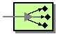

</td><td class="tableblock halign-left valign-top"><a href="competing-consumers.html" class="xref page">Competing Consumers</a></td><td class="tableblock halign-left valign-top">How can a messaging client process multiple messages concurrently?</td></tr><tr><td class="tableblock halign-left valign-top">

</td><td class="tableblock halign-left valign-top"><a href="message-dispatcher.html" class="xref page">Message Dispatcher</a></td><td class="tableblock halign-left valign-top">How can multiple consumers on a single channel coordinate their message processing?</td></tr><tr><td class="tableblock halign-left valign-top">

</td><td class="tableblock halign-left valign-top"><a href="selective-consumer.html" class="xref page">Selective Consumer</a></td><td class="tableblock halign-left valign-top">How can a message consumer select which messages it wishes to receive?</td></tr><tr><td class="tableblock halign-left valign-top">

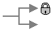

</td><td class="tableblock halign-left valign-top"><a href="durable-subscriber.html" class="xref page">Durable Subscriber</a></td><td class="tableblock halign-left valign-top">How can a subscriber avoid missing messages while it’s not listening for them?</td></tr><tr><td class="tableblock halign-left valign-top">

</td><td class="tableblock halign-left valign-top"><a href="idempotentConsumer-eip.html" class="xref page">Idempotent Consumer</a></td><td class="tableblock halign-left valign-top">How can a message receiver deal with duplicate messages?</td></tr><tr><td class="tableblock halign-left valign-top">

</td><td class="tableblock halign-left valign-top"><a href="resume-strategies.html" class="xref page">Resumable Consumer</a></td><td class="tableblock halign-left valign-top">How can a message receiver resume from the last known offset?</td></tr><tr><td class="tableblock halign-left valign-top">

</td><td class="tableblock halign-left valign-top"><a href="transactional-client.html" class="xref page">Transactional Client</a></td><td class="tableblock halign-left valign-top">How can a client control its transactions with the messaging system?</td></tr><tr><td class="tableblock halign-left valign-top">

</td><td class="tableblock halign-left valign-top"><a href="messaging-gateway.html" class="xref page">Messaging Gateway</a></td><td class="tableblock halign-left valign-top">How do you encapsulate access to the messaging system from the rest of the application?</td></tr><tr><td class="tableblock halign-left valign-top">

</td><td class="tableblock halign-left valign-top"><a href="service-activator.html" class="xref page">Service Activator</a></td><td class="tableblock halign-left valign-top">How can an application design a service to be invoked both via various messaging technologies and via non-messaging techniques?</td></tr></tbody></table>

## Flow Control

<table class="tableblock frame-all grid-all stretch"><colgroup><col> <col> <col></colgroup><tbody><tr><td class="tableblock halign-left valign-top">

</td><td class="tableblock halign-left valign-top"><a href="throttle-eip.html" class="xref page">Throttler</a></td><td class="tableblock halign-left valign-top">How can I throttle messages to ensure that a specific endpoint does not get overloaded, or we don’t exceed an agreed SLA with some external service?</td></tr><tr><td class="tableblock halign-left valign-top">

</td><td class="tableblock halign-left valign-top"><a href="delay-eip.html" class="xref page">Delayer</a></td><td class="tableblock halign-left valign-top">How can I delay the sending of a message?</td></tr><tr><td class="tableblock halign-left valign-top">

</td><td class="tableblock halign-left valign-top"><a href="loop-eip.html" class="xref page">Loop</a></td><td class="tableblock halign-left valign-top">How can I repeat processing a message in a loop?</td></tr><tr><td class="tableblock halign-left valign-top">

</td><td class="tableblock halign-left valign-top"><a href="stop-eip.html" class="xref page">Stop</a></td><td class="tableblock halign-left valign-top">How can I stop to continue routing a message?</td></tr><tr><td class="tableblock halign-left valign-top">

</td><td class="tableblock halign-left valign-top"><a href="threads-eip.html" class="xref page">Threads</a></td><td class="tableblock halign-left valign-top">How can I decouple the continued routing of a message from the current thread?</td></tr></tbody></table>

## Error Handling and Resilience

<table class="tableblock frame-all grid-all stretch"><colgroup><col> <col> <col></colgroup><tbody><tr><td class="tableblock halign-left valign-top">

</td><td class="tableblock halign-left valign-top"><a href="circuitBreaker-eip.html" class="xref page">Circuit Breaker</a></td><td class="tableblock halign-left valign-top">How can I stop calling an external service if the service is broken?</td></tr><tr><td class="tableblock halign-left valign-top">

</td><td class="tableblock halign-left valign-top"><a href="onFallback-eip.html" class="xref page">On Fallback</a></td><td class="tableblock halign-left valign-top">Defines the fallback route that executes when the Circuit Breaker trips or the primary route fails.</td></tr><tr><td class="tableblock halign-left valign-top">

</td><td class="tableblock halign-left valign-top"><a href="saga-eip.html" class="xref page">Saga</a></td><td class="tableblock halign-left valign-top">How can I define a series of related actions in a Camel route that should be either completed successfully (all of them) or not-executed/compensated?</td></tr><tr><td class="tableblock halign-left valign-top">

</td><td class="tableblock halign-left valign-top"><a href="throwException-eip.html" class="xref page">Throw Exception</a></td><td class="tableblock halign-left valign-top">How can I throw an exception during routing?</td></tr><tr><td class="tableblock halign-left valign-top">

</td><td class="tableblock halign-left valign-top"><a href="rollback-eip.html" class="xref page">Rollback</a></td><td class="tableblock halign-left valign-top">Marks the current exchange for rollback, typically used with transactions.</td></tr></tbody></table>

## System Management

<table class="tableblock frame-all grid-all stretch"><colgroup><col> <col> <col></colgroup><tbody><tr><td class="tableblock halign-left valign-top">

</td><td class="tableblock halign-left valign-top"><a href="../controlbus-component.html" class="xref page">ControlBus</a></td><td class="tableblock halign-left valign-top">How can we effectively administer a messaging system distributed across multiple platforms and a wide geographic area?</td></tr><tr><td class="tableblock halign-left valign-top">

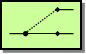

</td><td class="tableblock halign-left valign-top"><a href="intercept.html" class="xref page">Detour</a></td><td class="tableblock halign-left valign-top">How can you route a message through intermediate steps to perform validation, testing or debugging functions?</td></tr><tr><td class="tableblock halign-left valign-top">

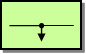

</td><td class="tableblock halign-left valign-top"><a href="wireTap-eip.html" class="xref page">Wire Tap</a></td><td class="tableblock halign-left valign-top">How do you inspect messages that travel on a point-to-point channel?</td></tr><tr><td class="tableblock halign-left valign-top">

</td><td class="tableblock halign-left valign-top"><a href="message-history.html" class="xref page">Message History</a></td><td class="tableblock halign-left valign-top">How can we effectively analyze and debug the flow of messages in a loosely coupled system?</td></tr><tr><td class="tableblock halign-left valign-top">

</td><td class="tableblock halign-left valign-top"><a href="log-eip.html" class="xref page">Log</a></td><td class="tableblock halign-left valign-top">How can I log processing a message?</td></tr><tr><td class="tableblock halign-left valign-top">

</td><td class="tableblock halign-left valign-top"><a href="step-eip.html" class="xref page">Step</a></td><td class="tableblock halign-left valign-top">Groups together a set of EIPs into a composite logical unit for metrics and monitoring.</td></tr></tbody></table>