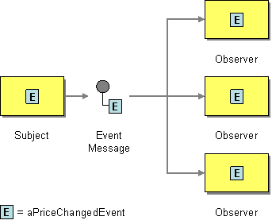

# Event Message

Camel supports the [Event Message](http://www.enterpriseintegrationpatterns.com/EventMessage.md) from the [EIP patterns](enterprise-integration-patterns.md).

How can messaging be used to transmit events from one application to another?



Use an Event Message for reliable, asynchronous event notification between applications.

Camel supports Event Message by the [Exchange Pattern](../../../manual/exchange-pattern.md) on a [Message](message.md) which can be set to `InOnly` to indicate a oneway event message. Camel [Components](../index.md) then implement this pattern using the underlying transport or protocols.

The default behaviour of many [Components](../index.md) is `InOnly` such as for [JMS](../jms-component.md), [File](../jms-component.md) or [SEDA](../seda-component.md).

Some components support both `InOnly` and `InOut` and act accordingly. For example, the [JMS](../jms-component.md) can send messages as one-way (`InOnly`) or use request/reply messaging (`InOut`).

> **Tip**
> See the related [Request Reply](requestReply-eip.md) message.

## Using endpoint URI

If you are using a component which defaults to `InOut` you can override the [Exchange Pattern](../../../manual/exchange-pattern.md) for a **consumer** endpoint using the pattern property.

```text
foo:bar?exchangePattern=InOnly
```

> **Important**
> This is only possible on endpoints used by consumers (i.e., in `<from>`).

In the example below the message will be forced as an event message as the consumer is in `InOnly` mode.

-   Java
    
-   XML
    
-   YAML
    

```java
from("mq:someQueue?exchangePattern=InOnly")
  .to("activemq:queue:one-way");
```

```xml
<route>
    <from uri="mq:someQueue?exchangePattern=InOnly"/>
    <to uri="activemq:queue:one-way"/>
</route>
```

```yaml
- route:
    from:
      uri: mq:someQueue?exchangePattern=InOnly
      steps:
        - to:
            uri: activemq:queue:one-way
```

## Using `setExchangePattern` EIP

You can specify the [Exchange Pattern](../../../manual/exchange-pattern.md) using `setExchangePattern` in the DSL.

-   Java
    
-   XML
    
-   YAML
    

```java
from("mq:someQueue")
  .setExchangePattern(ExchangePattern.InOnly)
  .to("activemq:queue:one-way");
```

```xml
<route>
    <from uri="mq:someQueue"/>
    <setExchangePattern pattern="InOnly"/>
    <to uri="activemq:queue:one-way"/>
</route>
```

```yaml
- route:
    from:
      uri: mq:someQueue
      steps:
        - setExchangePattern:
            pattern: InOnly
        - to:
            uri: activemq:queue:one-way
```

When using `setExchangePattern` then the [Exchange Pattern](../../../manual/exchange-pattern.md) on the [Exchange](../../../manual/exchange.md) is changed from this point onwards in the route.

This means you can change the pattern back again at a later point:

-   Java
    
-   XML
    
-   YAML
    

```java
from("mq:someQueue")
  .setExchangePattern(ExchangePattern.InOnly)
  .to("activemq:queue:one-way")
  .setExchangePattern(ExchangePattern.InOut)
  .to("activemq:queue:in-and-out")
  .log("InOut MEP received ${body}");
```

```xml
<route>
    <from uri="mq:someQueue"/>
    <setExchangePattern pattern="InOnly"/>
    <to uri="activemq:queue:one-way"/>
    <setExchangePattern pattern="InOut"/>
    <to uri="activemq:queue:in-and-out"/>
    <log message="InOut MEP received ${body}"/>
</route>
```

```yaml
- route:
    from:
      uri: mq:someQueue
      steps:
        - setExchangePattern:
            pattern: InOnly
        - to:
            uri: activemq:queue:one-way
        - setExchangePattern:
            pattern: InOut
        - to:
            uri: activemq:queue:in-and-out
        - log:
            message: "InOut MEP received ${body}"
```

> **Note**
> Using `setExchangePattern` to change the [Exchange Pattern](../../../manual/exchange-pattern.md) is often only used in special use-cases where you must force to be using either `InOnly` or `InOut` mode when using components that support both modes (such as messaging components like ActiveMQ, JMS, RabbitMQ etc.)

## JMS component and InOnly vs. InOut

When consuming messages from [JMS](../jms-component.md) a Request Reply is indicated by the presence of the `JMSReplyTo` header. This means the JMS component automatic detects whether to use `InOnly` or `InOut` in the consumer.

Likewise, the JMS producer will check the current [Exchange Pattern](../../../manual/exchange-pattern.md) on the [Exchange](../../../manual/exchange.md) to know whether to use `InOnly` or `InOut` mode (i.e., one-way vs. request/reply messaging)

## Other Implementation Details

There are concrete classes that implement the `Message` interface for each Camel-supported communications technology. For example, the `JmsMessage` class provides a JMS-specific implementation of the `Message` interface. The public API of the `Message` interface provides getters and setters methods to access the _message id_, _body_ and individual _header_ fields of a message.