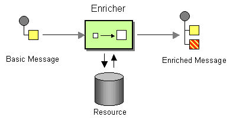

# Poll Enrich

Camel supports the [Content Enricher](http://www.enterpriseintegrationpatterns.com/DataEnricher.md) from the [EIP patterns](enterprise-integration-patterns.md).



In Camel the Content Enricher can be done in several ways:

-   Using [Enrich](enrich-eip.md) EIP, [Poll Enrich](#), or [Poll](poll-eip.md) EIP
    
-   Using a [Message Translator](message-translator.md)
    
-   Using a [Processor](../../../manual/processor.md) with the enrichment programmed in Java
    
-   Using a [Bean](bean-eip.md) EIP with the enrichment programmed in Java
    

The most natural Camel approach is using [Enrich](enrich-eip.md) EIP, which comes as two kinds:

-   [Enrich](enrich-eip.md) EIP: This is the most common content enricher that uses a `Producer` to obtain the data. It is usually used for [Request Reply](requestReply-eip.md) messaging, for instance, to invoke an external web service.
    
-   [Poll Enrich](#) EIP: Uses a [Polling Consumer](polling-consumer.md) to obtain the additional data. It is usually used for [Event Message](event-message.md) messaging, for instance, to read a file or download a file using [FTP](../ftp-component.md).
    

> **Note**
> This page documents the Poll Enrich EIP.

## Options

The Poll Enrich eip supports 1 options, which are listed below.

   
| Name | Description | Default | Type |
| --- | --- | --- | --- |
| **note** | The note for this node. |  | String |
| **description** | The description for this node. |  | String |
| **disabled** | Whether to disable this EIP from the route during build time. Once an EIP has been disabled then it cannot be enabled later at runtime. | false | Boolean |
| **expression** | **Required** The expression to compute the endpoint URI to poll-enrich from. |  | ExpressionDefinition |
| **variableReceive** | To use a variable to store the received message body (only body, not headers). This makes it handy to use variables for user data and to easily control what data to use for sending and receiving. |  | String |
| **aggregationStrategy** | Sets the AggregationStrategy to be used to merge the reply from the external service, into a single outgoing message. By default Camel will use the reply from the external service as outgoing message. |  | AggregationStrategy |
| **aggregationStrategyMethodName** | This option can be used to explicitly declare the method name to use, when using POJOs as the AggregationStrategy. |  | String |
| **aggregationStrategyMethodAllowNull** | If this option is false then the aggregate method is not used if there was no data to enrich. If this option is true then null values is used as the oldExchange (when no data to enrich), when using POJOs as the AggregationStrategy. |  | String |
| **aggregateOnException** | If this option is false then the aggregate method is not used if there was an exception thrown while trying to retrieve the data to enrich from the resource. Setting this option to true allows end users to control what to do if there was an exception in the aggregate method. | false | Boolean |
| **timeout** | Timeout in millis when polling from the external service. A negative value waits until a message is available (could block indefinitely). Zero attempts to receive immediately without waiting. A positive value waits up to the given timeout. | \-1 | String |
| **cacheSize** | Sets the maximum size used by the ConsumerCache which is used to cache and reuse consumers when uris are reused. Use 0 for default cache size, or -1 to turn cache off. |  | Integer |
| **ignoreInvalidEndpoint** | Whether to ignore an invalid endpoint URI when trying to create a consumer with that endpoint. | false | Boolean |
| **allowOptimisedComponents** | Whether to allow components to optimise if they are PollDynamicAware. | true | Boolean |
| **autoStartComponents** | Whether to auto startup components when poll enricher is starting up. | true | Boolean |

## Exchange properties

The Poll Enrich eip supports 1 exchange properties, which are listed below.

The exchange properties are set on the `Exchange` by the EIP, unless otherwise specified in the description. This means those properties are available after this EIP has completed processing the `Exchange`.

   
| Name | Description | Default | Type |
| --- | --- | --- | --- |
| **CamelToEndpoint** | Endpoint URI where this Exchange is being sent to. |  | String |

## Content enrichment using Poll Enrich EIP

`pollEnrich` uses a [Polling Consumer](polling-consumer.md) to obtain the additional data. It is usually used for [Event Message](event-message.md) messaging, for instance, to read a file or download a file using FTP.

The `pollEnrich` works just the same as `enrich`, however, as it uses a [Polling Consumer](polling-consumer.md), we have three methods when polling:

-   `receive`: Waits until a message is available and then returns it. **Warning** that this method could block indefinitely if no messages are available.
    
-   `receiveNoWait`: Attempts to receive a message exchange immediately without waiting and returning `null` if a message exchange is not available yet.
    
-   `receive(timeout)`: Attempts to receive a message exchange, waiting up to the given timeout to expire if a message is not yet available. Returns the message or `null` if the timeout expired.
    

### Poll Enrich with timeout

It is good practice to use timeout value.

By default, Camel will use the `receive` which may block until there is a message available. It is therefore recommended to always provide a timeout value, to make this clear that we may wait for a message until the timeout is hit.

You can pass in a timeout value that determines which method to use:

-   if timeout is `-1` or other negative number then `receive` is selected (**Important:** the `receive` method may block if there is no message)
    
-   if timeout is `0` then `receiveNoWait` is selected
    
-   otherwise, `receive(timeout)` is selected
    

The timeout values are in milliseconds.

### Using Poll Enrich

The content enricher (`pollEnrich`) retrieves additional data from a _resource endpoint_ in order to enrich an incoming message (contained in the _original exchange_).

An `AggregationStrategy` is used to combine the original exchange and the _resource exchange_. The first parameter of the `AggregationStrategy.aggregate(Exchange, Exchange)` method corresponds to the original exchange, the second parameter the resource exchange.

Here’s an example for implementing an `AggregationStrategy`, which merges the two data together as a `String` with colon separator:

```java
public class ExampleAggregationStrategy implements AggregationStrategy {

    public Exchange aggregate(Exchange original, Exchange resource) {
        // this is just an example, for real-world use-cases the
        // aggregation strategy would be specific to the use-case

        if (resource == null) {
            return original;
        }
        Object oldBody = original.getIn().getBody();
        Object newBody = resource.getIn().getBody();
        original.getIn().setBody(oldBody + ":" + newBody);
        return original;
    }

}
```

You then use the `AggregationStrategy` with the `pollEnrich` in the following example, where Camel will poll a file (timeout 10 seconds). The `AggregationStrategy` is then used to merge the file with the existing `Exchange`.

-   Java
    
-   XML
    
-   YAML
    

```java
AggregationStrategy aggregationStrategy = ...

from("direct:start")
  .pollEnrich("file:inbox?fileName=data.txt", 10000, aggregationStrategy)
  .to("mock:result");
```

```xml
<bean id="myStrategy" class="com.foo.ExampleAggregationStrategy"/>

<route>
  <from uri="direct:start"/>
  <pollEnrich timeout="10000" aggregationStrategy="myStrategy">
    <constant>file:inbox?fileName=data.txt</constant>
  </pollEnrich>
  <to uri="mock:result"/>
</route>
```

```yaml
- route:
    from:
      uri: direct:start
      steps:
        - pollEnrich:
            aggregationStrategy: myStrategy
            timeout: 10000
            expression:
              constant:
                expression: file:inbox?fileName=data.txt
        - to:
            uri: mock:result
```

### Using Poll Enrich with Rest DSL

You can also use `pollEnrich` with [Rest DSL](../../../manual/rest-dsl.md) to, for example, download a file from [AWS S3](../aws2-s3-component.md) as the response of an API call.

-   Java
    
-   XML
    
-   YAML
    

```java
rest("/report")
  .get("/{id}/report")
    .to("direct:report");

from("direct:report")
  .pollEnrich("aws-s3:xavier-dev?amazonS3Client=#s3client&amp;deleteAfterRead=false&amp;fileName=report-file.pdf");
```

```xml
<rest path="/report">
    <get path="/{id}/report">
      <to uri="direct:report"/>
    </get>
</rest>

<route>
  <from uri="direct:report"/>
    <pollEnrich>
        <constant>aws-s3:xavier-dev?amazonS3Client=#s3client&amp;deleteAfterRead=false&amp;fileName=report-file.pdf</constant>
    </pollEnrich>
</route>
```

```yaml
- rest:
    path: /report
    get:
      - path: /{id}/report
        to:
          uri: direct:report

- route:
    from:
      uri: direct:report
      steps:
        - pollEnrich:
            expression:
              constant:
                expression: "aws-s3:xavier-dev?amazonS3Client=#s3client&deleteAfterRead=false&fileName=report-file.pdf"
```

Notice that the enriched endpoint is a constant, however, Camel also supports dynamic endpoints which is covered next.

### Poll Enrich with Dynamic Endpoints

Both `enrich` and `pollEnrich` supports using dynamic uris computed based on information from the current `Exchange`.

For example to `pollEnrich` from an endpoint that uses a header to indicate a SEDA queue name:

-   Java
    
-   XML
    
-   YAML
    

```java
from("direct:start")
  .pollEnrich().simple("seda:${header.queueName}")
  .to("direct:result");
```

```xml
<route>
  <from uri="direct:start"/>
  <pollEnrich>
    <simple>seda:${header.queueName}</simple>
  </pollEnrich>
  <to uri="direct:result"/>
</route>
```

```yaml
- route:
    from:
      uri: direct:start
      steps:
        - pollEnrich:
            expression:
              simple:
                expression: "seda:${header.queueName}"
        - to:
            uri: direct:result
```

> **Tip**
> See the `cacheSize` option for more details on _how much cache_ to use depending on how many or few unique endpoints are used.

### Using Poll Enrich with file based components

When using `poll` or `pollEnrich` with the file based components, then the `eagerLimitMaxMessagesPerPoll` option has changed default from `false` to `true` from **Camel 4.13** onwards. Only use-cases where you need to sort the files first, requires to explicit set the option `eagerLimitMaxMessagesPerPoll=false` to make Camel scan for all files first before sorting, and then `poll` or `pollEnrich` will then pick the top file after the sorting.

This improves performance for use-cases without need for sorting first.

## See More

-   [Poll EIP](poll-eip.md)
    
-   [Enrich EIP](enrich-eip.md)